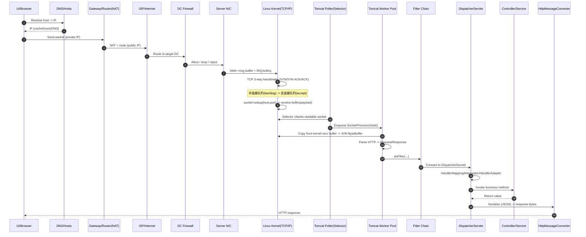

# 一个 Java 请求，从前端到后端的全访问链路（上下集）（面试与实战笔记）

## 1. 核心架构/流程可视化（必选）

- 关键路径一句话：HTTP(S) 请求穿过“网络（DNS/NAT/路由）→ 数据中心（防火墙/网卡/内核协议栈）→ Web 容器（Tomcat 线程模型）→ Spring MVC（过滤器/分发/参数绑定/序列化）”，每一层都有自己的队列、缓冲区与调度机制。

## 2. 核心主题与背景（它在讲什么？）

- 一句话概括：用“从浏览器到 Spring MVC”的视角，把一次 Java Web 请求经过的网络、OS、Tomcat、Spring MVC 全链路串起来。
- 技术体系位置：属于“计算机网络 + Linux I/O + Web 容器 + Spring MVC”交叉地带，是后端工程师理解性能、排障、线程与吞吐的基础心智模型。
- 核心痛点：很多人只背“Spring MVC 流程”或“TCP 三次握手”，但不知道它们如何在一次真实请求里连起来，导致面试答得碎、实战排障也缺抓手。

## 3. 核心知识点/解决方案拆解（它是怎么做的？）

### 3.1 内容属性判断

- 内容属性：底层原理讲解 + 请求链路流程串讲（偏面试与体系化认知）。

### 3.2 前端到机房：网络旅程（DNS → 路由 → NAT）

- 浏览器/调用方会先解析：
  - 协议：HTTP / HTTPS
  - Host：域名或 IP（可能带端口）
  - URL：具体 API 路径（如 /login）
  - 然后把这些封装成 HTTP(S) request 发出去
- DNS 解析的典型顺序（视频口径）：
  - 查本地缓存 + hosts 文件
  - 查配置的 DNS 服务器
  - 目标是拿到“能建立连接的 IP”
- 本地网关/路由器：
  - 判断目标是内网地址还是公网地址
  - 公网地址则交给 ISP，沿着多级路由寻找“到目标机房/目标服务器”的最优路径
- NAT（Network Address Translation，网络地址转换）：
  - 背景：你在家/公司常用私有 IP 出网，但公网回包必须能定位到你
  - 作用：把私有 IP 映射为公有 IP（并维护映射），保证响应能回流到正确的内网主机

### 3.3 机房到内核：防火墙 → 网卡 → 中断 → TCP

- 防火墙（视频用“三件事”概括）：
  - 丢弃（drop）
  - 拒绝（reject）
  - 允许（allow）
- 网卡与数据链路层（视频强调的关键点）：
  - 物理介质接收信号 → 数据链路层按以太网帧检查目标 MAC
  - 通过 DMA（Direct Memory Access，直接内存访问）把数据写入环形缓冲区（ring buffer）
  - 特点：DMA 过程不消耗 CPU
- 硬中断/软中断（视频口径）：
  - 硬中断：网卡“来数据了”立刻打断 CPU 当前任务，要求快速响应
  - 软中断：把耗时的解析工作异步化，硬中断尽快返回，避免长时间占用 CPU
- TCP 三次握手与连接队列（视频强调“核心不是三次，而是状态转换”）：
  - 客户端发 SYN
  - 服务端回 SYN-ACK，并把连接放入半连接队列
  - 客户端回 ACK 后转入全连接队列
  - 面试要点：半连接队列/全连接队列是理解 backlog、SYN Flood 与连接建立失败的核心抓手

### 3.4 内核到 JVM：socket 缓冲区 → Tomcat 线程模型 → Spring MVC

#### A. 内核 socket 缓冲区与 payload

- TCP 层会用请求的 host + port 去内核的 socket 哈希表里找到对应的 socket 结构（socket struct）。
- socket struct 关联一个接收缓冲区（receive buffer），用于存放网络传输来的 payload。
- payload 概念（视频强调不要把它窄化为 request body）：
  - payload 是更“全”的数据：HTTP 头、请求行、request body 等都包含在内。

#### B. Tomcat：Poller 线程 + 工作线程池（NIO 线程模型口径）

- Tomcat 启动阶段（视频口径）：
  - 初始化工作线程池（maxThreads 决定上限）
  - 工作线程启动后从任务队列取任务；无任务时进入 WAITING/TIMED_WAITING（阻塞在 take/poll）
  - 启动一个 Poller 线程（基于 NIO selector/轮询机制）
- 请求到来时的调度（视频口径）：
  - Poller 线程检查 socket 缓冲区是否可读
  - 如果可读：把 socket 封装成 SocketProcessor（一个可执行对象/Runnable），投递到任务队列
  - 工作线程被唤醒，从 WAITING → RUNNING，执行 SocketProcessor.run()
- SocketProcessor.run() 的关键动作（视频口径）：
  - 从内核缓冲区把数据复制到 JVM 的 ByteBuffer
  - 后续才能进行 HTTP 协议解析

#### C. Spring MVC：Filter → DispatcherServlet → HandlerMapping/Adapter → 序列化返回

- HTTP 解析完成后，会把内容封装成 Request/Response（视频用“我们熟悉的两个对象”来指代）。
- Filter 责任链（doFilter）：
  - 先走容器过滤器链，做鉴权、编码、日志等通用处理
- DispatcherServlet：
  - 标志着进入 Spring MVC 的核心分发流程
  - 典型关键组件（按视频提到的顺序）：
    - HandlerMapping：确定请求映射到哪个 Controller 方法（@RequestMapping）
    - HandlerInterceptor：preHandle 返回 false 则请求直接结束
    - HandlerAdapter：完成参数解析与绑定（@RequestBody / @PathVariable / @RequestParam 等），并把数据转成 Java 对象
- 返回阶段（视频口径）：
  - HandlerMethodReturnValueHandler 处理返回值
  - HttpMessageConverter 把 Java 对象序列化成 JSON 字节流，写入 response 输出流
  - 之后可能还有 postHandle 等后置处理

## 4. 面试高频考点与追问（面试官会怎么考？）

### Q1：一次 HTTP 请求从输入域名到建立连接，中间发生了什么？

- 参考回答（关键词）：DNS 解析（缓存/hosts/DNS 服务器）→ 路由转发（网关/ISP 路由）→ NAT（私网出网映射）→ 到达机房防火墙 → 网卡收包。

### Q2：TCP 三次握手“真正的核心”是什么？半连接队列/全连接队列有什么意义？

- 参考回答（关键词）：核心是连接状态机与队列迁移，不是“来回三次”本身；服务端在 SYN-ACK 后进入半连接队列（syn backlog），收到 ACK 才进入全连接队列（accept queue）；队列容量与 backlog 配置、SYN Flood、防护策略强相关。

### Q3：网卡收到包后为什么要 DMA、硬中断、软中断？各自解决什么问题？

- 参考回答（关键词）：DMA 把数据高效写入 ring buffer，减少 CPU 拷贝；硬中断用于快速通知 CPU 有包到达但必须尽快返回；软中断/异步处理把耗时解析下沉，避免长时间占用中断上下文拖垮系统吞吐。

### Q4：Tomcat 的 Poller 线程和 Worker 线程分别干什么？为什么需要两类线程？

- 参考回答（关键词）：Poller/Selector 负责监听 socket 可读事件并封装任务；Worker 线程池负责真正处理请求（读取、解析、执行业务）；解耦 I/O 事件发现与业务处理，避免所有线程都阻塞在 I/O 上，提高并发与资源利用率。

### Q5：Spring MVC 里 Filter、Interceptor、HandlerAdapter、MessageConverter 分别在什么阶段发挥作用？

- 参考回答（关键词）：Filter 属于 Servlet 容器责任链，早于 Spring MVC；DispatcherServlet 进入后，HandlerMapping 定位处理器，Interceptor 做前后置拦截（preHandle/postHandle），HandlerAdapter 做参数绑定与方法调用适配，MessageConverter 做请求/响应体的序列化/反序列化（如 JSON）。

## 5. 亮点、坑点与最佳实践（如何体现经验？）

### 亮点

- 把“网络-内核-容器-框架”四层串成一条链：面试回答更整体，线上排障更快定位“卡在哪层”。
- 强调握手的状态与队列：比背包序更接近真实系统的瓶颈与攻击面。
- 点出 payload/receive buffer：能把“请求体在哪里、何时拷贝进 JVM”讲清楚。

### 坑点/局限性

- 把 payload 等同 request body：会导致对抓包、日志、调试与协议解析理解偏窄。
- 把三次握手背成固定话术，但说不清半连接/全连接队列与 backlog 的关系。
- 误以为 Tomcat 只有“一个线程处理一个请求”：忽略 Poller/Selector、任务队列与线程池调度。
- 把“可用性/性能”问题只归因到业务代码：实际上很多问题卡在 DNS、NAT、防火墙策略、内核队列或线程池配置。

### 最佳实践（面试能讲、实战能用）

- 排障分层法：
  - 连不上：先查 DNS → 路由/NAT → 防火墙 → 端口监听
  - 连得上但慢：再看内核队列（backlog）、线程池（maxThreads）、应用耗时
- Tomcat/Spring 侧的经验口径（偏原则）：
  - 不在 I/O 事件线程里做重活（避免阻塞），把耗时留给工作线程池
  - 控制过滤器链复杂度，关键拦截逻辑放在更合适的层（Filter vs Interceptor）
  - 关注队列与缓冲区：任何“队列满”都会表现为超时、拒绝或吞吐骤降

## 6. 总结与升华（一句话亮点）

- 面试行话版：一次请求的吞吐与延迟，本质是“DNS/路由/NAT + 内核队列与缓冲区 + Tomcat 线程池调度 + Spring MVC 适配与序列化”这条链路上的队列、拷贝与调度是否健康。
