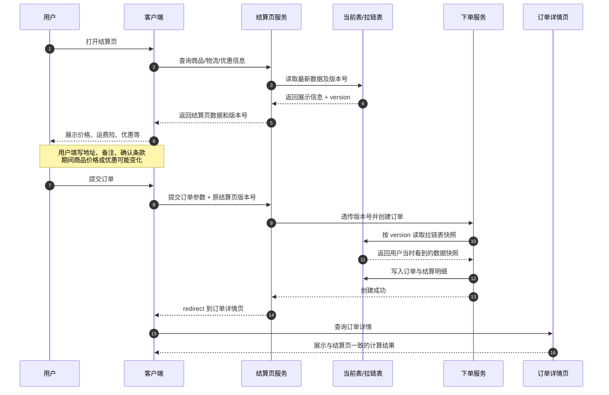

# 得物电商订单结算业务数据一致性设计（面试与实战笔记）

## 0. 内容属性判断

这期属于**业务场景实战型架构设计**：它不是讲数据库 MVCC 的底层实现，而是用电商订单结算页的真实业务场景，说明如何通过“多版本号 + 拉链表”保证用户从结算页到订单详情页看到和结算的数据一致。

## 1. 核心架构/流程可视化

关键路径说明：**结算页返回的不只是价格等展示值，还要返回对应版本号；提交订单时必须把这些版本号原样带回服务端；下单服务再按版本号读取拉链表快照，而不是直接读当前最新值。**

## 2. 核心主题与背景

**一句话概括：** 视频讲的是电商下单链路中，如何用多版本号和拉链表解决“用户结算时看到的价格/优惠”和“最终创建订单时使用的数据”不一致的问题。

它处在电商交易系统的**订单结算与数据一致性设计**位置，核心痛点是：用户进入结算页后，到真正提交订单之间存在时间差；如果期间商品价格、运费险、物流、优惠券或售后保障发生变化，订单详情页可能和用户刚才确认的信息不一致，轻则体验差，重则引发财务、客服和合规问题。

普通业务可以提示“信息已变化，请重新确认”，但在抢购、秒杀、限量库存等场景下，频繁打断用户会严重影响成交体验。因此，系统需要把“用户当时确认的数据快照”固化下来。

## 3. 核心知识点/解决方案拆解

### 3.1 业务场景还原

用户购买商品时，会先进入订单结算页。结算页会展示：

- 商品价格
- 运费、运费险
- 售后保障
- 到货信息
- 优惠券和活动优惠
- 订单总价

用户看到这些信息后，还要填写地址、备注、确认条款，最后才点击提交订单。这个过程中可能过去几十秒到几分钟，后台商品或活动数据可能已经被运营修改。

如果下单服务创建订单时直接读取“当前最新数据”，就会出现：用户结算页看到 89.99 元，提交订单时系统按 99.99 元计算。这个问题不是数据库脏读，而是**业务时间窗口导致的前后视图不一致**。

### 3.2 核心方案：多版本号 + 拉链表

视频中的方案可以概括为：**事实表保存当前最新状态，拉链表保存历史版本快照，业务流程用版本号贯穿结算和下单。**

专业术语解释：

- **版本号 version**：一次业务信息变更对应一个版本，例如商品价格 version=1 是 89.99 元，version=2 是 99.99 元。
- **拉链表**：一种保存历史状态的数据表。每条记录都有生效时间、失效时间和版本号，用来描述某个业务对象在某段时间内的状态。
- **事实表/当前表**：保存商品当前最新信息，便于普通查询快速拿最新值。
- **快照**：某个时间点或某个版本下的一组业务数据，用于还原用户当时看到的状态。

典型表设计可以这样理解：

| 表 | 保存内容 | 查询用途 |
|---|---|---|
| 商品当前表 | 商品最新价格、最新保障、最新版本号 | 首页、商详页、普通最新数据查询 |
| 商品拉链表 | 商品历史价格、版本号、生效/失效时间 | 按版本号还原历史快照 |
| 订单表/订单明细表 | 下单时使用的版本号、金额、数量、优惠明细 | 支付、售后、审计、对账 |

### 3.3 更新阶段：每次变更都生成新版本

当商品信息发生变化时，系统不能只更新当前表，还要维护历史记录：

1. 将旧版本的拉链记录关闭，例如设置 `end_time` 为新版本生效前一刻。
2. 在拉链表插入一条新版本记录，写入新的价格、保障、优惠等信息。
3. 更新当前表，把最新值和最新版本号写入当前表。

这样，当前表负责“查最新”，拉链表负责“查历史”。两者一起支撑性能和一致性。

### 3.4 结算阶段：返回展示数据和版本号

当客户端打开订单结算页时：

1. 结算页服务查询商品、物流、优惠券等当前信息。
2. 服务端同时取出这些信息对应的最新版本号。
3. 结算页把展示数据和版本号一起返回给客户端。
4. 客户端缓存这些版本号，后续提交订单时必须原样提交。

这里的关键不是“客户端相信价格”，而是**客户端携带服务端签发过的版本引用**。生产环境中，价格计算仍应在服务端完成。

### 3.5 下单阶段：按版本号读取快照

当用户提交订单时：

1. 客户端提交商品 ID、数量、地址、备注、优惠选择，以及结算页拿到的版本号。
2. 结算页服务校验参数后，把版本号附加到下单请求。
3. 下单服务不直接读当前表最新价格，而是根据版本号读取拉链表中的历史快照。
4. 下单服务基于该快照计算订单金额并写入订单明细。
5. 创建成功后跳转订单详情页，展示刚刚落库的订单结算结果。

这样即使商品已经涨价，只要用户是在旧版本结算页确认的，订单仍按旧版本快照计算，用户体验保持一致。

### 3.6 它保证的是什么一致性

这个方案保证的是**用户视角的一致性**，也可以叫“结算页到订单页的读写视图一致”。它不是严格意义上的分布式事务，也不是数据库 MVCC 的一致性读，而是业务层通过版本引用固化数据快照。

面试表达时要特别说明：该方案解决的是“前后体验一致”和“订单计算依据可追溯”，不直接解决库存扣减、支付幂等、优惠券并发占用等问题。这些仍需要各自的并发控制和事务设计。

## 4. 面试高频考点与追问

### 问题 1：为什么电商结算页和下单页会出现数据不一致？

参考回答：

因为结算页展示和最终提交订单之间存在时间窗口。用户填写地址、备注、确认条款期间，商品价格、物流费用、运费险、优惠券规则可能发生变化。如果下单时重新读取当前最新数据，就可能和用户刚才确认的数据不一致。关键词是：**时间窗口、业务快照、用户视角一致性**。

### 问题 2：多版本号 + 拉链表是怎么解决这个问题的？

参考回答：

每次商品或结算相关信息变化时，系统生成新版本，并把历史版本写入拉链表。结算页返回展示数据时，同时返回对应版本号；提交订单时客户端把版本号带回；下单服务按版本号查询拉链表快照进行计算，而不是读最新值。这样订单使用的就是用户当时看到并确认的版本。关键词是：**版本号贯穿链路、按版本查快照、当前表查最新、拉链表查历史**。

### 问题 3：为什么不能直接把结算页价格从客户端传回来，然后按客户端价格下单？

参考回答：

不能信任客户端传回的价格，因为客户端参数可能被篡改，也可能因为缓存、网络或前端逻辑导致数据错误。客户端可以携带版本号作为“引用”，但最终价格、优惠和总额必须由服务端根据版本号重新计算。关键词是：**客户端不可信、服务端计算、参数防篡改、版本引用**。

### 问题 4：拉链表和数据库 MVCC 有什么区别？

参考回答：

MVCC 是数据库引擎为了并发控制和一致性读提供的底层机制，通常服务于事务隔离；拉链表是业务建模手段，用显式字段保存业务对象的历史版本，服务于审计、追溯和按版本还原。两者都体现“多版本”思想，但层级不同：MVCC 在数据库内部，拉链表在业务数据模型中。关键词是：**底层并发控制 vs 业务历史建模**。

### 问题 5：这个方案还有哪些必须补充的生产级设计？

参考回答：

需要补充版本号校验、服务端签名或防篡改、订单金额落库、库存和优惠券占用的并发控制、幂等下单、历史数据归档、监控告警和对账。多版本快照只解决结算依据一致，不等于整条交易链路都一致。关键词是：**幂等、并发控制、审计、归档、对账**。

## 5. 亮点、坑点与最佳实践

### 5.1 亮点

- **用户体验稳定**：用户确认的是哪个版本，订单就按哪个版本计算，避免提交后价格突变。
- **业务可追溯**：订单金额来自哪个商品版本、优惠版本、物流版本都能查到，便于客服、审计和对账。
- **读写职责清晰**：当前表面向最新查询，拉链表面向历史快照，性能和可追溯性兼顾。
- **适合高价值交易链路**：抢购、秒杀、限量发售等场景中，减少“信息变化请重新确认”的打断。

### 5.2 坑点/局限性

- **只传版本号，不传完整价格**：如果相信客户端价格，会留下明显的安全漏洞。
- **版本维度要完整**：商品、物流、优惠券、售后保障都可能影响结算，不能只记录商品价格版本。
- **版本快照不能随意清理**：订单、售后、对账仍可能需要历史数据，归档策略要考虑业务保留周期。
- **它不解决库存一致性**：库存扣减、优惠券锁定、支付幂等还需要独立设计，不能把所有一致性问题都归给拉链表。
- **多版本会增加存储和查询复杂度**：高频变更的商品或活动需要关注拉链表膨胀、索引设计和归档成本。

### 5.3 最佳实践

- **订单明细落冗余快照**：除了保存版本号，订单明细中也应落库关键金额字段，例如单价、优惠金额、运费、应付金额，方便后续审计和展示。
- **版本号服务端生成**：版本号应由服务端或数据变更流程生成，保证单调递增或全局唯一，不由客户端决定。
- **关键版本做签名校验**：可以对商品 ID、优惠 ID、版本号、用户 ID、过期时间生成签名，防止客户端篡改版本引用。
- **拉链表建组合索引**：常见索引为 `(biz_id, version)`，如果按时间查询也可建立 `(biz_id, start_time, end_time)`。
- **提交时做有效性策略判断**：某些业务允许使用旧版本，某些强监管或强价格敏感业务可能必须重新确认。策略应配置化，而不是写死。
- **把金额计算做成可测试的领域服务**：金额计算应集中在服务端，输入是商品快照、优惠快照、物流快照和购买数量，输出可审计的计费明细。

## 6. 总结与升华

面试中可以这样概括：

**订单结算一致性的关键不是下单时读最新，而是把用户确认时的业务快照版本贯穿到订单创建，用拉链表还原当时视图，并把最终计算结果落库，做到体验一致、依据可追溯、金额可审计。**

