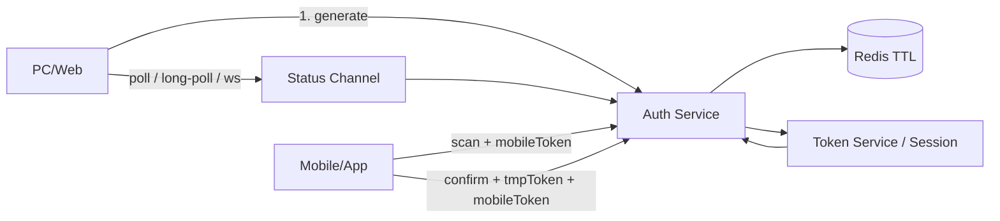
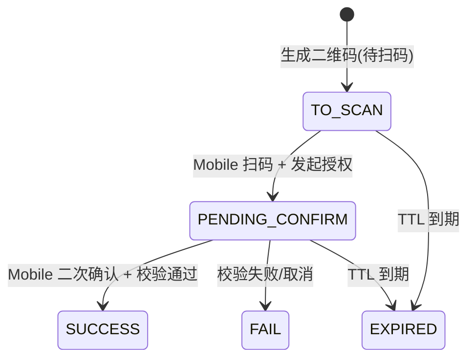
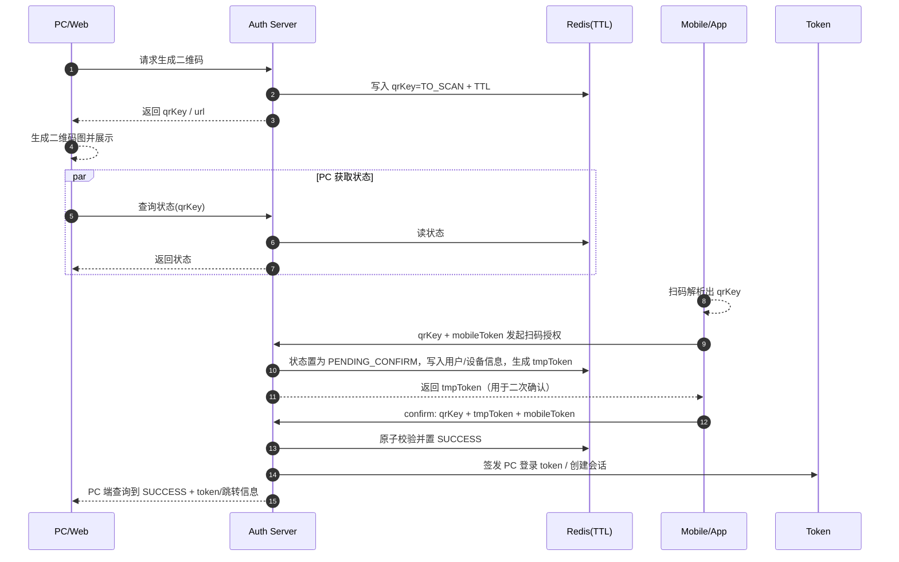

---
tags:
  - 场景题
  - 系统设计
  - 程序员
---

# 场景题：二维码扫码登录设计（面试复习资料）

## 来源

- [场景题：二维码扫码登录设计](https://www.bilibili.com/video/BV1cz421z7hn)

## 1. 题目与场景澄清

### 核心问题（一句话）

设计一套“PC 展示二维码、手机扫码并二次确认、PC 最终登录成功”的登录认证系统（包含状态机、端到端流程、接口与通信机制）。

### 角色与边界

- 待登录设备（PC/Web）：请求生成二维码、展示二维码、持续获取二维码状态、登录成功后建立会话
- 已登录扫码设备（Mobile/App）：扫码解析二维码内容，携带自身已登录 token 发起授权与确认
- 服务端（Auth/SSO）：生成二维码 key、维护状态机、校验移动端 token、签发 PC 登录态

### 需求分析

#### 功能性需求

- PC 端进入扫码登录页后，向服务端请求生成二维码，拿到二维码 key（或包含 key 的 URL），并生成二维码图展示
- Mobile 扫码解析出二维码 key，携带 Mobile 已登录 token 请求服务端完成“扫码授权”，使二维码进入“已扫码待确认”状态
- Mobile 端必须二次确认（确认登录 / 取消），服务端根据确认结果推进状态机
- PC 端能够实时感知二维码状态：未扫码 → 已扫码待确认 → 成功 / 失败 / 过期
- 二维码过期后，PC 端提示刷新重新生成新的二维码

#### 非功能性需求

- 安全性：避免二维码截图/转发导致越权登录；防重放；二次确认；短时有效；确认阶段需要强认证
- 低延迟：扫码与确认后，PC 端能快速感知状态变化（轮询/长轮询/推送）
- 高可用：生成/查询/扫码/确认链路能抗高并发与局部故障，支持水平扩展与降级
- 正确性：状态机迁移严格、幂等，处理并发确认与过期竞态，避免“过期后仍成功”

## 2. 核心架构设计方案（重点）

### 整体架构图景

### 二维码状态机

### 关键流程（时序）

### 存储与数据模型（建议答法）

二维码是短生命周期凭证，适合放在 Redis 并通过 TTL 管理过期。

- Key：`qr:{qrKey}`
- Value（示例）：
  - `status`: `TO_SCAN | PENDING_CONFIRM | SUCCESS | FAIL | EXPIRED`
  - `expireAt`: 过期时间（同时用 TTL）
  - `pcBindInfo`（可选）：pcDeviceId / uaHash / ipHash
  - `scanUserId` / `scanDeviceId`：扫码后写入
  - `tmpTokenHash`：临时 token 的 hash（不直接存明文）
  - `lastUpdateAt`

### 接口设计（按端划分）

#### PC/Web

- `POST /qr/generate`
  - 出参：`qrKey`, `expireAt`, `qrUrl`（可选）
- `GET /qr/status?qrKey=...`
  - 出参：`status`, `message`, `loginToken`（或 `redirectUrl`/一次性 code）

#### Mobile/App

- `POST /qr/scan`
  - 入参：`qrKey` + `mobileToken`
  - 出参：`tmpToken`
  - 语义：完成扫码授权，把二维码推进到“待确认”
- `POST /qr/confirm`
  - 入参：`qrKey` + `tmpToken` + `mobileToken`
  - 出参：`ok`（服务端同时推进 SUCCESS 并准备 PC 登录结果）

### 关键决策与权衡（Trade-off）

#### 1) Redis TTL vs MySQL 持久化

- 选 Redis：二维码是短时凭证，天然需要 TTL；读写频繁，key 直接用 `qrKey`，Redis 简洁高效
- 选 MySQL：可以做但会引入过期数据清理、写放大与更多索引/查询成本；通常只在需要审计与强一致落库时引入

#### 2) PC 获取状态：轮询 vs 长轮询 vs WebSocket

- 轮询：实现简单、兼容性强；缺点是读放大（视频举例：B 站就是轮询）
- 长轮询：降低无效请求，但连接管理与超时控制更复杂
- WebSocket：体验最佳、服务端主动推送，但要维护长连接、网关与扩容复杂度更高

#### 3) 是否绑定“请求二维码的 PC 设备信息”

- 绑定（更安全）：`qrKey` 绑定 `pcDeviceId/ua/ip`，降低截图转发导致的跨设备登录风险
- 不绑定（更简单）：链路更轻，但更依赖二次确认与风控策略

### 核心难点攻克（高分点）

#### 1) 把扫码登录抽象成“认证问题”

登录永远是两件事：

- 告诉系统我是谁（身份标识）
- 向系统证明我是谁（凭证）

在扫码登录里：

- `mobileToken` 负责“证明我是谁”（手机端已登录态，服务端可解析出 userId、deviceId 等）
- `qrKey` 负责“指向 PC 这次待登录会话”（把移动端授权动作映射到 PC 端登录）

#### 2) 二次确认与临时 token 的意义

扫码后不直接登录，而是先进入“待确认”。服务端可下发 `tmpToken` 给移动端用于二次确认，但确认时不能只靠 `tmpToken`：

- 二次确认必须携带 `mobileToken` 再做一次强认证
- 避免 `tmpToken` 在链路中被劫持后，攻击者仅凭临时 token 即完成登录

#### 3) 状态机一致性与幂等（并发/重复点击/过期竞态）

推荐把状态迁移做成“只允许合法迁移”的原子操作：

- `TO_SCAN -> PENDING_CONFIRM`：仅允许扫码授权推进一次
- `PENDING_CONFIRM -> SUCCESS/FAIL`：仅允许一次确认结果落地
- 若 TTL 已过期，任何推进都应失败并返回 EXPIRED

实现上可用 Redis 原子指令或 Lua 脚本做 compare-and-set，保证并发下不乱序、不重复。

#### 4) 轮询压力与前端停止条件

视频抓包展示了一个关键细节：二维码过期后，PC 端停止轮询。

工程上建议：

- 成功/失败/过期后立即停轮询
- 轮询间隔设置 + 抖动（jitter）避免“齐步打点”
- 高峰期可升级长轮询或 WebSocket

## 3. 模拟面试满分回答（话术版）

### 需求

我设计的是扫码登录：PC 生成并展示二维码，手机端扫码后必须二次确认，PC 才建立登录态；二维码需要短时有效并支持状态查询，状态包括未扫码、待确认、成功、失败、过期。

### 估算

核心压力在 PC 端状态查询：假设同时有 10 万用户停留在登录页，轮询 1 秒一次就是 10 万 QPS 的读请求，因此状态必须放在高性能缓存（Redis），并确保前端在成功/过期后停止轮询。若要进一步降压，可用长轮询或 WebSocket。

### 接口设计

- `POST /qr/generate`：PC 获取 `qrKey` 与过期时间
- `GET /qr/status?qrKey=...`：PC 获取状态与登录结果（token/跳转信息）
- `POST /qr/scan`：手机扫码授权，入参 `qrKey + mobileToken`，返回 `tmpToken`，并把状态置为待确认
- `POST /qr/confirm`：手机确认登录，入参 `qrKey + tmpToken + mobileToken`，校验通过后置成功并生成 PC 登录结果

### 数据库/缓存设计

用 Redis 存 `qr:{qrKey}` 并设置 TTL，value 存状态、扫码后的 userId/deviceId、临时 token 的 hash、更新时间等。重点是状态迁移要原子化，防止并发与过期竞态。

### 核心架构

Auth 服务负责生成 `qrKey`、写入 Redis、校验 `mobileToken`、推进状态机并签发 PC 登录态。PC 端通过轮询/长轮询/WS 获取状态变化，成功后用返回的 token/一次性 code 建立会话。

### 瓶颈优化与安全补强

- 性能：轮询退避 + 抖动；成功/过期停轮询；必要时长轮询/WS；Redis 扛读
- 正确性：Redis 原子状态迁移（CAS/Lua），接口幂等
- 安全：二维码短 TTL；二次确认；确认必须带 `mobileToken` 二次认证；可选绑定 PC 设备信息与风控策略

## 4. 面试启示与考察点

### 面试官在考察什么

- 能否把“扫码登录”抽象成：状态机 + 多端协作 + 认证授权
- 安全意识：二次确认、临时 token、重放/劫持风险、设备绑定与风控
- 性能与可演进：轮询带来的读放大，以及轮询→长轮询→WS 的演进路径
- 正确性：并发与过期竞态下的状态迁移与幂等

### 举一反三（可迁移题型）

- 设备授权/网页登录授权（类似 device code 的思路）
- 一次性凭证流程：短信验证码、邮箱登录链接、找回密码 token
- 支付/订单状态机：待支付→已支付→失败/超时 与前端轮询/推送
- 短生命周期任务：导出任务、审批任务的状态查询与通知

### 避坑指南

- 扫码后直接登录，忽略二次确认与“确认阶段需要再次携带 mobileToken 做认证”
- 不设计状态机与合法迁移，导致重复确认、状态乱序、过期后仍成功
- `qrKey` 可预测或 TTL 过长，导致枚举/重放风险
- 轮询无停止条件与退避策略，高峰期无效请求打爆服务端
