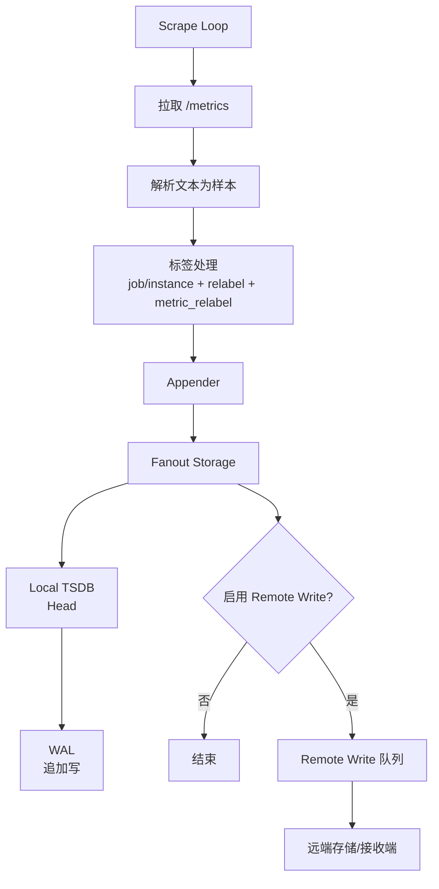
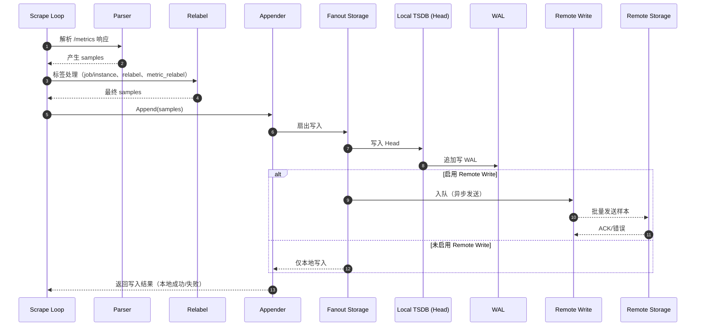

# 第 11 课：数据写入流程

**学习时长**：3-4 小时  
**难度等级**：⭐⭐⭐ 进阶  
**先修要求**：完成第 10 课 - 存储子系统 - TSDB 概述

---

## 学习目标

完成本课程后，你将能够：

- ✅ 说清样本从抓取到落盘的完整路径
- ✅ 理解 Sample、Series、LabelSet 的关系
- ✅ 理解写入时为什么需要 WAL，以及它和 Head 的关系
- ✅ 理解 Fanout Storage 与 Remote Write 的作用与边界
- ✅ 能用 Prometheus 自带页面与指标定位“写入变慢/写入失败/远程写入堆积”

---

## 11.1 一条线串起来：写入路径总览

把 Prometheus 的写入流程压缩成一条线：

```
Scrape Loop
  ↓（抓 /metrics）
解析文本 → 样本（samples）
  ↓
Appender（写入接口）
  ↓
Fanout Storage
  ├→ Local TSDB（Head + WAL）
  └→ Remote Write（可选）
```

### 11.1.1 Mermaid 流程图（结构视角）



一句话总结：

> 抓取负责产生样本；Storage 负责把样本安全、快速地写进去，并提供可查询的数据结构。

---

## 11.2 写入的最小数据单元：Sample / Series

### 11.2.1 Series（时间序列）

一条时间序列由以下内容唯一确定：

- 指标名（metric name）
- 标签集合（labels）

例如：

`http_requests_total{job="web",instance="10.0.1.12:8080",method="GET"}`

只要 labels 里任何一个值变化，就变成另一条 series。

### 11.2.2 Sample（样本）

样本就是某条 series 在某个时间点的值：

- timestamp
- value

写入时最重要的约束：

- 同一条 series 的样本时间通常是递增的
- 高频写入时，“series 数量”比“样本数量”更影响成本（高基数问题）

---

## 11.3 Scrape Loop 到样本：在写入前发生了什么

对一个 Target 的一次抓取，会经历：

1) HTTP 拉取 metrics（metrics_path）
2) 解析文本为样本
3) 附加基础标签（job/instance）
4) 执行 relabel（目标级）与 metric_relabel（样本级）
5) 得到最终要写入的样本集合

写入链路通常从第 5 步开始：把“最终样本”交给 Storage。

---

## 11.4 Appender：写入接口的意义

Prometheus 写入不是“直接写文件”，而是通过统一的写入接口（Appender）：

- 让抓取侧只关心“我有样本要写”
- 让存储侧决定“写到哪里、怎么写、怎么保证恢复”

直觉上可以把它看成：

> Appender 是写入的入口，底层可以是本地 TSDB，也可以同时扇出到远程存储。

---

## 11.5 Fanout Storage：为什么能同时写本地和远端

Fanout 的意思就是“扇出”：

- 一份样本可以同时写入多个后端
- Prometheus 默认本地写入是主路径
- Remote Write 是可选的额外路径

典型结构：

- Local TSDB：保证本地可查、低延迟
- Remote Write：把数据推给远端长期存储或统一存储（例如 Thanos Receive、Mimir、VictoriaMetrics 等）

重要边界：

- Remote Write 失败不代表本地写入失败，但可能导致远端数据缺口
- Remote Write 有队列与重试，会引入“延迟”和“堆积”的观察点

---

## 11.6 Local TSDB 写入：Head + WAL 的配合

本地写入可以按两个动作理解：

1) 写入 Head（内存结构，供最近查询）
2) 追加写入 WAL（磁盘日志，用于崩溃恢复）

为什么是 WAL：

- 追加写很快
- Prometheus 崩溃后，重启可以回放 WAL，把 Head 恢复出来

你可以把它理解为：

- Head：当前“正在用”的数据
- WAL：把“正在用的数据变化”落到磁盘，保证可恢复

### 11.6.1 Mermaid 时序图（一次写入的时间顺序）



---

## 11.7 Remote Write：写入远端时发生了什么

Remote Write 的核心思路：

- Prometheus 把样本按时间窗口打包
- 放入队列
- 由后台 worker 异步发送到远端

因此 Remote Write 常见现象是：

- 远端慢/断：队列堆积，延迟变大
- 队列满：可能丢数据或阻塞（取决于实现与配置）

最实用的排查思路：

- 本地查询正常但远端缺数据：看 remote write 的队列与错误
- 本地写入变慢：看 TSDB 与 WAL 指标是否异常

---

## 11.8 实践：用自监控指标观察写入链路

目标：不读源码，也能判断写入链路“哪一段慢了/哪一段失败了”。

### 11.8.1 先确认抓取侧正常

```promql
up
scrape_samples_scraped
scrape_samples_post_metric_relabeling
```

观察点：

- 如果 `up=0`，优先解决抓取问题
- 如果 `scrape_samples_post_metric_relabeling` 显著小于 `scrape_samples_scraped`，说明 metric_relabel 在大量过滤

### 11.8.2 观察 TSDB 写入健康度

```promql
prometheus_tsdb_head_series
prometheus_tsdb_head_chunks
prometheus_tsdb_wal_writes_total
```

观察点：

- `head_series` 持续上涨：可能在发生高基数（labels 维度爆炸）
- WAL 写入异常：可能是磁盘 IO 或文件系统问题

### 11.8.3 如果启用了 Remote Write，观察是否堆积

Prometheus 会暴露 remote write 相关指标（命名随版本可能略有差异），排查时重点看：

- 发送失败次数、重试次数
- 队列长度/堆积趋势

---

## 11.9 常见问题与定位路径

- 本地写入慢：先看磁盘 IO、WAL 指标、Head series 是否暴涨
- 远端写入慢：看 remote write 队列、错误、远端限流/超时
- 存储暴涨：优先怀疑高基数标签，结合 `prometheus_tsdb_head_series` 与业务标签设计排查

---

## 课后小结

- 抓取产生样本，写入通过 Appender 进入 Fanout Storage
- Fanout 可以同时写本地 TSDB 与 Remote Write
- 本地写入核心是 Head + WAL：一个保证查询，一个保证恢复
- 排障先分清是“抓取侧出问题”还是“写入侧出问题”
