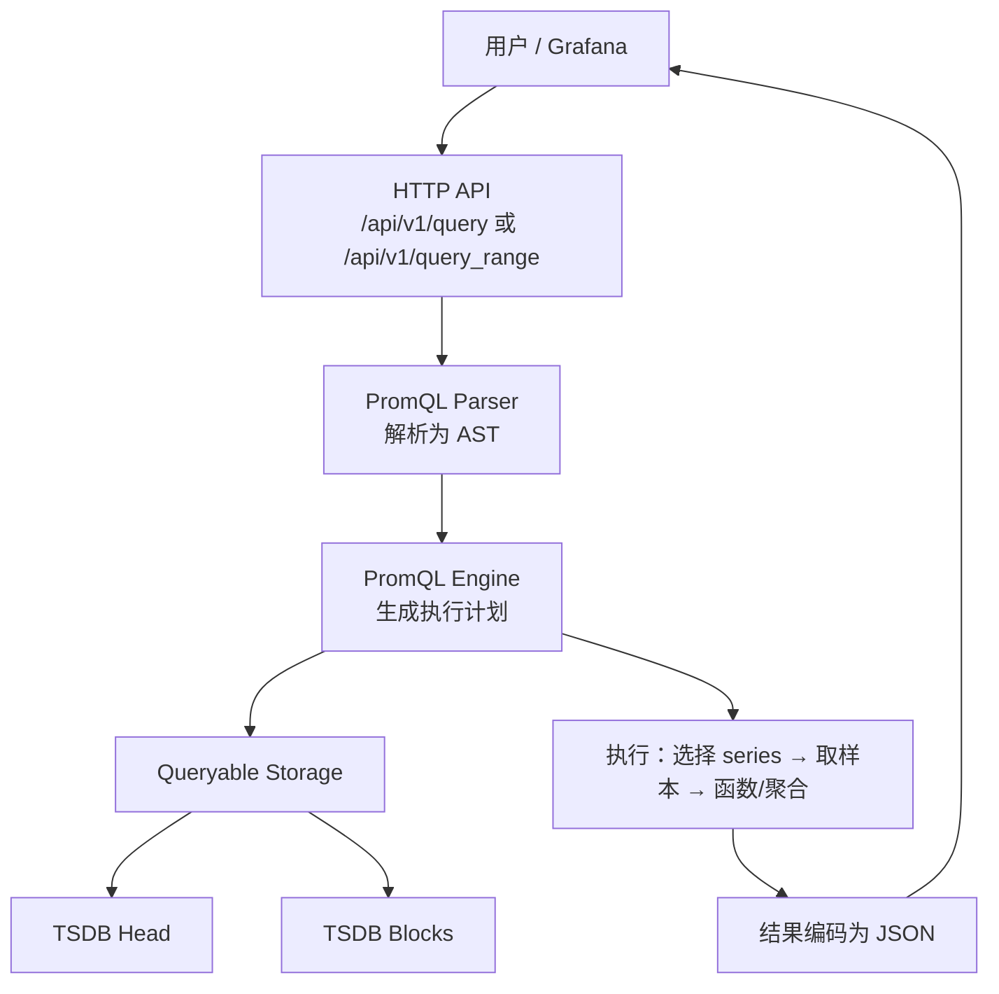

# 第 12 课：数据查询流程

**学习时长**：3-4 小时  
**难度等级**：⭐⭐⭐ 进阶  
**先修要求**：完成第 11 课 - 数据写入流程

---

## 学习目标

完成本课程后，你将能够：

- ✅ 说清一次 PromQL 查询从 HTTP API 到 TSDB 的完整路径
- ✅ 理解 Instant Query 与 Range Query 的区别与使用场景
- ✅ 理解查询引擎在做什么：解析 → 计划 → 执行 → 返回
- ✅ 理解 Head + Blocks 如何共同参与查询
- ✅ 会用 HTTP API 调试查询，并读懂返回结果结构

---

## 12.1 查询链路总览：从请求到结果

Prometheus 的查询路径可以压缩成：

```
HTTP API / Web UI / Grafana
  ↓
PromQL Engine（解析与执行）
  ↓
Storage（TSDB：Head + Blocks）
  ↓
结果编码（JSON）→ 返回客户端
```

### 12.1.1 Mermaid 流程图（结构视角）



---

## 12.2 Instant Query vs Range Query

Prometheus 常用两类查询接口：

### 12.2.1 Instant Query（瞬时查询）

- 接口：`/api/v1/query`
- 含义：在一个“时间点”上计算表达式的结果
- 典型用途：看当前值、看告警条件、看 TopN

示例：

```text
GET /api/v1/query?query=up
GET /api/v1/query?query=rate(http_requests_total[5m])
```

### 12.2.2 Range Query（范围查询）

- 接口：`/api/v1/query_range`
- 含义：在一个“时间范围”内按步长（step）反复计算，返回一条曲线（或多条）
- 典型用途：画图、看趋势、做区间聚合

示例：

```text
GET /api/v1/query_range?query=rate(http_requests_total[5m])&start=...&end=...&step=15s
```

你可以把它理解为：

- Instant：算一次
- Range：按 step 算很多次

---

## 12.3 查询引擎在做什么：四步

一次 PromQL 查询在引擎内大致分四步：

1) **解析**：把 PromQL 文本解析成 AST（抽象语法树）  
2) **计划**：确定要从 Storage 拿哪些时间序列、要取什么时间范围  
3) **执行**：取样本并计算（函数、聚合、二元运算、向量匹配等）  
4) **返回**：把结果序列化为 JSON 返回

本课重点不是源码细节，而是抓住两个直觉：

- 引擎先“选 series”，再“读样本”
- Range 查询的代价通常更高，因为计算次数更多

---

## 12.4 Storage 查询：Head + Blocks 怎么一起工作

TSDB 数据分成两部分：

- Head：最新写入的数据（更热）
- Blocks：历史持久化块（更冷）

查询时 Storage 会把两部分合并成一个“可查询视图”，引擎只关心：

- 给我“满足标签条件”的 series
- 给我“这些 series 在时间范围内的样本”

因此常见现象是：

- 查最近几分钟：主要命中 Head
- 查几小时/几天：会读很多 Blocks，IO 与 CPU 压力更大

---

## 12.5 查询结果格式：你需要看懂的最小集合

HTTP API 返回是 JSON，结构一般是：

- `status`：success / error
- `data.resultType`：vector / matrix / scalar / string
- `data.result`：结果数据

最常见两种：

- Instant Query 返回 `vector`（一组样本点，每条 series 一个点）
- Range Query 返回 `matrix`（一组时间序列曲线，每条 series 多个点）

---

## 12.6 实践：用 HTTP API 调试查询

目标：不依赖 UI，也能定位“查询为什么慢、为什么为空、为什么标签不对”。

### 12.6.1 用浏览器直接请求

Instant Query：

```text
http://localhost:9090/api/v1/query?query=up
```

Range Query（示例参数用你自己的时间戳替换）：

```text
http://localhost:9090/api/v1/query_range?query=up&start=1711944000&end=1711947600&step=15s
```

### 12.6.2 用 “先查标签、再查值” 的排查顺序

1) 先查有没有 series：

```promql
up{job="prometheus"}
```

2) 再查有没有值随时间变化：

```promql
rate(prometheus_http_requests_total[5m])
```

3) 最后再写复杂表达式（聚合/子查询/联表）

---

## 12.7 常见问题与快速定位

- 查询为空：多半是标签条件不匹配，先用 `up` 逐步缩小过滤条件
- 查询很慢：先缩短时间范围、增大 step、减少高基数维度，再考虑优化表达式
- 图表“锯齿/断点”：检查 step 是否太大、数据是否被保留策略删掉、目标是否 intermittent（看 `up`）

---

## 课后小结

- 查询链路：HTTP API → PromQL Engine → Storage（Head + Blocks）→ JSON 返回
- Instant 是单点计算，Range 是按 step 多次计算
- 引擎先选 series 再读样本，时间范围与基数决定成本
- 用 HTTP API 可以快速验证“有没有数据/标签是否正确/表达式是否可执行”

