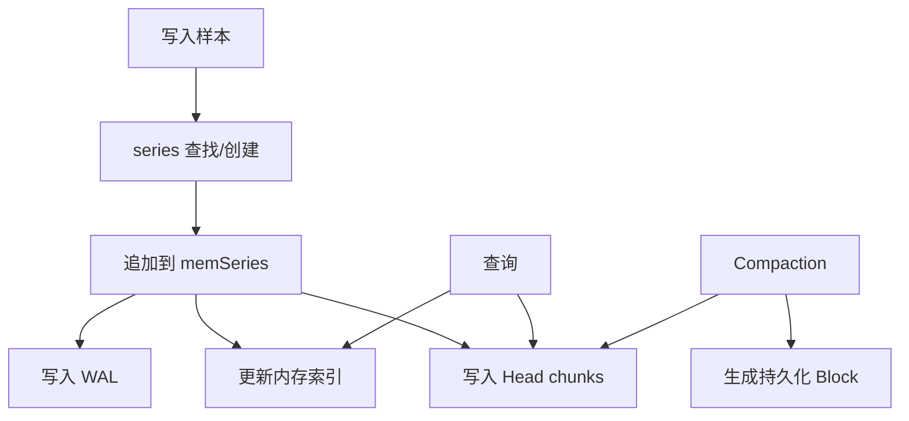
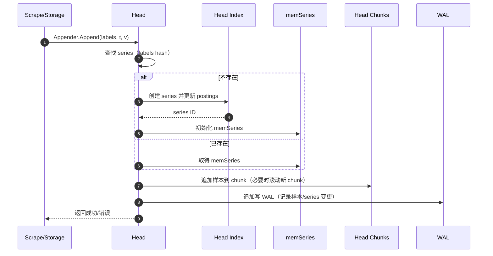

# 第 13 课：TSDB 深入 - Head Block

**学习时长**：3-4 小时  
**难度等级**：⭐⭐⭐⭐ 深入  
**先修要求**：完成第 12 课 - 数据查询流程

---

## 学习目标

完成本课程后，你将能够：

- ✅ 说清 Head Block 在 TSDB 里的职责（接收写入、服务最近查询）
- ✅ 理解 Head 的关键数据结构：Series、Chunk、Index（内存索引视图）
- ✅ 理解样本写入 Head 的基本流程（series 查找/创建、追加 chunk、写 WAL）
- ✅ 理解 Head 如何支撑查询（按标签找 series、按时间取样本）
- ✅ 能把常见问题映射到 Head（高基数、内存上涨、写入慢、重启恢复慢）

---

## 13.1 Head Block 是什么

Head Block 是 Prometheus TSDB 的“当前工作区”：

- 接收最新写入的样本
- 提供最近时间窗口的查询
- 后台会把 Head 里的数据切块并落盘为持久化 Block（Compaction 的输入）

直觉理解：

- Head：最新数据（热数据），主要在内存里
- Blocks：历史数据（冷数据），主要在磁盘上

---

## 13.2 Head 里主要有哪些东西

可以把 Head 拆成三类能力：

1) **写入与恢复**
- 接收样本追加写入
- 通过 WAL/Checkpoint 支持崩溃恢复

2) **内存索引（用于查询选出 series）**
- 根据 label 匹配快速找出“哪些 series 可能命中”

3) **样本存储（用于查询读取样本点）**
- 每条 series 会被分成多个 chunk
- chunk 做压缩，避免内存爆炸

### 13.2.1 Mermaid 结构图（Head 内部视角）



---

## 13.3 写入时发生了什么：从 sample 到 memSeries

写入时的关键点是：先确定“这条样本属于哪条时间序列（series）”，再把值追加进去。

一个 series 的身份由 `metric_name + labels` 唯一确定。

### 13.3.1 写入的核心步骤

1) **把 labels 规范化**：例如排序、去重、必要的 label 校验  
2) **查找 series**：用 labels 的哈希/引用快速定位  
3) **不存在则创建**：分配新的 series ID，并把它加入索引  
4) **追加样本**：
- 时间戳必须合理（通常是递增）
- 落到当前 chunk；chunk 满了就开新 chunk
5) **记录可恢复信息**：写入 WAL（追加写）

### 13.3.2 Mermaid 时序图（写入一次样本）



---

## 13.4 Chunk：为什么要分块

如果把每条 series 的所有样本都放在一个大数组里：

- 内存增长快
- 查询范围大时读取成本高
- 压缩机会少

因此 Prometheus 会把每条 series 切分成多个 chunk：

- chunk 通常覆盖一段时间范围
- chunk 内部做压缩（节省内存/磁盘）
- 查询按时间范围只读必要的 chunk

你在磁盘目录里可能会看到与 Head 相关的文件/目录（不同版本略有差异）：

- `wal/`：写入日志
- `chunks_head/`：Head 的 chunk 相关数据（用于落盘/恢复/减少内存压力）

---

## 13.5 Head 的“索引”怎么理解（按标签找 series）

PromQL 查询的第一步通常是“选出 series”，例如：

`up{job="node-exporter",instance=~"node.*"}`

这一步不需要读样本值，关键是根据标签快速筛选。

直觉上可以把 Head 的索引理解为：

- 把 `label_name=label_value` 映射到一组 series ID
- 多个标签条件就是对 series ID 集合做交集/并集/差集

这也是为什么“标签基数太高”会导致问题：

- series 数量暴涨，索引与 series 本身都占内存

---

## 13.6 重启恢复：为什么 WAL 会影响启动速度

Prometheus 崩溃或重启后，Head 需要被恢复出来：

- Head 在内存里，不能直接依赖内存状态
- WAL 记录了写入顺序，重启时回放 WAL 还原 Head

WAL 太大时，恢复会变慢，常见原因：

- 抓取量大
- 保留时间长且 compaction/截断进度慢
- 高基数导致写入量与索引更新量大

---

## 13.7 Head 相关的常见指标与问题定位

只要记住一条排查主线：

> 先看 series 数量，再看写入/查询是否受影响。

常用指标（Prometheus 自身会暴露）：

```promql
prometheus_tsdb_head_series
prometheus_tsdb_head_chunks
prometheus_tsdb_wal_writes_total
```

典型现象与原因：

- `head_series` 持续暴涨：高基数（labels 维度爆炸）
- 写入变慢：磁盘 IO（WAL）、锁竞争、目标过多导致写入压力过大
- 重启恢复慢：WAL 回放时间长，通常与写入量/基数有关

---

## 13.8 源码阅读建议（按最小闭环）

本课推荐按“写入 → WAL → 查询”顺序读：

1) `tsdb/head.go`：Head 的主体结构与生命周期  
2) `tsdb/head_append.go` / `tsdb/head_append_v2.go`：写入/追加路径  
3) `tsdb/head_wal.go`：WAL 相关逻辑（记录与回放）  
4) `tsdb/head_read.go`：从 Head 读取样本/查询相关  
5) `tsdb/head_test.go`：用测试理解边界条件与预期行为  

---

## 课后小结

- Head Block 是 TSDB 的写入入口与最近查询的核心
- 写入核心：找到/创建 series → 追加到 chunk → 写 WAL → 更新索引
- 查询核心：先按标签从索引选 series，再按时间从 chunk 取样本
- 高基数会直接打到 Head：series 多、内存大、恢复慢、查询慢

