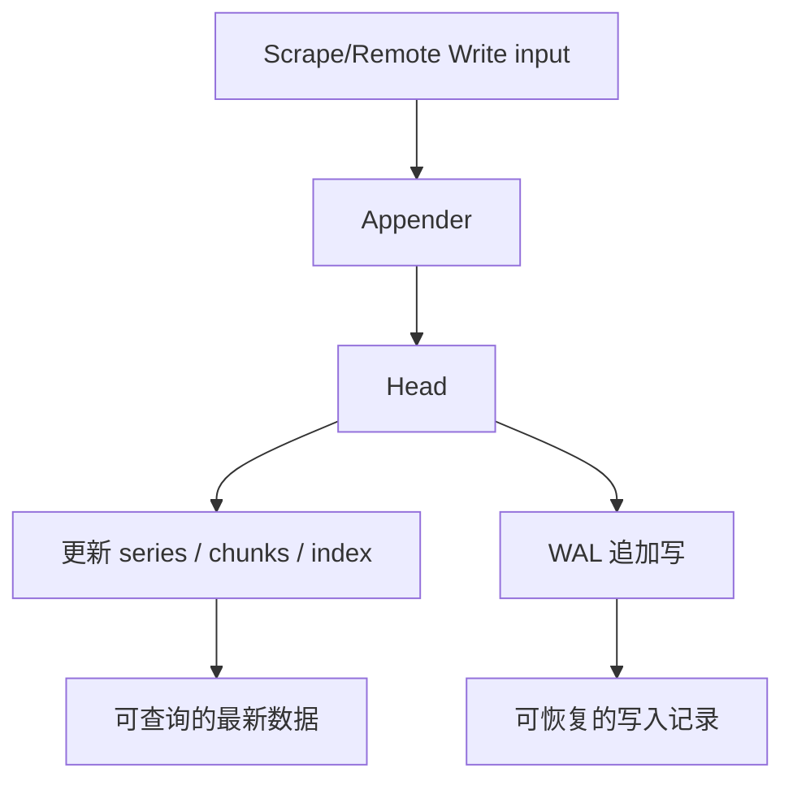
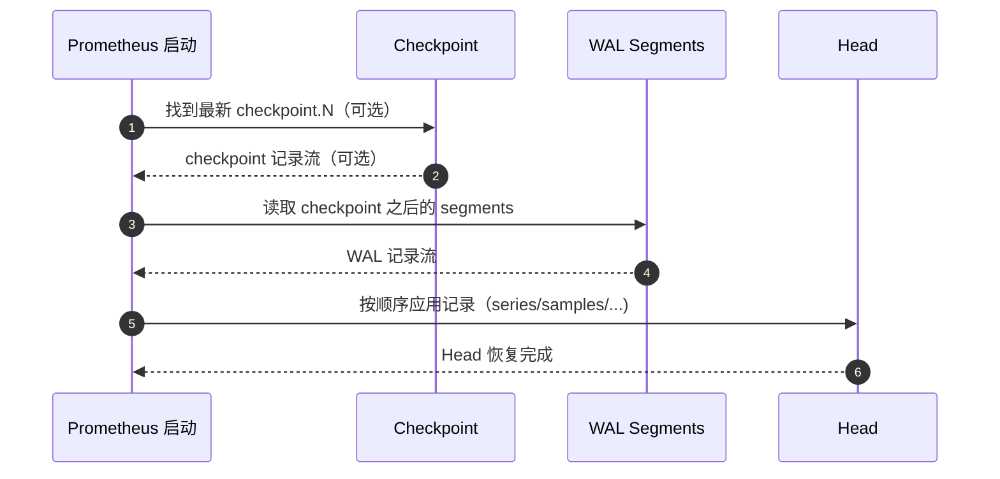

# 第 14 课：TSDB 深入 - WAL 与恢复

**学习时长**：3-4 小时  
**难度等级**：⭐⭐⭐⭐ 深入  
**先修要求**：完成第 13 课 - TSDB 深入 - Head Block

---

## 学习目标

完成本课程后，你将能够：

- ✅ 说清 WAL（Write-Ahead Log）在 TSDB 中的作用：可恢复、追加写、顺序 IO
- ✅ 了解 WAL 的基本存储形态：分段（segment）+ 分页（page）+ 记录（record）
- ✅ 理解“写入 WAL”和“回放 WAL”分别在做什么
- ✅ 理解 Checkpoint 的意义：加速恢复 + 允许截断旧 WAL
- ✅ 能用现象定位问题：WAL 过大、恢复慢、WAL 损坏与修复

---

## 14.1 WAL 是什么，解决什么问题

Head 在内存里，进程崩溃会丢内存状态。WAL 的目标就是：

- 写入时把关键变更追加到磁盘
- 重启时按写入顺序回放，恢复 Head

一句话总结：

> WAL 是 Head 的“操作记录”，确保崩溃后能把 Head 还原出来。

---

## 14.2 WAL 在写入链路中的位置

写入时，样本会进入 Head，同时把变更写入 WAL：

你只需要记住一个直觉：

- Head 负责“可查”
- WAL 负责“可恢复”

---

## 14.3 WAL 存储形态：Segment / Page / Record

Prometheus 的 WAL 不是一个大文件，而是一组分段文件：

- 每个段文件叫一个 **segment**
- segment 文件名是数字（例如 `00000000`、`00000001`）
- 默认单个 segment 大小上限是 128MB

为了让写入更稳定，segment 内部按固定大小写入：

- **page**：32KB
- **record**：写入的逻辑记录（比如 series、samples、tombstones 等）

两个关键点：

- record 可能跨 page（必要时会拆分）
- record 不会跨 segment（便于安全截断旧 segment）

---

## 14.4 记录（Record）里通常有什么

WAL 里记录的不是“文本指标”，而是 TSDB 的内部增量信息，常见类型包括：

- Series：某个 series 的定义（labels + seriesID）
- Samples：某些 series 的样本点
- Tombstones：删除标记（逻辑删除）
- Exemplars：样本的 exemplar（如果启用）
- Metadata：指标元数据（如果启用）
- HistogramSamples / FloatHistogramSamples：直方图相关样本（版本相关）

直觉理解：

- Series 先把“名字和身份”写清楚
- Samples 再把“这个身份的值”写进去

---

## 14.5 写入 WAL：为什么追加写很快

WAL 的写入基本是顺序追加：

- 不做随机写
- 主要是 append + 周期性 fsync
- 减少磁盘寻道与碎片化

因此 WAL 写入通常很快，瓶颈更多来自：

- 磁盘 IO 很差（或同盘有重负载）
- 写入量过大（抓取目标太多、样本太多）
- 高基数导致 series 创建/索引更新开销大

---

## 14.6 回放 WAL：重启时为什么会慢

Prometheus 重启时，需要把 Head 恢复出来。直觉流程是：

1) 找到“最新的 checkpoint”（如果存在）
2) 从 checkpoint 开始读取记录
3) 再读取 checkpoint 之后的 wal segments
4) 按顺序解码 record，并应用到 Head（创建 series、追加样本、应用 tombstones 等）

恢复慢的常见原因：

- WAL 太大（写入量大或截断不及时）
- 高基数（series 多，索引构建耗时）
- 磁盘 IO 差（读取与解码慢）

---

## 14.7 Checkpoint：为什么需要它

如果每次重启都从第一个 wal segment 开始回放，WAL 越积越大，启动就会越来越慢。

Checkpoint 的目标是：

- 把一段旧 WAL 压缩成一个更“短”的可回放版本
- 让系统可以安全地截断旧 segment

Checkpoint 的形态：

- 存在 WAL 目录下的 `checkpoint.N/` 目录（N 是一个整数）
- 内部也按 WAL 的分段格式存储，便于统一用同一套 Reader 读取

Checkpoint 的生成、筛选与截断策略细节较多，单独整理在文档中：

- [第 14.7 课-TSDB 深入 - Checkpoint 机制详解](./第%2014.7%20课-TSDB%20深入%20-%20Checkpoint%20机制详解.md)

---

## 14.8 WAL 截断与清理：什么时候会发生

Prometheus 会在后台周期性做：

- 创建 checkpoint（覆盖一段旧 WAL）
- 截断旧 segment（删除或跳过不再需要的段）
- 删除更老的 checkpoint（保留最新即可）

直觉判断：

- 有 checkpoint：说明系统在“整理旧 WAL”
- WAL 段数量持续增加且不减少：说明“整理跟不上写入”或受限于某些条件

---

## 14.9 WAL 损坏（Corruption）与修复思路

WAL 是磁盘文件，极端情况下会出现损坏或“撕裂写”（例如断电、磁盘故障）。

Prometheus 的基本策略是：

- 检测到损坏后，报告损坏位置（segment + offset）
- 通过 repair 丢弃损坏点之后的数据，保证后续可继续写入

直觉理解：

> 修复的代价是“丢掉损坏点之后的那段最新数据”，换取“系统能重新启动并继续工作”。

---

## 14.10 实践：用文件与页面观察 WAL 行为

目标：把抽象概念和 `data/wal/` 目录对应起来。

1) 运行一段时间让 Prometheus 持续写入  
2) 观察 `data/wal/` 目录：是否出现递增的 segment 文件（数字文件名）  
3) 观察是否出现 `checkpoint.N/` 目录  
4) 重启 Prometheus，观察启动时是否提示 WAL replay / checkpoint 相关日志（不同版本日志略有差异）

如果你发现重启变慢，可以用这条主线排查：

- 是否 WAL 段很多/很大
- 是否 `prometheus_tsdb_head_series` 很高（高基数）
- 磁盘 IO 是否有明显瓶颈

---

## 14.11 源码阅读建议（按 WAL 最小闭环）

建议按“写入 → checkpoint → 回放 → 修复”的顺序读：

1) `tsdb/wlog/wlog.go`：WAL 写入、segment/page 组织、Repair  
2) `tsdb/wlog/reader.go`：WAL 读取与迭代  
3) `tsdb/wlog/checkpoint.go`：checkpoint 的生成与清理  
4) `tsdb/head_wal.go`：把 record 应用到 Head（回放逻辑）  
5) `tsdb/head.go`：WAL 截断逻辑（checkpoint + truncate）  

---

## 课后小结

- WAL 是 Head 的“可恢复写入记录”，核心价值是崩溃恢复
- WAL 以 segment 组织，内部用 page 批量写，record 表达 TSDB 内部增量
- Checkpoint 用来缩短回放链路，并支持截断旧 WAL
- 恢复慢通常是 WAL 大、基数高、磁盘慢；损坏修复通常意味着丢最新一段数据
