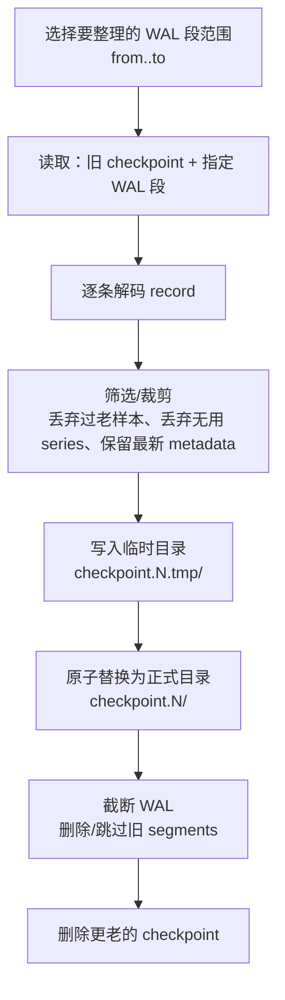
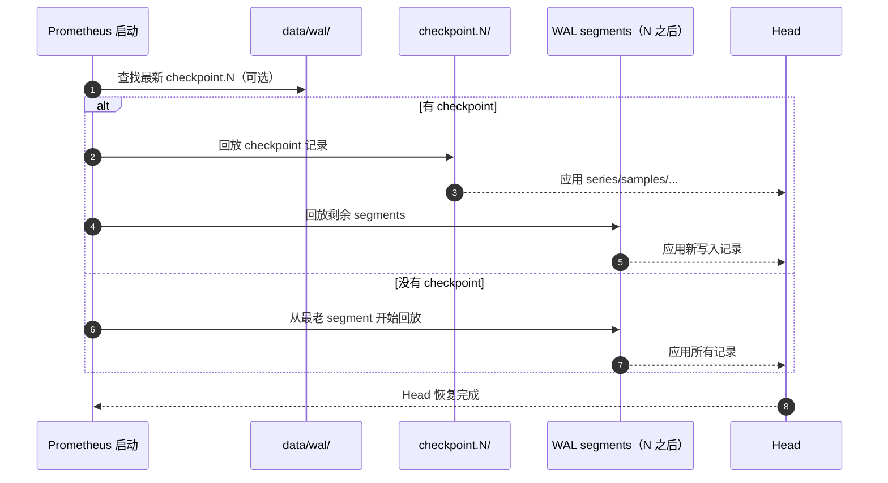

# 第 14.7 课：TSDB 深入 - Checkpoint 机制详解

**学习时长**：1-2 小时  
**难度等级**：⭐⭐⭐⭐ 深入  
**先修要求**：完成第 14 课 - TSDB 深入 - WAL 与恢复

---

## 14.7.1 Checkpoint 要解决什么问题

Prometheus 的 Head 在内存里，写入会持续追加到 WAL。重启时需要回放 WAL 才能恢复 Head。

如果 WAL 一直增长，重启时回放会越来越慢。因此需要一个机制把“很老的 WAL”变成更短、更干净、可快速回放的形式，这就是 Checkpoint。

一句话：

> Checkpoint 是对旧 WAL 的一次整理与压缩，用于加速重启恢复，并让旧 WAL 可以被安全截断。

---

## 14.7.2 Checkpoint 是什么

Checkpoint 是 WAL 的一个“快照化版本”，但它本质上仍然是 WAL 格式：

- 存在于 `data/wal/checkpoint.N/`（N 是递增编号）
- 目录里依然是分段文件（segment），文件名也是数字
- 可以像普通 WAL 一样被 Reader 顺序读取

它不是把 Head 直接序列化成一个大对象，而是把“恢复 Head 所需的记录流”整理成更短的一段。

---

## 14.7.3 什么时候会创建 Checkpoint

Prometheus 会周期性对 WAL 做整理（checkpoint + truncate），触发点通常与“截断 WAL 的时机”相关。

直觉上可以这样理解：

- WAL 里已经有一大段数据“足够旧”，继续保留只会拖慢重启
- 先把这段旧 WAL 做成 checkpoint
- 再把对应的旧 segments 截断掉

创建 checkpoint 时，通常不会把最新的 WAL 段包含进去，避免与正在写入的段纠缠。

---

## 14.7.4 Checkpoint 里包含哪些内容

Checkpoint 不是“原封不动复制旧 WAL”，它会做筛选与整理：

- 保留：恢复 Head 需要的关键信息
- 丢弃：明显不再需要的旧数据（例如早于某个时间点的样本）

在 Prometheus 的实现里，checkpoint 过程中通常会涉及这些策略：

- Series：只保留仍然需要的 series（例如仍在 Head 中存在，或短期内仍可能被引用）
- Samples：丢弃早于某个最小时间（mint）的样本
- Metadata：只保留最新元数据（避免重复）
- Tombstones/Exemplars/Histograms：按需要保留或裁剪（取决于记录类型与时间范围）

直觉总结：

> Checkpoint 让 WAL 从全量流水账变成恢复 Head 的最小必要流水账。

---

## 14.7.5 Checkpoint 生成流程（结构视角）

两个关键点：

- 先写 `checkpoint.N.tmp/`，全部成功后再切换为 `checkpoint.N/`，避免半成品影响重启
- 只有 checkpoint 落地成功，才会去截断旧 WAL

---

## 14.7.6 Checkpoint 如何加速重启恢复

没有 checkpoint：

- 启动时从最老的 WAL segment 开始回放

有 checkpoint：

- 启动时先找到最新的 `checkpoint.N/`
- 先回放 checkpoint（更短、更干净）
- 再回放 checkpoint 之后的 WAL segments（只剩较新的一小段）

恢复时间通常取决于两件事：

- 要回放的记录量（checkpoint 能显著减少）
- series 数量与索引构建成本（高基数会明显拖慢）

---

## 14.7.7 Checkpoint 与 WAL Truncate 的关系

Checkpoint 给了 WAL “安全截断”的依据：

- checkpoint 已经覆盖了旧 segments 的必要信息
- 旧 segments 可以被删除或忽略

因此，如果你观察到：

- checkpoint 目录在增长，旧的 segment 文件在减少  
通常说明 WAL 整理在正常工作。

相反，如果：

- `data/wal/` 的 segment 文件持续变多，但很少出现 checkpoint  
一般说明整理频率跟不上写入压力，或者受限于某些条件（例如数据太新、选择范围不足以 checkpoint）。

---

## 14.7.8 常见现象与排查思路

### 14.7.8.1 重启很慢

优先从这三类原因入手：

- WAL 过大：`data/wal/` 段太多/体积太大
- 高基数：`prometheus_tsdb_head_series` 很高
- 磁盘慢：读取 WAL 与解码时 IO 成本高

### 14.7.8.2 WAL 一直涨但 checkpoint 很少

常见解释：

- 系统保留了最近一段 WAL 以保证可靠性（不会把最新段 checkpoint 掉）
- 写入量太低/段太少，不满足“值得 checkpoint”的范围
- checkpoint 失败（磁盘、权限、空间不足等）

### 14.7.8.3 出现 WAL Corruption（损坏）

极端情况下 WAL 可能损坏。修复策略通常是：

- 丢弃损坏位置之后的数据，保证系统能重新启动并继续写入

代价是：

- 最新一段数据可能丢失（损坏点之后）

---

## 14.7.9 源码定位（想进一步看实现）

按“checkpoint 生成 → WAL 读取 → 回放到 Head → truncate”的顺序：

- `tsdb/wlog/checkpoint.go`：checkpoint 的生成与清理
- `tsdb/wlog/wlog.go`：WAL 的 segment/page/record 写入与 Repair
- `tsdb/wlog/reader.go`：WAL Reader
- `tsdb/head_wal.go`：回放 record 并应用到 Head
- `tsdb/head.go`：触发 checkpoint 与截断 WAL 的逻辑

