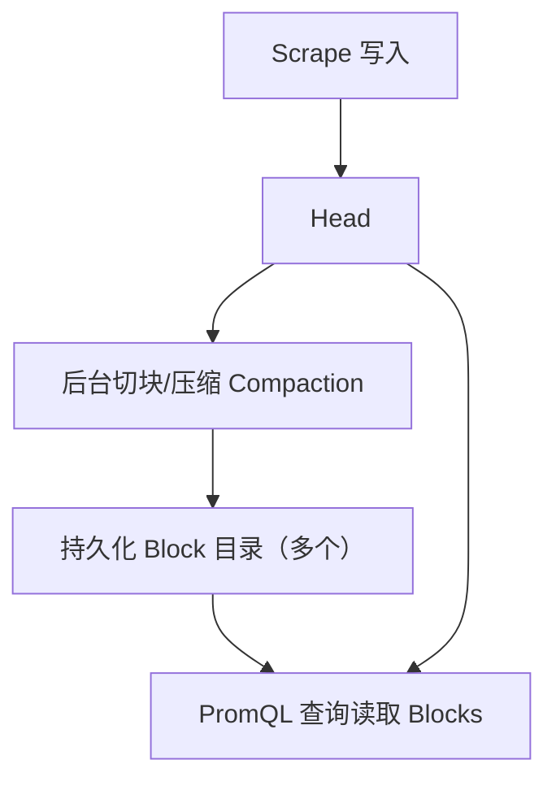
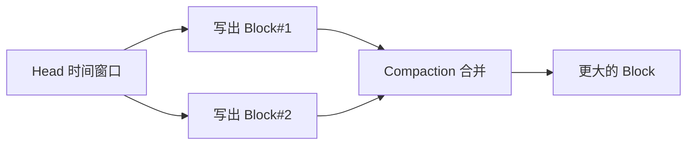

# 第 15 课：TSDB 深入 - 持久化 Block

**学习时长**：3-4 小时  
**难度等级**：⭐⭐⭐⭐ 深入  
**先修要求**：完成第 14 课 - TSDB 深入 - WAL 与恢复

---

## 学习目标

完成本课程后，你将能够：

- ✅ 说清持久化 Block 在 TSDB 里的职责（存历史数据、服务历史查询）
- ✅ 看懂一个 Block 目录里最重要的文件：`chunks/`、`index`、`meta.json`、`tombstones`
- ✅ 理解 Block 是怎么从 Head 产生的（切块 + compaction）
- ✅ 理解查询为什么需要 index（按标签找 series）和 chunks（取样本）
- ✅ 理解 tombstones 的作用（逻辑删除）以及它对查询/压缩的影响

---

## 15.1 Block 在 TSDB 里的位置

TSDB 的数据分两层：

- Head：最新数据（主要在内存里）
- Blocks：历史数据（落盘后的持久化块）

你可以把 Block 理解为：一段时间范围内的“历史归档包”，查询历史数据主要读 Block。



---

## 15.2 Block 目录长什么样

Prometheus 的 `data/` 目录下通常会有多个 Block 目录，目录名是一串 ULID（看起来像随机字符串），例如：

```
data/
  01J0...3K/          # 一个 Block（ULID）
    chunks/
    index
    meta.json
    tombstones        # 可选：有删除时才会出现或变更
```

你只需要抓住一个要点：

> Block = index（找谁）+ chunks（读值）+ meta（说明书）+ tombstones（删除记录）。

---

## 15.3 meta.json：这包数据的“说明书”

`meta.json` 是理解 Block 的最快入口，通常包含：

- 这个 Block 的时间范围（minTime / maxTime）
- compaction 的层级信息（这个 Block 是怎么合并来的）
- 统计信息（series 数、samples 数、chunk 数等）

实践建议：

- 打开任意一个 `meta.json`，先确认时间范围
- 再看统计信息，理解这个 Block 的规模

---

## 15.4 index：为什么查询必须先读它

PromQL 查询通常先做“选出匹配的时间序列（series）”，再去读样本。

例如：

`rate(http_requests_total{job="web",method="GET"}[5m])`

这里的关键问题是：怎么快速找出所有满足 `job="web" AND method="GET"` 的 series？

Block 的 `index` 文件提供的就是这类能力：

- 标签名/标签值到 series 的映射（常见实现是倒排索引）
- postings 列表（满足某个 label pair 的一组 series 引用）
- 让引擎可以对 postings 做交集/并集，快速得到目标 series 集合

直觉总结：

> index 负责把“标签过滤”变成一次高效的查找，而不是扫描所有 series。

---

## 15.5 chunks/：样本真正存在哪里

`chunks/` 目录里存的是样本数据（压缩后的 chunk）。

你可以把 chunk 理解为：

- 每条 series 的样本会被切成多个小段（chunk）
- 每个 chunk 覆盖一段时间范围
- chunk 会压缩，减少磁盘与 IO

查询时的目标是：

- 先从 index 找到 series
- 再根据 series 的 chunk metas（时间范围、引用）去读 chunks
- 只读取落在查询时间范围内的 chunk，避免全量读取

---

## 15.6 tombstones：删除为什么是“逻辑删除”

Prometheus 支持删除时间序列或时间范围的数据，但通常不是立刻把 chunks 物理抹掉，而是先记录删除信息：

- tombstones 记录“哪些 series 的哪些时间段被标记删除”
- 查询时会应用 tombstones，避免返回被删除的数据

这带来一个直觉：

- 删除后磁盘不一定立刻变小
- 后台 compaction/清理阶段会逐步把删除真正反映到磁盘占用上

---

## 15.7 Block 怎么从 Head 产生：Compaction 的直觉流程

把 Compaction 想成“把 Head 里的一段数据打包成 Block，并不断合并小包为大包”：

1) Head 累积到一定时间范围  
2) 把这段范围内的数据切成 chunks，写入 `chunks/`  
3) 为这些 chunks 写 `index` 与 `meta.json`  
4) 后台把多个小 Block 合并成更大 Block（减少文件数量，提高压缩率）  



---

## 15.8 查询视角：为什么历史查询更“贵”

历史查询通常更重，原因很简单：

- 时间范围更大，需要读更多 Blocks
- 每个 Block 都要做一次“按标签选 series → 读 chunk → 计算”
- 高基数会放大 postings 与 chunk 读取量

因此排障时常见的直觉策略是：

- 缩小时间范围
- 增大 step（range query 的计算次数减少）
- 减少高基数维度（避免引擎处理过多 series）

---

## 15.9 实践：打开一个 Block，按顺序看懂它

目标：不读源码也能定位“这包历史数据里有什么”。

1) 在 `data/` 下找到一个 ULID 目录  
2) 打开 `meta.json`：确认时间范围与规模  
3) 看到 `index`：知道“标签过滤靠它”  
4) 看到 `chunks/`：知道“样本值在这里”  
5) 如果有 `tombstones`：说明历史上发生过删除或清理动作  

---

## 15.10 源码阅读建议（想对照实现）

建议按“Block 读取 → index/chunks → 生成 Block（写）”的顺序读：

- `tsdb/block.go`：BlockReader/IndexReader/ChunkReader 的核心抽象
- `tsdb/index/`：index 的读写与 postings 相关逻辑
- `tsdb/chunks/`：chunk 的读写与引用组织
- `tsdb/blockwriter.go`：生成 Block 的写入路径
- `tsdb/tombstones/`：tombstones 的读写

---

## 课后小结

- Block 是 TSDB 的历史存储单元：index 负责找 series，chunks 负责存样本，meta 描述时间范围与统计，tombstones 负责逻辑删除
- Block 由 Head 经 compaction 写出，并不断合并以提升压缩率与查询效率
- 历史查询更贵的根因是“时间范围更大 + 读更多 Blocks + 处理更多 series”

