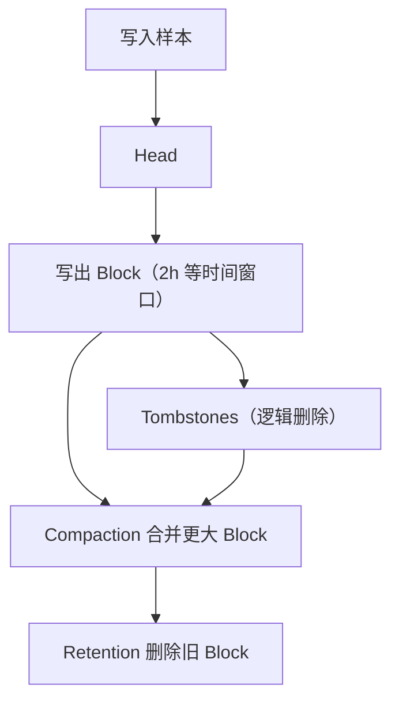
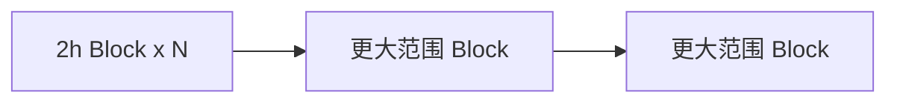

# 第 16 课：TSDB 深入 - 压缩与保留

**学习时长**：3-4 小时  
**难度等级**：⭐⭐⭐⭐ 深入  
**先修要求**：完成第 15 课 - TSDB 深入 - 持久化 Block

---

## 学习目标

完成本课程后，你将能够：

- ✅ 说清 Compaction 在做什么：合并 Block、提升压缩率、提升查询效率
- ✅ 说清 Retention 在做什么：按时间/大小/比例删除旧数据，限制磁盘占用
- ✅ 把“删除数据后磁盘不立刻下降”与 tombstones/compaction 关联起来
- ✅ 能用 `data/` 目录现象判断系统是否在正常压缩与清理
- ✅ 了解常见性能瓶颈：高基数、Block 过多、时间范围过大、磁盘 IO

---

## 16.1 一条线看懂：数据从写入到清理的生命周期



你只需要记住两个直觉：

- Compaction 让历史数据“更少文件、更高压缩、更好查”
- Retention 让存储“不会无限增长”

---

## 16.2 Compaction（压缩合并）在做什么

### 16.2.1 为什么需要 Compaction

如果只不断写出小 Block，会遇到三个问题：

- Block 数量越来越多，查询要打开/扫描更多文件
- 压缩率不够好（小块难以获得更好的压缩）
- tombstones（删除记录）长期存在，会让查询成本变高

Compaction 的目标：

- 合并多个小 Block 变成更大 Block
- 清理 tombstones 对数据的影响（把逻辑删除逐步变成物理结果）
- 降低查询需要触碰的 Block 数量

### 16.2.2 “分层合并”的直觉

Compaction 通常是分层进行的：先合并小范围，再合并大范围。



你可以把它理解为“后台整理归档”：

- 先把零散的小包合成中包
- 再把中包合成大包

### 16.2.3 Compaction 的常见观察现象

在 `data/` 目录里，你可能会看到：

- 小 Block 逐渐减少，大 Block 出现
- 临时目录（例如 `.tmp-for-creation` / `.tmp-for-deletion`）短暂出现后消失
- 某些 Block 最终被标记删除并移走（或变为待删除状态）

如果 Compaction 跟不上，常见表现是：

- Block 数量持续增多
- 查询明显变慢（尤其是长时间范围查询）

---

## 16.3 Retention（保留策略）在做什么

Retention 的目标是让磁盘占用“可控”，Prometheus TSDB 不是无限存储。

常见三种保留方式：

### 16.3.1 按时间保留（retention.time）

含义：只保留最近一段时间的数据，例如 15 天。

直觉：超过时间窗口的 Block 会被删除。

### 16.3.2 按大小保留（retention.size）

含义：限制 Blocks 总体占用不超过某个大小，例如 50GB。

直觉：空间不够时会优先删除最旧的 Block。

### 16.3.3 按磁盘比例保留（retention.percentage）

含义：限制 TSDB 数据最多使用磁盘的某个比例（例如 80%），避免把磁盘打满。

直觉：接近阈值时会更积极地删除旧 Block。

---

## 16.4 “数据过期处理”到底删除了什么

Retention 删除的主要对象是：**旧的持久化 Block**。

需要特别注意两点：

- 删除的是 Block（chunks/index/meta/tombstones），不是“删某几条样本”
- 如果你是通过 API/管理操作删除某些时间序列，那通常会先写 tombstones，再在后续 compaction 中逐步体现为磁盘占用下降

一句话：

> Retention 负责删旧 Block；tombstones 负责记删除；compaction 负责把“逻辑删除”逐步变成“物理结果”。

---

## 16.5 典型问题与定位思路

### 16.5.1 磁盘占用持续增长

常见原因：

- retention 配置过长/过大/未生效
- 写入量远超预期（目标太多、抓取间隔太短、指标过多）
- 高基数导致 series 爆炸，间接带来更多样本与索引膨胀

建议排查顺序：

1) 看 retention 配置（time/size/percentage 是否设置合理）
2) 看 `data/` 下 Block 数量与增长速度
3) 看 Head series 是否暴涨（高基数）

### 16.5.2 删除数据后磁盘没立刻变小

常见原因：

- 删除只产生 tombstones，物理空间要等 compaction/清理阶段才能回收
- OS 文件系统与块文件组织导致“回收不立即可见”

### 16.5.3 查询越来越慢

常见原因：

- 时间范围太大，读了很多 Block
- 维度太高，series 数量太多
- compaction 跟不上导致 Block 数量过多
- 磁盘 IO 慢，读取 chunks/index 成本高

---

## 16.6 实践：用 `data/` 目录验证压缩与保留是否正常

目标：不读源码也能看出“是否在正常整理与清理”。

1) 运行 Prometheus 一段时间，让它写出多个 Block  
2) 观察 `data/` 下 ULID 目录数量是否会阶段性变化（出现合并后数量减少）  
3) 随时间推移，最旧的 Block 是否会被删除（符合 retention.time/size/percentage）  
4) 如果你做过删除操作，观察是否出现/更新 `tombstones`，以及后续 compaction 是否让旧数据逐步消失  

---

## 16.7 配置示例（最小可用）

Prometheus 推荐在配置文件里设置 TSDB retention（命令行 flag 在新版本里已逐步弱化）。

```yaml
storage:
  tsdb:
    retention:
      time: 15d
      size: 50GB
      percentage: 80
```

实践建议：

- 生产环境优先保证不会打满磁盘（percentage 或 size）
- time 以业务回溯需求为准

---

## 16.8 源码阅读建议（想对照实现）

建议按“compaction → block 写入 → retention/清理”的顺序读：

- `tsdb/compact.go`：Compactor 的计划与合并逻辑
- `tsdb/blockwriter.go`：Block 写出路径
- `tsdb/db.go`：DB 生命周期、块加载、保留策略与清理入口
- `tsdb/tombstones/`：tombstones 的读写与应用

---

## 课后小结

- Compaction 解决“块多、查慢、压缩不佳、删除难回收”的问题
- Retention 解决“磁盘无限增长”的问题，主要删除旧 Block
- tombstones + compaction 共同决定“删除何时真正释放空间”
- 长期稳定运行的关键：合理 retention + 控制基数 + 让 compaction 跟得上写入

