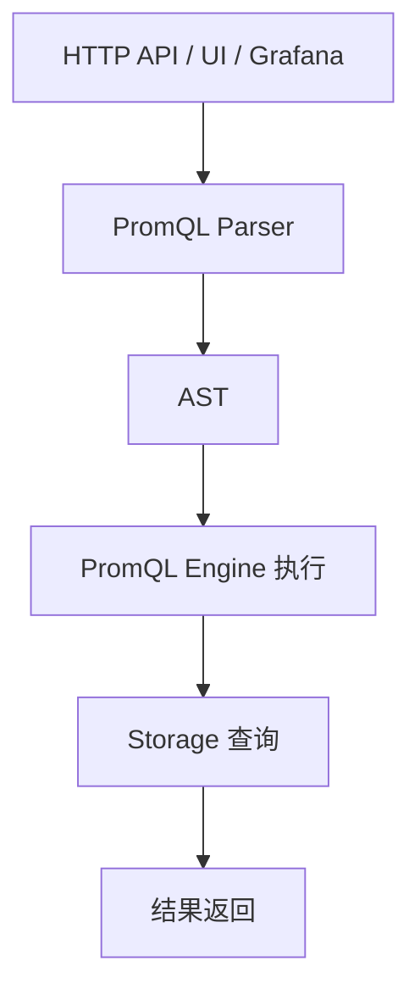

# 第 17 课：PromQL 引擎 - 解析器

**学习时长**：3-4 小时  
**难度等级**：⭐⭐⭐⭐ 深入  
**先修要求**：完成第 12 课 - 数据查询流程

---

## 学习目标

完成本课程后，你将能够：

- ✅ 理解 PromQL 解析器的职责：把查询字符串变成 AST
- ✅ 理解解析的三段：Lexer（分词）→ Parser（语法）→ AST（结构）
- ✅ 说清“语法错误”与“语义错误”的区别
- ✅ 能在源码中定位 PromQL 解析入口与关键文件
- ✅ 能用一个 PromQL 示例把 token 与 AST 节点对应起来

---

## 17.1 解析器在查询链路中的位置

PromQL 查询的前半段可以抽象为：



本课只关注 Parser 这一段：把文本变成“结构化表达式树（AST）”。

---

## 17.2 解析三件套：Lexer / Parser / AST

### 17.2.1 Lexer（词法分析）

Lexer 把字符流切成 token（词元），例如：

- 标识符（metric 名、函数名）
- 字符（`{` `}` `(` `)` `[` `]` `,`）
- 关键字（`by`、`without`、`on`、`ignoring`、`offset` 等）
- 运算符（`+` `-` `*` `/` `and` `or` `unless` 等）

Prometheus 的 PromQL lexer 入口在：

- `promql/parser/lex.go`

### 17.2.2 Parser（语法分析）

Parser 根据语法规则把 token 组装成 AST 节点，决定结合顺序（优先级、结合性）以及结构是否合法。

Prometheus 的 PromQL parser 入口在：

- `promql/parser/parse.go`
- `promql/parser/generated_parser.y`（语法规则）
- `promql/parser/generated_parser.y.go`（生成后的语法解析器）

### 17.2.3 AST（抽象语法树）

AST 是 PromQL 的结构化表示，后续执行引擎会基于 AST 做：

- 类型检查与补充信息
- 选择 series、读取样本
- 执行函数/聚合/二元运算

Prometheus 的 AST 类型定义在：

- `promql/parser/ast.go`

---

## 17.3 Prometheus 里的解析入口在哪里

最常用的入口方法是：

- `parser.NewParser(opts).ParseExpr(query)`

对应源码：

- `promql/parser/parse.go`

解析过程大致是：

1) `NewParser` 创建解析器对象  
2) `ParseExpr` 生成底层 parser 实例，调用 `parseExpr()`  
3) `parseExpr()` 使用 generated parser 完成语法分析  
4) 返回 AST（或返回解析错误）

---

## 17.4 示例：把 PromQL 拆成 token 与 AST

用一个例子贯穿本课：

```promql
sum by (job) (rate(http_requests_total{status=~"5.."}[5m]))
```

### 17.4.1 直觉 token 列表（不追求完全覆盖）

- `sum`（聚合器）
- `by`（关键字）
- `(` `job` `)`（分组标签列表）
- `(` `rate` `(` … `)` `)`（函数调用嵌套）
- `http_requests_total`（metric identifier）
- `{ status=~"5.." }`（label matchers）
- `[5m]`（range selector）

### 17.4.2 AST 的直觉结构

你可以把它理解为“从外到内”一层层包裹：

- AggregateExpr：`sum by(job) (...)`
  - Call：`rate(...)`
    - VectorSelector：`http_requests_total{status=~"5.."}` + Range(`[5m]`)

对应的 AST 类型在 `promql/parser/ast.go` 里能找到，例如：

- `AggregateExpr`
- `Call`
- `VectorSelector`

---

## 17.5 “语法错误” vs “语义错误”

### 17.5.1 语法错误（Parser 能直接判断）

例子：

```promql
sum by (job rate(http_requests_total[5m]))
```

缺少括号/结构不符合语法规则，解析阶段就会报错。

### 17.5.2 语义错误（解析通过，但后续执行/类型检查失败）

例子：

```promql
rate(1[5m])
```

语法上没问题，但 `rate()` 需要的是范围向量，`1` 是标量，后续阶段会报类型错误。

直觉记法：

- 语法错误：句子都写不对
- 语义错误：句子写对了，但意思不通

---

## 17.6 源码阅读建议（最小闭环）

推荐按“入口 → lexer → grammar → AST”顺序看：

1) `promql/parser/parse.go`：解析入口、对外 API  
2) `promql/parser/lex.go`：token 定义、关键词/运算符识别  
3) `promql/parser/generated_parser.y`：PromQL 的语法规则（看懂大概结构即可）  
4) `promql/parser/ast.go`：AST 节点类型（重点看 AggregateExpr/BinaryExpr/Call/VectorSelector）  

---

## 课后小结

- Parser 的输出是 AST，执行引擎只跟 AST 打交道
- Lexer 决定 token，Parser 决定结构与优先级，AST 决定后续执行的输入形态
- 语法错误在解析阶段就失败，语义错误通常在类型检查/执行阶段暴露

