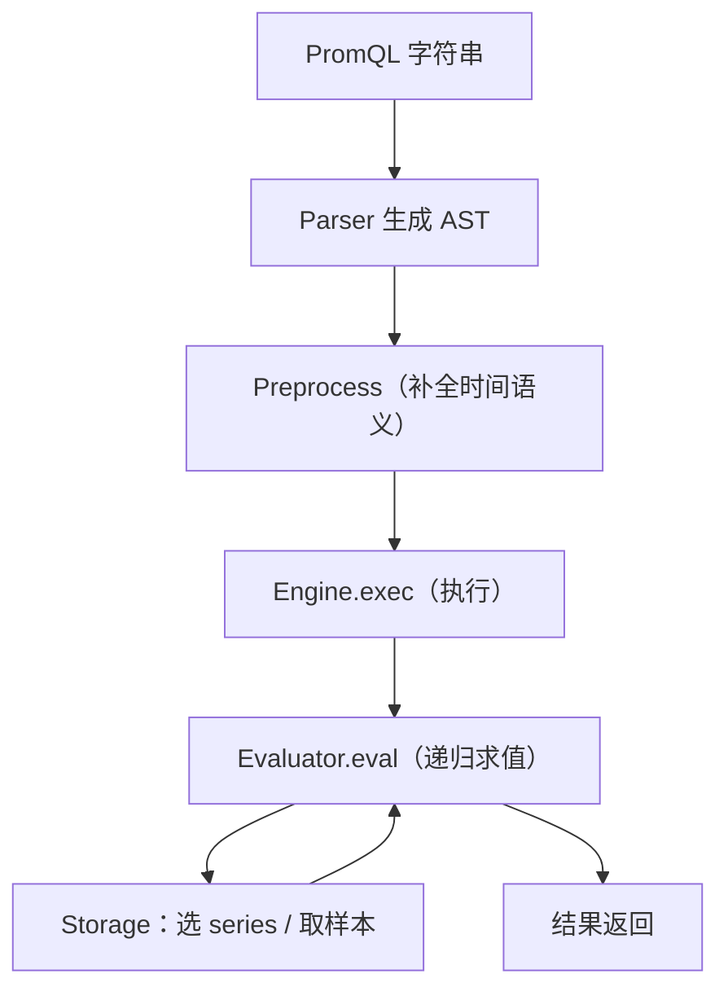

# 第 18 课：PromQL 引擎 - 执行器

**学习时长**：4-5 小时  
**难度等级**：⭐⭐⭐⭐ 深入  
**先修要求**：完成第 17 课 - PromQL 引擎 - 解析器

---

## 学习目标

完成本课程后，你将能够：

- ✅ 说清一次查询在 Engine 内部的主流程：Parse → Preprocess → Exec → Eval
- ✅ 理解 Instant Query 与 Range Query 在执行器中的区别
- ✅ 理解执行的核心思路：先选 series，再读样本，再做运算/聚合
- ✅ 理解常见保护机制：超时、取消、最大样本数（max samples）
- ✅ 能在源码中定位执行器关键入口与核心方法

---

## 18.1 执行器在查询链路中的位置

PromQL 的执行器是“把 AST 算出结果”的那部分：



---

## 18.2 两类 Query：Instant vs Range

Prometheus Engine 提供两类创建 Query 的入口：

- Instant：`NewInstantQuery(ctx, queryable, opts, qs, ts)`
- Range：`NewRangeQuery(ctx, queryable, opts, qs, start, end, interval)`

它们的共同点：

- 都会先 `ParseExpr(qs)` 得到 AST
- 都会做 `PreprocessExpr(...)` 给表达式补充“时间相关语义”

不同点：

- Range Query 必须是 Scalar 或 instant Vector（源码里会检查）
- Range Query 会按 step（interval）在多个时间点重复评估

---

## 18.3 从入口到执行：一次查询的主流程

把一次查询从入口到结果串起来：

### 18.3.1 入口：NewInstantQuery / NewRangeQuery

以 Instant 为例，关键步骤是：

1) `ParseExpr(qs)`：解析成 AST  
2) `validateOpts(expr)`：校验是否使用了被禁用的语法特性（例如 `@`、负 offset）  
3) `PreprocessExpr(expr, start, end, interval)`：补全/调整 AST  
4) 返回 `Query` 对象，之后调用 `Exec(ctx)` 执行

源码入口位置：

- `promql/engine.go`：`NewInstantQuery`、`NewRangeQuery`

### 18.3.2 执行：Query.Exec → Engine.exec

执行时会进入：

- `(*query).Exec(ctx)` → `(*Engine).exec(ctx, q)`

这里会做一些“查询生命周期管理”：

- 当前查询计数（metrics）
- 设置超时（context with timeout）
- 可选的 query logging
- 最终返回结果或错误

---

## 18.4 Preprocess：为什么需要它

Preprocess 的目的可以用一句话概括：

> 让表达式在“给定的时间范围与步长”下可以被稳定评估，并把一些时间修饰语下推到合适的位置。

直觉上你可以把它看成“执行前的整理”：

- 把某些修饰符与时间边界对齐
- 处理子查询 step 的默认策略
- 让后续 evaluator 不用重复做相同的准备工作

---

## 18.5 Evaluator.eval：执行器的核心

执行器的核心通常是一个递归求值过程：

- 遇到 AST 节点（聚合、二元运算、函数、selector…）
- 先求子表达式的值
- 再按节点规则组合成结果

可以用一个典型例子来理解“从内到外求值”：

```promql
sum(rate(http_requests_total[5m])) by (job)
```

求值顺序直觉是：

1) `http_requests_total[5m]`：先选 series，再从 storage 取 5m 范围内样本
2) `rate(...)`：对每条 series 的样本做 rate 计算
3) `sum by(job)`：按 job 聚合

核心原则：

> 先选 series（标签过滤），再读样本（按时间范围），最后做计算（函数/聚合/向量匹配）。

---

## 18.6 Storage 交互：为什么“先选 series”很关键

执行器与 storage 的交互通常分两步：

1) **series selection**：根据 label matchers 找到匹配的 series  
2) **sample loading**：按时间范围读取样本（chunks）  

这也是高基数为什么会让查询变慢：

- series 选择阶段候选集很大
- 样本读取与计算阶段被放大

---

## 18.7 保护机制：超时、取消、最大样本数

为了避免单个查询拖垮 Prometheus，执行器通常有三类保护：

### 18.7.1 超时与取消

- 超时：`context.WithTimeout`，超过超时直接终止
- 取消：调用 `Query.Cancel()` 或上层请求取消

### 18.7.2 最大样本数（max samples）

执行器会统计“本次查询加载/处理的样本数量”，超过阈值会报错（防止 OOM）。

直觉理解：

- 时间范围越大，样本越多
- series 越多，样本越多
- step 越小（range query），重复评估次数越多

---

## 18.8 Range Query：为什么更容易慢

Range Query 的本质是“按 step 反复算”：

- step 越小，计算次数越多
- 选择的 series 越多，每一步的计算量越大
- 时间范围越长，总体计算量越大

直觉公式：

> 总计算量 ≈ 评估点数量（(end-start)/step） × 每次评估的代价（series 数 × 每条 series 的样本量）

---

## 18.9 源码阅读建议（最小闭环）

按“入口 → exec → eval → storage 交互”的顺序读：

1) `promql/engine.go`：`NewInstantQuery` / `NewRangeQuery` / `exec`
2) `promql/engine.go`：`evaluator.eval(...)`（核心递归求值）
3) `promql/functions.go`：函数计算（如 rate、increase、histogram 相关）
4) `promql/parser/ast.go`：遇到不熟的 AST 节点就回来看定义

---

## 课后小结

- 执行器做的事：把 AST 在给定时间范围内评估成结果
- Instant 算一次，Range 按 step 算多次，Range 更容易慢
- 性能关键：series 数、时间范围、step，三者决定样本量与计算量
- 保护机制很重要：超时、取消、max samples 防止查询拖垮系统

