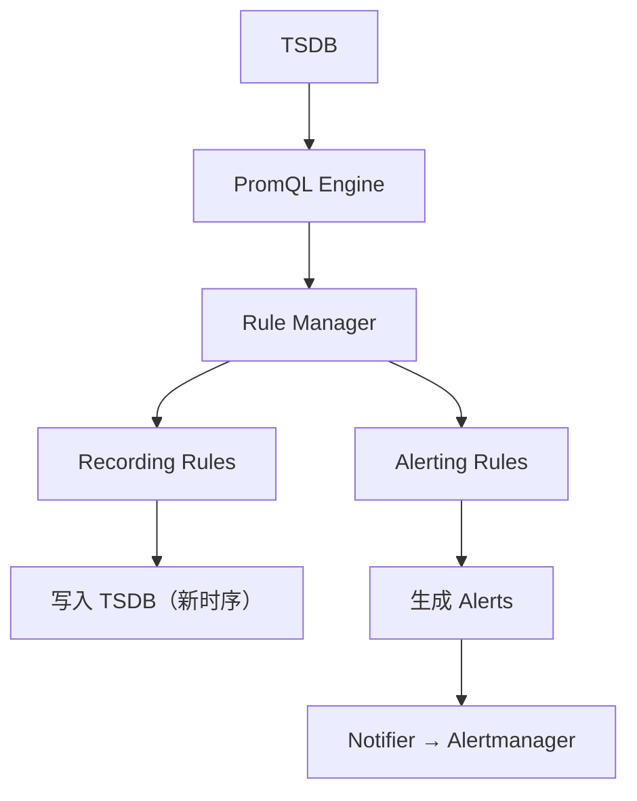

# 第 19 课：告警与规则管理

**学习时长**：3-4 小时  
**难度等级**：⭐⭐⭐ 进阶  
**先修要求**：完成第 18 课 - PromQL 引擎 - 执行器

---

## 学习目标

完成本课程后，你将能够：

- ✅ 理解 Prometheus 规则系统的两类规则：Recording / Alerting
- ✅ 说清 Rule Manager / Group / Rule 的关系与职责
- ✅ 理解规则评估的基本流程：定时评估 → 写入结果 → 发送告警
- ✅ 理解告警状态流转：Inactive → Pending → Firing → Resolved
- ✅ 能写出一个可用的规则文件，并在 UI 中验证效果

---

## 19.1 规则系统在 Prometheus 的位置

Prometheus 的规则系统做两件事：

- **Recording Rule**：把复杂查询预计算成新指标（写回 TSDB），让查询更快、更稳定
- **Alerting Rule**：定时判断条件是否满足，触发告警并推送给通知组件（Notifier/Alertmanager）



---

## 19.2 三个核心概念：Manager / Group / Rule

你可以用“班级模型”理解：

- Manager：管理所有班级，负责加载规则文件、启动/停止评估
- Group：一个班级，一组规则，按同一个 interval 周期评估
- Rule：一条规则，可能是 recording，也可能是 alerting

源码位置对应：

- `rules/manager.go`：Manager
- `rules/group.go`：Group（评估周期与评估流程）
- `rules/recording.go`：RecordingRule
- `rules/alerting.go`：AlertingRule

---

## 19.3 规则文件长什么样（最小可用）

规则文件是 YAML，最小结构：

```yaml
groups:
  - name: example
    interval: 30s
    rules:
      - record: job:http_requests:rate5m
        expr: sum by (job) (rate(http_requests_total[5m]))
      - alert: HighErrorRate
        expr: rate(http_requests_total{status=~"5.."}[5m]) > 1
        for: 2m
        labels:
          severity: page
        annotations:
          summary: "5xx 错误率过高"
```

直觉理解：

- `interval`：这组规则多久算一次
- recording 的结果会写回 TSDB（形成一个新的 time series）
- alerting 的结果会形成 alert，并根据 `for` 决定是否进入 Firing

---

## 19.4 规则评估流程：定时评估 → 写入/通知

以一个 rule group 为单位，周期性执行：

1) 到点触发（group interval）
2) 对每条 rule 执行 `rule.Eval(...)`（底层会跑 PromQL）
3) recording：把结果样本写入 TSDB
4) alerting：更新告警状态，满足条件就发通知

在源码里，Group 评估入口在：

- `(*Group).Eval(ctx, ts)`（`rules/group.go`）

Group 评估里有两个关键动作：

- 调用 `rule.Eval(...)` 得到向量结果（vector）
- 使用 `Appender` 把结果写回 TSDB（recording / staleness 等）

---

## 19.5 Recording Rule：为什么它能“加速查询”

Recording Rule 的价值是把“复杂表达式”变成“简单指标”：

例如：

```promql
sum by (job) (rate(http_requests_total[5m]))
```

如果你每次仪表盘都跑这条，成本高；写成 recording 之后：

- Prometheus 每 30s 预计算一次写入 TSDB
- Grafana 查询只需要读一个新指标 `job:http_requests:rate5m`

直觉总结：

- 用 CPU 换查询稳定性
- 用存储换查询速度

---

## 19.6 Alerting Rule：告警状态怎么流转

告警通常经历 4 个状态：

- Inactive：条件不满足
- Pending：条件满足，但还在等待 `for` 时间
- Firing：条件持续满足超过 `for`，触发告警
- Resolved：从 Firing 变回不满足（恢复），发送恢复通知（取决于通知链路）

最容易踩坑的点：

- 不写 `for`：条件一满足就会 Firing，抖动会非常明显
- `for` 太长：告警延迟太大

---

## 19.7 staleness：规则结果为什么需要“写入 StaleNaN”

如果一条 recording rule 上一次评估产生了某条 series，但下一次评估不再产生它：

- 如果什么都不做，这条旧 series 在查询里可能还会“残留一段时间”

因此，Prometheus 会对“上次存在但这次没返回”的 series 写入一个特殊值：StaleNaN，用于表示该时间序列已过期。

在 `rules/group.go` 中可以看到类似逻辑：

- 记录上一次评估返回的 series
- 本次评估没出现的，写入 staleness 标记

直觉理解：

> 规则结果也是时序数据，时序需要有“消失”的语义，否则就会产生脏数据。

---

## 19.8 并发评估：为什么不是所有规则都串行

默认情况下，组内规则通常是顺序评估，但 Prometheus 也支持并发评估（受 feature flag/控制器影响）。

并发的价值：

- 大量规则时减少总评估时间

并发的风险：

- 评估瞬时压力更大（CPU/IO）
- 如果规则之间有依赖，可能出现“先后关系”问题（需要通过设计避免或由控制器处理）

---

## 19.9 实践：在 UI 里验证规则是否生效

你可以用这几个入口验证：

- `/rules`：看规则是否加载、上次评估时间、是否报错
- `/alerts`：看告警状态（pending/firing）
- Expression Browser：查询 recording rule 写入的指标是否存在

最实用的排查顺序：

1) 规则文件是否被加载（配置 `rule_files` 是否正确）
2) `/rules` 中是否有 parse/exec 错误
3) 对表达式先在图形界面单独执行，确认表达式本身没问题

---

## 19.10 源码阅读建议（最小闭环）

建议按“入口 → group eval → rule eval → 写入/通知”顺序读：

- `rules/manager.go`：Manager 如何加载/管理 groups
- `rules/group.go`：评估主循环（最关键）
- `rules/recording.go`：recording 规则的 Eval 与 labels 处理
- `rules/alerting.go`：alerting 规则状态机与发送逻辑
- `rules/rule.go`：通用接口与基础结构

---

## 课后小结

- Recording：定时预计算并写回 TSDB，提升查询性能与稳定性
- Alerting：定时判断条件，按 `for` 形成 Pending/Firing，并推送通知链路
- Group 决定评估周期，Rule 决定评估逻辑，Manager 负责整体调度与生命周期
- 排障首选 `/rules` 与 `/alerts` 页面

