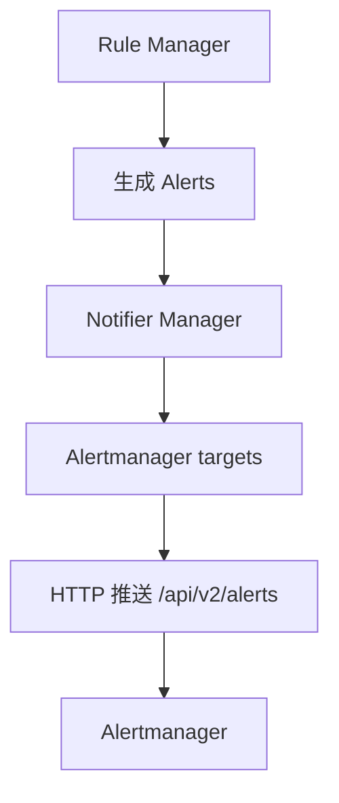

# 第 20 课：告警通知（Notifier）

**学习时长**：2-3 小时  
**难度等级**：⭐⭐⭐ 进阶  
**先修要求**：完成第 19 课 - 告警与规则管理

---

## 学习目标

完成本课程后，你将能够：

- ✅ 说清 Prometheus Notifier 的职责：把告警推送给 Alertmanager
- ✅ 理解告警从 Rule Manager 到 Notifier 再到 Alertmanager 的路径
- ✅ 理解 Notifier 的核心机制：队列、批量、重试、丢弃策略
- ✅ 知道 Alertmanager 的服务发现与 relabel 在哪里生效
- ✅ 能用 Prometheus 自监控指标定位“告警推送失败/队列堆积”

---

## 20.1 Notifier 在 Prometheus 架构中的位置

告警链路可以简化为：

Rule Manager 决定“要不要告警”，Notifier 负责“把告警可靠地送出去”。

---

## 20.2 Notifier 负责什么，不负责什么

Notifier 负责：

- 把一批 alerts 通过 HTTP 发给 Alertmanager
- 维护发送队列，控制批量大小
- 处理短期失败（网络抖动、目标暂时不可用）
- 记录发送成功/失败/丢弃的指标

Notifier 不负责：

- 告警去重、分组、路由、抑制、静默

这些属于 Alertmanager 的工作。

---

## 20.3 从规则到通知：端到端数据流

把第 19 课的 alerting rule 放进来：

1) rule group 到点评估，AlertingRule 产生 alerts  
2) Rule Manager 调用 Notifier 的 NotifyFunc 发送  
3) Notifier 把 alerts 入队（按目标 Alertmanager 分流）  
4) 后台 send loop 批量取出并发送  

源码定位：

- Notifier Manager：`notifier/manager.go`
- 发送循环：`notifier/sendloop.go`

---

## 20.4 Alertmanager 目标从哪里来（静态 + 服务发现）

Prometheus 可以通过两种方式拿到 Alertmanager 地址：

- 静态配置：直接写 URLs
- 服务发现：通过 SD 获取 Target Groups，再经过 relabel 得到最终 targets

直觉和抓取服务发现一样：

- 服务发现产出“候选目标”
- relabel 决定“最终使用哪些目标、改写哪些标签/地址”

Notifier 对 Alertmanager 同样维护“目标集合”，并且会对每个 Alertmanager 地址维护发送循环（send loop）。

---

## 20.5 队列与批量：为什么需要 send loop

Notifier 发送告警时面临两个现实问题：

- 一次规则评估可能产生很多条 alerts
- 网络可能失败或延迟，不适合在评估线程里直接同步发送

因此 Notifier 使用 send loop 的模式：

- alerts 先进入队列（QueueCapacity）
- 后台 goroutine 按批取出（MaxBatchSize）
- 发送成功就丢弃，失败则按策略处理

在 `sendloop.go` 中可以看到几个关键点：

- 队列满会丢最旧的（倾向保留最新告警）
- 单次批量不会超过 MaxBatchSize
- 有 work 信号后，循环持续发送直到队列清空

---

## 20.6 失败与丢弃：最重要的几个直觉

### 20.6.1 队列满

当队列满时：

- 新告警进来，会挤掉队列中更旧的告警
- 对应 dropped 指标会上升

直觉：Notifer 的目标是“尽快把最新状态送出去”，而不是保证每条历史告警都送达。

### 20.6.2 发送失败

常见失败原因：

- Alertmanager 不可达（网络、DNS、端口）
- TLS/鉴权配置错误
- Alertmanager 过载/限流

失败会体现在 errors 指标与日志里，同时队列可能堆积。

---

## 20.7 关闭行为：DrainOnShutdown 是什么意思

Prometheus 关闭时，Notifier 可以选择：

- DrainOnShutdown=true：尽量把队列里剩余告警发送出去再退出
- DrainOnShutdown=false：直接丢弃队列中未发送的告警

直觉选择：

- 对稳定性要求高：倾向 drain
- 希望快速退出：倾向不 drain

---

## 20.8 排错：告警为什么没到 Alertmanager

建议按这个顺序排：

1) `/alerts`：Prometheus 是否真的进入 firing（是否产生 alerts）
2) Prometheus 配置：是否配置了 alertmanagers（静态或 SD）
3) 网络连通性：Prometheus 到 Alertmanager 的 HTTP 是否通
4) Notifier 指标：是否 errors/dropped/queue_length 在上升
5) Alertmanager 侧：是否收到（UI/日志）

---

## 20.9 关键自监控指标（建议从这几条开始）

Notifier 会暴露一组 `prometheus_notifications_*` 指标（名称随版本可能略有变化），核心关注点：

- 发送成功次数（sent）
- 发送失败次数（errors）
- 丢弃数量（dropped）
- 队列长度（queue_length）
- 发送延迟（latency）

直觉用法：

- errors 上升 + queue_length 上升：发送失败且堆积
- dropped 上升：队列满或批次过大导致丢弃

---

## 20.10 源码阅读建议（最小闭环）

建议按“管理目标 → 入队 → 发送循环 → HTTP 请求”顺序读：

- `notifier/manager.go`：配置应用、Alertmanager 目标集合管理
- `notifier/alertmanagerset.go`：每个 AM 配置对应的集合
- `notifier/sendloop.go`：队列、批量、发送循环、丢弃策略
- `notifier/alertmanager.go`：和 Alertmanager API 的对接细节

---

## 课后小结

- Notifier 的核心职责是“可靠地把 alerts 推给 Alertmanager”
- 关键机制是队列 + 批量发送 + 丢弃策略，确保规则评估不被网络阻塞
- 排错先确认 firing，再看目标是否正确，最后看 notifier 的 errors/queue/dropped 指标

