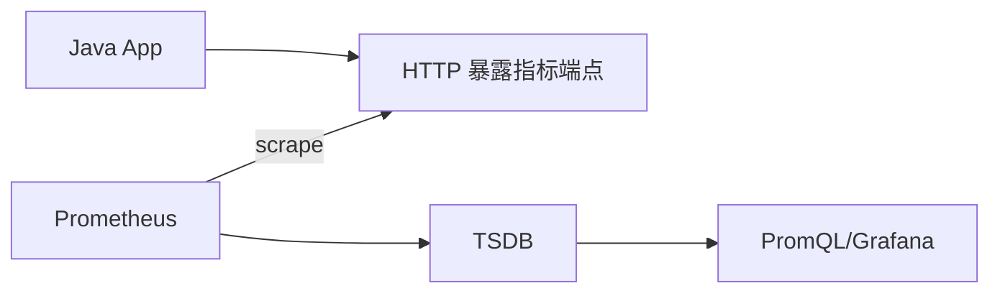

# 第 21 课：Java 监控指标基础

**学习时长**：2-3 小时  
**难度等级**：⭐⭐ 进阶  
**先修要求**：完成第 3 课 - 配置文件详解（了解 scrape_configs）

---

## 学习目标

完成本课程后，你将能够：

- ✅ 理解 Java 应用为什么要“暴露指标”，以及 Prometheus 如何采集
- ✅ 了解两条主流路线：Micrometer vs Prometheus Java Client
- ✅ 理解 Java 常见指标类型与 Prometheus 类型的对应关系
- ✅ 知道 Spring Boot 暴露指标端点的常见方式（`/actuator/prometheus`）
- ✅ 能用一个最小示例把应用指标暴露出来，并用 Prometheus 抓到

---

## 21.1 Java 应用接入 Prometheus 的基本思路

Prometheus 是 Pull 模型，Java 应用要做的事很简单：

1) 在应用里把指标注册到一个“指标注册表/采集器”  
2) 暴露一个 HTTP 端点，返回 Prometheus 可识别的文本格式（通常是 `/metrics` 或 `/actuator/prometheus`）  
3) Prometheus 配置抓取该端点



---

## 21.2 两条主流实现路线

### 21.2.1 Micrometer（更偏“应用观测统一门面”）

Micrometer 的定位是指标门面（facade）：

- 应用侧只写 Micrometer API
- 底层可以导出到不同监控后端（Prometheus、Influx、OTLP 等）
- 在 Spring Boot 生态里使用最普遍

典型形态：

- 业务代码记录 timer/counter/gauge
- 暴露端点由 Spring Boot Actuator + Micrometer Prometheus registry 提供

### 21.2.2 Prometheus Java Client（更偏“直接写 Prometheus 指标”）

Prometheus Java Client 的定位更直接：

- 你直接创建 Counter/Gauge/Histogram 等 Prometheus 指标
- 直接暴露 `/metrics`（Servlet、HTTP server、框架集成）

适用场景：

- 非 Spring Boot 项目
- 想更贴近 Prometheus 的数据模型与细节控制

---

## 21.3 指标类型：Java 里常见的四类

无论走哪条路线，最终都在表达同一类数据：

| 语义 | 常见例子 | 适合的 Prometheus 类型 |
|---|---|---|
| 只增不减的累计量 | 请求总数、错误总数 | Counter |
| 可上下波动的瞬时值 | 当前线程数、队列长度 | Gauge |
| 一组事件的分布 | 请求耗时、消息大小 | Histogram / Summary |
| 基于时间的统计 | 方法耗时 | 通常落地为 Histogram 或 Summary（框架封装为 Timer） |

直觉记法：

- Counter：只增不减
- Gauge：随时变化
- Histogram/Summary：关注分布（P95、P99、bucket）

---

## 21.4 指标命名与标签：决定“好不好用”的关键

### 21.4.1 命名规范（建议）

- 使用小写 + 下划线：`http_requests_total`
- 带单位后缀：`_seconds`、`_bytes`、`_total`
- 一个指标表达一个含义，避免“多义指标”

### 21.4.2 标签设计（建议）

标签（labels）用来切分维度，但会带来基数成本：

- 合理标签：`job`、`instance`、`method`、`status`
- 高风险标签：`user_id`、`order_id`、`trace_id`、`request_id`

直觉：

> 标签越多、取值越散，series 就越多，存储与查询成本就越高。

---

## 21.5 Spring Boot 暴露指标端点（典型方式）

在 Spring Boot 体系里，最常见端点是：

- `/actuator/prometheus`

Prometheus 抓取配置通常写成：

```yaml
scrape_configs:
  - job_name: "spring-boot"
    metrics_path: /actuator/prometheus
    static_configs:
      - targets: ["app:8080"]
```

---

## 21.6 最小实践：验证“应用已暴露，Prometheus 已抓到”

### 21.6.1 应用侧验证

1) 本地启动应用  
2) 打开端点：

- `http://localhost:8080/actuator/prometheus` 或 `http://localhost:8080/metrics`

你应能看到类似文本格式（示意）：

```text
http_server_requests_seconds_count{...} 123
http_server_requests_seconds_sum{...} 45.6
```

### 21.6.2 Prometheus 侧验证

1) 在 Prometheus 的 `/targets` 页面确认该 job 是 `UP`  
2) 在表达式页面执行：

```promql
up{job="spring-boot"}
```

能查到 `1` 说明抓取链路打通。

---

## 21.7 常见问题与排查顺序

- 端点 404：`metrics_path` 配错或应用没启用端点
- targets 存在但 `up=0`：网络/端口/鉴权问题，先看 `/targets` 的 error
- 有指标但不好用：优先检查命名与标签是否合理（是否引入高基数）
- 采集到的指标太多：用 `metric_relabel_configs` 做过滤（在 Prometheus 侧控成本）

---

## 课后小结

- Java 接入 Prometheus 的核心是：暴露可抓取端点 + 选择合适指标类型 + 控制标签基数
- Micrometer 更适合 Spring Boot 体系，Prometheus Java Client 更适合需要直接控制指标的场景
- 抓取是否成功先看 `/targets`，指标是否存在先从 `up` 和最关键业务指标查起

