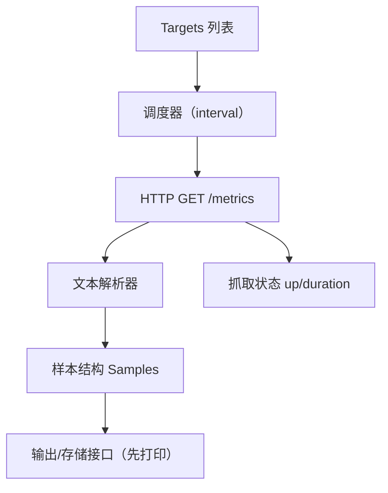

# 第 25 课：实现简易抓取器（Scraper）

**学习时长**：3-4 小时  
**难度等级**：⭐⭐⭐ 进阶  
**先修要求**：完成第 9 课 - 抓取管理（Scrape Manager）、第 11 课 - 数据写入流程

---

## 学习目标

完成本课程后，你将能够：

- ✅ 实现一个最小可用的抓取器：定时抓取多个 targets 的 `/metrics`
- ✅ 解析 Prometheus 文本格式（至少支持 Counter/Gauge 的样本行）
- ✅ 生成统一的样本结构（name + labels + value + timestamp）
- ✅ 实现基本的抓取状态指标（类似 `up`、抓取耗时）
- ✅ 理解从“抓取”到“写入存储”的接口边界（下一课会用）

---

## 25.1 你要实现的最小系统长什么样

目标：实现一个能持续抓取并打印结果（或暂存内存）的 scraper。



---

## 25.2 定义数据结构：Sample / Target / Result

建议你先定义几个最小结构（语言无关，伪代码）：

```text
Target:
  url: string
  labels: map<string,string>   # 固定标签（例如 job/instance/env）

Sample:
  name: string
  labels: map<string,string>
  value: float
  timestamp: int64             # 可选，没有就用抓取时间

ScrapeResult:
  target: Target
  samples: []Sample
  up: 0|1
  duration_seconds: float
  error: string?
```

直觉：你后面做 TSDB 的时候，写入的最小单位就是 Sample。

---

## 25.3 实现抓取循环：每个 target 一个 loop

你可以照着 Prometheus 的思路：

- 每个 target 一个抓取循环
- 周期性执行：抓取 → 解析 → 产出样本 → 输出

伪代码：

```text
func runScrapeLoop(target, interval):
  while not stopped:
    start = now()
    resp, err = http_get(target.url, timeout)
    if err:
      emit ScrapeResult(up=0, duration=now()-start, error=err)
      sleep(interval)
      continue

    text = read_body(resp)
    samples, parseErr = parsePromText(text)
    if parseErr:
      emit ScrapeResult(up=0, duration=now()-start, error=parseErr)
      sleep(interval)
      continue

    # 合并 target 固定标签（job/instance 等）
    samples = mergeTargetLabels(samples, target.labels)

    emit ScrapeResult(up=1, duration=now()-start, samples=samples)
    sleep(interval)
```

---

## 25.4 Prometheus 文本格式：你最少要支持什么

Prometheus exposition format（文本格式）包含多种行：

- 注释/元信息：`# HELP ...`、`# TYPE ...`
- 样本行：`metric_name{label="value"} 123`

最小可用实现建议：

- 忽略 `# HELP` / `# TYPE`（先不处理）
- 支持解析“样本行”的 3 个部分：
  - metric name
  - labels（可选）
  - value（float）
- 先不处理 exemplar 与复杂 escape 细节（后面再补）

样本行例子：

```text
http_requests_total{method="GET",status="200"} 1027
process_cpu_seconds_total 12.34
```

---

## 25.5 文本解析器：一个可落地的思路

建议按行处理：

1) trim 空白
2) 空行跳过
3) `#` 开头跳过
4) 其余当样本行解析

样本行解析步骤（简化版）：

- 找出 value：通常在最后一个空格后面
- name+labels 在前半段：
  - 有 `{...}`：`name` 在 `{` 前，labels 在 `{}` 内
  - 没有 `{}`：整段是 `name`

labels 解析（简化版）：

- 以 `,` 分隔成 `k="v"` 对
- 去掉引号，处理 `\"` 这类简单转义

注意：Prometheus label value 的转义规则比较多，最小实现先覆盖常见情况即可。

---

## 25.6 生成抓取状态指标：up 与 duration

Prometheus 本身会为每个 target 生成自监控指标（你可以先做最小子集）：

- `up{job="...",instance="..."} 1|0`
- `scrape_duration_seconds{job="...",instance="..."} <耗时>`

你自己的 scraper 也可以这么做：

```text
up{target="http://x/metrics"} 1
scrape_duration_seconds{target="http://x/metrics"} 0.032
```

直觉：这能让你排查“抓没抓到、为什么慢”。

---

## 25.7 实践：先抓 Prometheus 自己

最推荐的第一个 target：

- `http://localhost:9090/metrics`

你应该能看到：

- 输出的样本量很大（Prometheus 自带很多指标）
- 如果你先只解析 Counter/Gauge 的样本行，也能拿到很多数据

建议你加一个 filter，先只打印某个前缀的指标：

- `prometheus_engine_.*`
- `prometheus_tsdb_.*`
- `go_.*`

---

## 25.8 常见坑与修正

- 抓取超时：timeout 太小，或目标端点慢/卡
- 解析失败：样本行里有你没支持的语法（先跳过该行并记录错误计数）
- 标签爆炸：不要无脑把 URL path、query、错误文本当 label
- 并发过高：targets 多时注意并发限制（不要瞬间把机器打满）

---

## 25.9 课后小结

- 最小 scraper = 调度（interval）+ HTTP 抓取 + 文本解析 + 样本结构化 + 状态指标
- 每个 target 一个抓取循环的模型最直观，后续可以再做并发/限速/队列优化
- 下一课实现 TSDB 时，你的 scraper 输出（Sample 列表）就是写入输入

