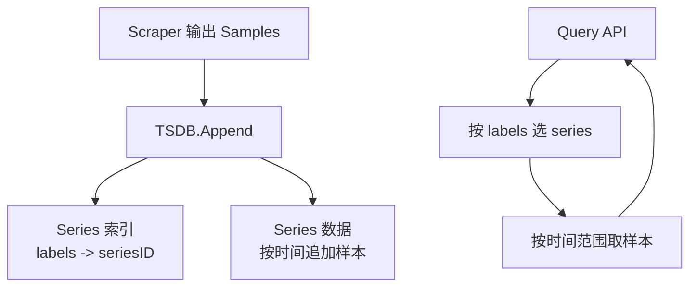

# 第 26 课：实现时间序列存储

**学习时长**：4-6 小时  
**难度等级**：⭐⭐⭐⭐ 深入  
**先修要求**：完成第 25 课 - 实现简易抓取器（Scraper）

---

## 学习目标

完成本课程后，你将能够：

- ✅ 实现一个最小可用的内存 TSDB：支持写入样本与按时间范围查询
- ✅ 理解 time series 的唯一性：`metric_name + labels` 决定一条 series
- ✅ 理解为什么需要索引：从 labels 快速定位 series
- ✅ 实现一个最简的压缩策略（delta 编码 / 简单 chunk）
- ✅ 为后续实现 PromQL 子集打好 storage 查询接口

---

## 26.1 你要实现的最小 TSDB 形态

本课实现的目标是“能跑起来、能查到值”，不追求完整性。



---

## 26.2 定义核心数据结构

建议先定义 4 个最核心结构：

### 26.2.1 LabelSet（标签集合）

要求：

- labels 要有稳定顺序（例如按 key 排序）
- series key 要可 hash（例如序列化成 string 或自定义 hash）

### 26.2.2 Series（时间序列）

包含：

- `metric_name`
- `labels`
- 一组样本（按时间递增）

### 26.2.3 Sample

包含：

- `t`（timestamp）
- `v`（value）

### 26.2.4 TSDB（数据库）

包含两部分：

- `seriesByKey`：`seriesKey -> series`
- `index`：`labelName=labelValue -> set(seriesKey)`（最简倒排索引）

---

## 26.3 写入路径：Append(sample)

最简写入流程：

1) 计算 `seriesKey = hash(metric + labels)`
2) 查找 series，不存在则创建
3) 把样本追加到 series（要求 t 递增，或至少不乱序太离谱）
4) 更新倒排索引（仅在创建 series 时需要）

伪代码：

```text
func Append(sample):
  key = seriesKey(sample.name, sample.labels)
  s = seriesByKey.get(key)
  if s == nil:
    s = newSeries(sample.name, sample.labels)
    seriesByKey[key] = s
    index.add(sample.labels, key)

  s.append(sample.t, sample.v)
```

---

## 26.4 查询路径：Select + Range

PromQL 查询通常分两步：

1) 先根据 labels 选出 series（Select）
2) 再对每条 series 取时间范围内的样本（Range）

建议你实现一个最小接口：

```text
Select(matchers) -> []SeriesRef
QueryRange(seriesRef, start, end) -> []Sample
```

matchers 最小支持：

- `=` 精确匹配（例如 `job="web"`）

先不做：

- 正则匹配
- `!=`、`!~` 等

---

## 26.5 为什么需要索引（以及最简索引怎么做）

如果没有索引，你只能：

- 遍历所有 series
- 逐个检查 labels 是否匹配

series 一多就会慢。

最简倒排索引：

- 把每个 label pair（`k=v`）映射到“包含该 label pair 的 series 集合”
- Select 时对多个集合求交集

```text
index["job=web"] = {s1, s2, s3}
index["method=GET"] = {s1, s3}
交集 = {s1, s3}
```

---

## 26.6 样本存储：最简 chunk + delta 压缩

你可以先实现一个非常简化的 chunk：

- 每条 series 的样本按固定大小分 chunk（例如 120 个点一个 chunk）
- chunk 内只存 delta：
  - 时间戳存 `dt = t - prevT`
  - 值存 `dv = v - prevV`（或直接存 float，先不压也可以）

直觉：

- 时间戳通常是固定间隔，dt 很小，压缩很有效
- Prometheus 真正使用的 Gorilla 编码更复杂，本课只做“能理解的版本”

---

## 26.7 与 Scraper 对接：从结果到写入

把第 25 课 scraper 的输出接入 TSDB：

- ScrapeResult 成功：遍历 samples，调用 `TSDB.Append`
- ScrapeResult 失败：写入 `up=0` 和 `scrape_duration_seconds`

这样你就完成了一个最小闭环：

Targets → 抓取 → 解析 → 写入 → 查询

---

## 26.8 实践建议：最小验收用例

建议你准备 3 个验收用例：

1) 单条 series 连续写入 100 个点，范围查询能正确返回  
2) 两条 labels 不同的 series 写入同名 metric，Select 能正确区分  
3) 查询不存在的 labels，返回空集  

如果你实现了 chunk：

- 跨 chunk 的范围查询能正常拼接

---

## 26.9 常见坑与修正

- labels 没排序导致同一条 series 被当成不同 key
- 乱序样本导致 range 查询不稳定（先强制要求递增）
- 索引没更新导致查不到新 series
- 并发写入导致 map 竞态（先单线程，后面再加锁）

---

## 课后小结

- 最小 TSDB = series 唯一化 + 倒排索引 + 时间范围样本读取
- PromQL 的执行依赖 storage：先选 series，再取样本
- chunk 与压缩是为了规模化，本课只做最简版，为后面实现查询语言打基础

