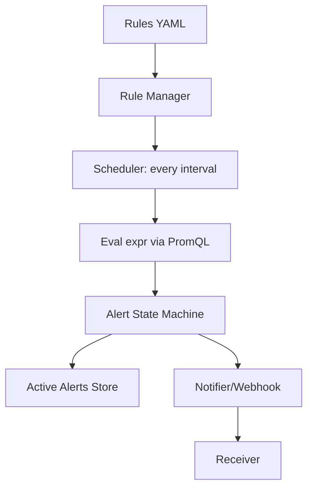
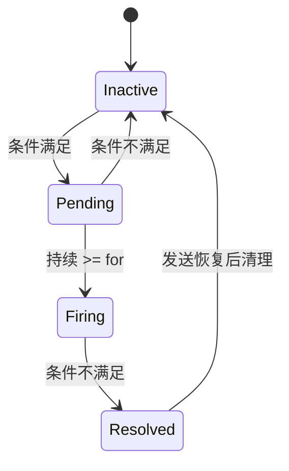

# 第 29 课：实现告警规则引擎

**学习时长**：4-6 小时  
**难度等级**：⭐⭐⭐⭐ 深入  
**先修要求**：完成第 28 课 - 实现 HTTP API 与 UI（至少完成 query/query_range 基础）

---

## 学习目标

完成本课程后，你将能够：

- ✅ 实现一个最小告警规则引擎：读取规则 → 定时评估 → 状态机 → 通知
- ✅ 支持告警规则的关键字段：expr、for、labels、annotations
- ✅ 实现告警状态流转：Inactive → Pending → Firing → Resolved
- ✅ 支持最小通知方式：Webhook（HTTP POST）
- ✅ 跑通端到端：指标变化 → 规则命中 → 通知被接收

---

## 29.1 你要实现的最小告警系统长什么样

你已经有：

- PromQL 子集（或至少能对表达式求值）
- TSDB（能查到数据）
- HTTP API（能调试查询）

这一课要实现的是“定时评估 + 状态机 + 推送”：



---

## 29.2 规则文件格式（最小可用）

建议你直接复用 Prometheus 的 YAML 风格（最容易理解）：

```yaml
groups:
  - name: example
    interval: 30s
    rules:
      - alert: HighErrorRate
        expr: rate(http_requests_total[5m]) > 1
        for: 2m
        labels:
          severity: page
        annotations:
          summary: "错误率过高"
```

最小解析要求：

- groups 数组
- 每个 group 有 interval
- 每条 rule 有 alert/expr/for/labels/annotations

---

## 29.3 评估模型：为什么要引入 evalTime

告警引擎本质上是“按时间点反复评估表达式”：

- 每个 group 每 interval 触发一次
- 每次评估都有一个明确的 evalTime（通常是 now）

这让你可以稳定复现问题，并且能做回放/补算。

---

## 29.4 expr 的返回结果：你需要什么样的数据结构

PromQL 表达式评估后，理想情况返回一个向量（vector）：

- 每个元素是一条“告警实例”（series）
- 元素的 labels 决定“告警的维度”（例如按 instance 区分）
- value 决定是否触发（你可以约定：非 0 表示触发）

最小约束：

- expr 结果为空：表示没有任何告警实例触发
- expr 返回 N 条：表示 N 个维度触发（例如多个实例）

---

## 29.5 状态机：Inactive / Pending / Firing / Resolved

每个告警实例（按 labels 唯一标识）都应维护一个状态：

### 29.5.1 状态定义

- Inactive：当前不满足条件
- Pending：满足条件，但未达到 `for` 时长
- Firing：满足条件且持续超过 `for`
- Resolved：从 Firing 回到不满足（可选状态，用于发送恢复通知）

### 29.5.2 状态迁移规则（最小实现）

设：

- `t`：当前 evalTime
- `active`：该实例本次是否满足条件
- `forDuration`：规则里的 for（缺省为 0）

迁移逻辑直觉：

1) active=false：
   - 若之前是 Firing：转 Resolved，并发送恢复通知
   - 否则：转 Inactive

2) active=true：
   - 若之前是 Inactive：进入 Pending，记录 `activeAt=t`
   - 若之前是 Pending 且 `t-activeAt >= forDuration`：转 Firing，发送告警
   - 若之前是 Firing：保持 Firing（可选：周期性重发）



---

## 29.6 告警唯一键：如何区分“同一条规则的不同实例”

同一条 alert rule 可能会命中多个实例，例如：

```promql
up == 0
```

会按 instance 区分多个 down 的目标。

你需要一个 key 来区分告警实例，建议用：

- `alertname` + “结果向量的 labels（排序后）”

伪代码：

```text
key = hash(alertname + sorted(labels))
```

---

## 29.7 输出与通知：最小 Webhook 协议

为了简单，你可以定义一个最小 Webhook payload（JSON）：

```json
{
  "receiver": "default",
  "status": "firing|resolved",
  "alerts": [
    {
      "labels": { "alertname": "HighErrorRate", "instance": "node1" },
      "annotations": { "summary": "错误率过高" },
      "startsAt": "2026-04-01T12:00:00Z",
      "endsAt": "2026-04-01T12:10:00Z"
    }
  ]
}
```

最小实现建议：

- firing 时发送一次
- resolved 时发送一次
- 不做复杂重试与分组（后续第 30 课再优化）

---

## 29.8 调度器：group interval 怎么实现

你可以用最简单的方式：

- 每个 group 一个 ticker
- tick 到了就评估一次
- 评估函数必须可取消（用 context）

注意：

- 评估时间可能超过 interval（表达式慢）
- 最小实现可选择“串行执行，下一次 tick 跳过/延后”

---

## 29.9 端到端验收：用一个可控指标验证

你需要一个“可控指标”，例如：

- `test_toggle{instance="a"}`（手动设 0/1）

规则：

```yaml
- alert: ToggleOn
  expr: test_toggle == 1
  for: 30s
```

验收步骤：

1) 把指标置为 1，等待 > 30s，看到 firing 通知
2) 把指标置为 0，看到 resolved 通知
3) 查看你的 UI 或日志，确认状态机流转正确

---

## 29.10 常见坑与修正

- key 不稳定：labels 没排序导致同一告警实例被认为不同
- `for` 语义错误：忘了记录 activeAt 或用错时间单位
- expr 结果为空时没清理旧 firing：导致“鬼告警”
- resolved 频繁抖动：for 太短或表达式太敏感

---

## 课后小结

- 告警引擎 = 定时评估 + 状态机 + 通知
- 状态机的核心是 `for`：Pending 到 Firing 的门槛
- “告警实例”由结果向量 labels 决定，需要稳定的唯一键
- 最小实现先跑通 firing/resolved 两种通知，再逐步增强（分组、重试、抑制、静默）

