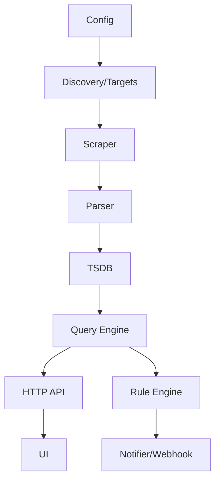

# 第 30 课：系统集成与优化

**学习时长**：4-6 小时  
**难度等级**：⭐⭐⭐⭐ 深入  
**先修要求**：完成第 25-29 课（抓取器/存储/PromQL/API/UI/告警引擎）

---

## 学习目标

完成本课程后，你将能够：

- ✅ 把前面实现的模块整合成一个可运行的“简化版 Prometheus”
- ✅ 为系统补齐关键的运行能力：配置管理、热加载、可观测性、自监控指标
- ✅ 做 4 类核心优化：并发、缓存、限流、持久化
- ✅ 能用压测与指标定位瓶颈：抓取侧、写入侧、查询侧、告警侧
- ✅ 输出一份可交付的最小系统说明：如何启动、如何验证、如何排障

---

## 30.1 最终系统应该长什么样

把你在第 25-29 课实现的组件串起来：

最小闭环：

- targets 可配置
- 抓取能持续运行
- 查询能返回 vector/matrix
- 告警能 firing/resolved 并推送

---

## 30.2 配置管理：你需要哪些配置项

建议把配置分成 4 组：

1) **抓取配置**
- targets（static/file_sd）
- scrape_interval / timeout

2) **存储配置**
- 数据目录（path）
- retention（time/size）

3) **查询配置**
- query timeout
- max points / max samples（保护）

4) **告警配置**
- rules 文件路径
- group interval
- webhook/receiver 地址

### 30.2.1 热加载（reload）

最小可用的热加载策略：

- 收到 `SIGHUP`（或 Windows 下提供 `/reload` API）
- 重新读取配置
- 对比新旧配置，增删目标/规则

直觉：

- 目标变了：增删 scrape loop
- 规则变了：重建 rule groups

---

## 30.3 可观测性：你的系统也要“被监控”

至少暴露两类自监控指标：

### 30.3.1 抓取侧

- `up`
- `scrape_duration_seconds`
- `scrape_samples_scraped`
- `scrape_errors_total`

### 30.3.2 查询侧

- `query_requests_total`
- `query_duration_seconds`
- `query_errors_total`

### 30.3.3 存储侧

- `tsdb_head_series`
- `tsdb_writes_total`
- `tsdb_read_samples_total`

### 30.3.4 告警侧

- `rule_evaluations_total`
- `rule_eval_duration_seconds`
- `alerts_firing`
- `notifications_sent_total` / `notifications_errors_total`

直觉：你需要这些指标来定位瓶颈，而不是靠猜。

---

## 30.4 并发模型：哪些地方适合并发

### 30.4.1 Scraper 并发

- 每个 target 一个 loop（最直观）
- targets 多时需要并发上限（worker pool 或 semaphore）

### 30.4.2 TSDB 并发

最小实现通常先做单写入锁：

- Append 加锁
- 查询可并发读（读写锁）

后续优化方向：

- series 分片（按 hash 分 shard），降低锁竞争
- chunk append 与 index 更新分离

### 30.4.3 查询并发

并发查询需要保护：

- 最大并发查询数
- 每个查询的最大返回点数/最大样本数
- 超时与取消

---

## 30.5 缓存：把“重复工作”缓存起来

两类最常见缓存：

### 30.5.1 series selection 缓存

- 相同 matchers 在短时间内重复查询很常见
- 缓存 postings/series 列表能显著减少 CPU

### 30.5.2 query_range 结果缓存

- Grafana 会频繁刷新相同时间窗口
- 可以按（query,start,end,step）做短 TTL 缓存

注意：

- 缓存要有上限与 TTL
- 缓存命中率比缓存大小更重要

---

## 30.6 限流与保护：防止系统被打挂

建议至少做 5 个保护点：

- 最大抓取并发数（避免瞬时大量请求）
- 最大每次抓取解析行数/样本数（避免异常端点返回爆炸）
- query timeout
- query_range 最大点数：`(end-start)/step` 上限
- 告警发送队列上限（避免下游不可用时内存爆炸）

---

## 30.7 持久化：从“能跑”到“能重启恢复”

你在第 26 课做的是内存 TSDB，这一课可以加一个最小持久化：

### 30.7.1 WAL（最简版）

- Append 时追加写入一个日志文件（JSON 行或二进制都可）
- 启动时回放 WAL 恢复内存状态

### 30.7.2 Snapshot（可选）

- 定期把内存状态写成 snapshot
- 启动时先加载 snapshot，再回放 snapshot 之后的 WAL

直觉：这就是 Prometheus 的“WAL + Checkpoint”思想的简化版。

---

## 30.8 性能验证：用什么方式判断优化有效

建议你至少做 3 类验证：

1) 抓取规模
- targets 从 10 → 100 → 1000 的变化
- 观察 scrape_duration 与错误率

2) 查询压力
- 同一条 query_range 在不同 step 下的耗时差异
- 观察 query_duration 与 CPU

3) 告警压力
- 规则数量从 10 → 100 → 1000
- 观察 rule_eval_duration 与通知队列

不要靠“感觉”，要用自监控指标看趋势。

---

## 30.9 最终交付清单（建议）

你可以把“可交付”定义为这 8 件事：

- 能启动（单命令）
- 能配置 targets 与 rules
- 能抓到样本并写入 TSDB
- `/api/v1/query` 可用
- `/api/v1/query_range` 可用
- UI 可用（哪怕简陋）
- 告警 firing/resolved 可用，并能发送 webhook
- 自监控指标可用，并能解释“当前瓶颈在哪里”

---

## 课后小结

- 集成的关键是边界清晰：Scraper 产样本，TSDB 存样本，Engine 算结果，Rule 引擎判告警，Notifier 负责送出去
- 优化的关键是可观测性：没有自监控指标就很难定位瓶颈
- 保护机制比性能更优先：限流/超时/上限决定系统能不能稳定运行

