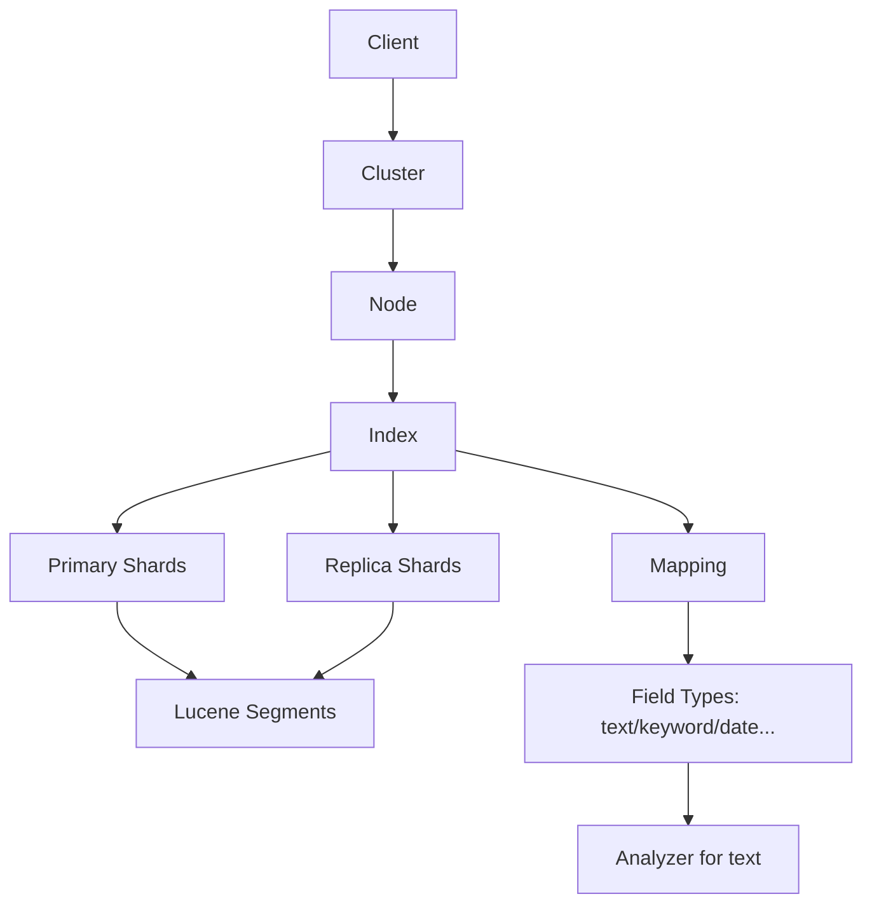
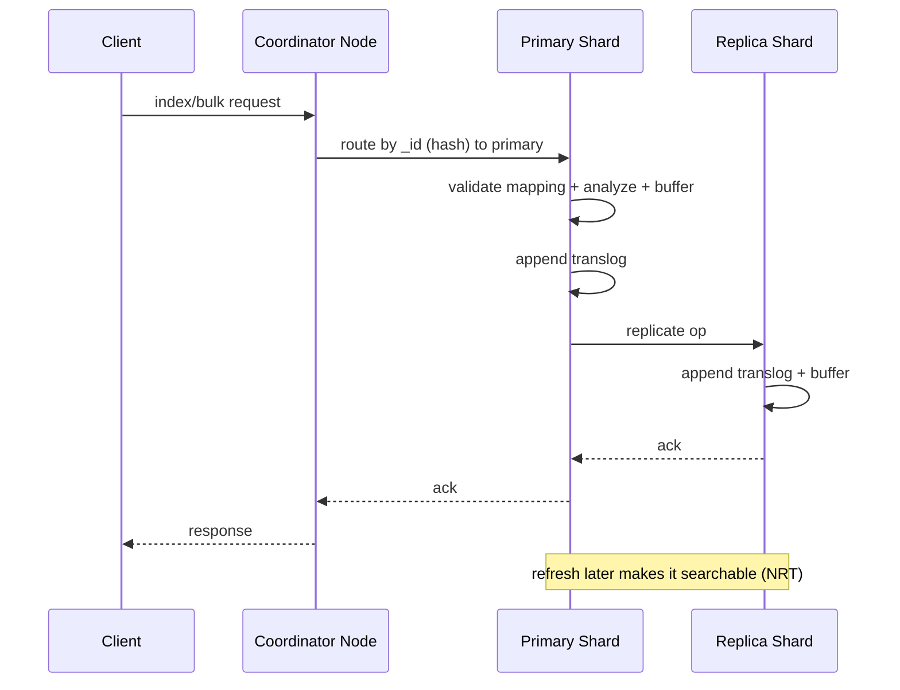
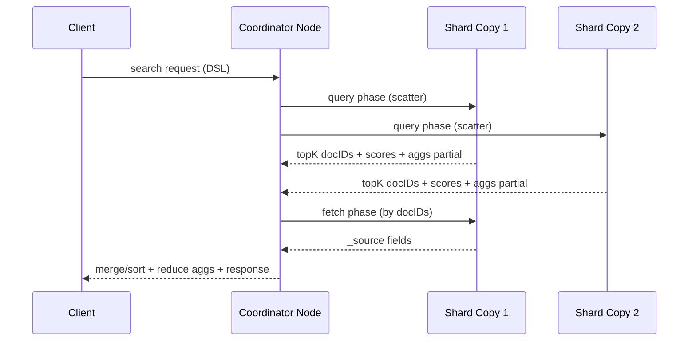

# Elasticsearch（ES）是什么（理解型面试笔记）

## 0. 你要先记住的一句话（定位 + 场景 + 不适用）
Elasticsearch 是一个基于 Lucene 的分布式搜索与分析引擎，擅长全文检索与聚合分析，但不适合作为强事务主库（强一致 + 复杂事务 + 频繁更新）。

## 1. 直觉层：它解决的痛点是什么
一句话锚点：当你想“像搜百度一样搜业务数据”，并且还要“按维度实时统计”，ES 往往比 MySQL 更合适。

- 全文检索体验：分词、相关性排序、同义词、纠错、短语匹配、高亮。
- 模糊查询性能：避免在大数据量下用 `LIKE '%xx%'` 造成的性能崩溃与索引失效。
- 多维聚合分析：对日志/埋点/订单等做 `group by + 多层聚合 + 时间窗口` 的近实时分析。
- 分布式扩展：容量与吞吐可以通过增加节点横向扩展，天然高可用（副本）。

典型业务场景（面试友好表达）：
- 电商/内容平台：商品/帖子/文档搜索（检索 + 排序 + 高亮 + 过滤）。
- 日志与可观测：ELK/Elastic Stack 做检索与聚合（定位异常、看趋势、做报表）。
- 风控/画像：按用户、地域、设备等维度聚合统计，支撑实时看板。

## 2. 模型层：核心概念地图（用自己的话解释每个词）
一句话锚点：把 ES 当成“面向文档的分布式索引系统”，核心是 Index/Document + Shard/Replica + Mapping/Analyzer。

### 2.1 术语类比（帮助快速上手）
| 关系型概念 | ES 概念 | 直觉解释 |
|---|---|---|
| 表 | Index | 一类数据的集合（逻辑容器） |
| 行 | Document | 一条 JSON 文档（最小数据单元） |
| 列 | Field | JSON 的字段 |
| schema | Mapping | 字段类型与索引方式（text/keyword/date 等） |
| 索引 | 倒排索引 | 关键词 → 文档列表，查“词”比查“行”快 |

### 2.2 核心组件与数据组织
- Cluster：集群，多个节点共同对外提供服务。
- Node：节点，一台 ES 实例；可能承担 master/data/ingest 等角色。
- Shard：分片，Index 的物理分割单位；Primary Shard 承担写入主责任。
- Replica：副本分片，提供高可用与读扩展；主分片挂了可提升为主。
- Segment：Lucene 的不可变数据段；写入会生成新 segment，更新本质是“删旧加新”。
- Refresh：把内存缓冲里的数据生成 segment 并打开搜索视图，让数据“可被搜索”（近实时）。
- Translog：写前日志，用于崩溃恢复与 durability（与 refresh/flush 相关）。
- Analyzer：分析器（分词 + 归一化），决定 text 字段如何被索引与查询。
- Query DSL：ES 的查询语言（JSON 结构），常见有 match、term、bool、range、aggs。

### 2.3 概念关系图（理解用）

- Index 是逻辑概念，Shard/Replica 是分布式物理落盘与并行计算的关键。
- Segment 不可变，决定了“更新/删除为什么贵”与“为什么近实时”。
- Mapping/Analyzer 决定“能不能搜到”和“相关性排序好不好”。

## 3. 机制层：它为什么有效（抓住 1-3 个关键机制讲透）
一句话锚点：ES 的快来自“倒排索引 + 分片并行 + 近实时 refresh”，代价是“写入与更新更复杂、资源占用更高、语义更接近最终一致”。

### 3.1 倒排索引（Inverted Index）
- 传统行存（MySQL）更像“按主键/索引找行”；全文检索需要在字段内容里找关键词，会变得很慢。
- 倒排索引把“词 → 文档列表”提前算好，查询时从词直接定位到文档集合，再做过滤/排序/评分。

### 3.2 近实时（Near Real-Time）
- 写入不会立刻变成“可搜索”，而是依赖 refresh 周期把内存缓冲生成 segment 并对搜索打开视图。
- 这就是为什么 ES 常说“近实时”，以及为什么会出现“写入成功但搜不到”的短暂窗口。

### 3.3 分布式并行（Shard Scatter/Gather）
- 查询通常由协调节点把请求分发到相关分片并行执行（scatter），再汇总结果（gather/reduce）。
- 聚合也是并行计算：每个分片先做局部聚合，协调节点再做全局 reduce。

## 4. 流程层：一次典型操作从请求到结果发生了什么
一句话锚点：写入走“主分片确认 + 复制 + translog”，查询走“分发到分片并行查 + 汇总”，可见性由 refresh 控制。

### 4.1 写入流程（Index / Bulk）

- 路由：默认用 `_id` 做 hash，决定落到哪个 shard；自定义 routing 会影响数据分布与查询并行度。
- durability：translog 保障崩溃后可恢复；是否 fsync 取决于配置与请求参数。
- 可搜索性：ack 成功不等于“立刻可搜”，需要等 refresh（或显式 refresh）。

### 4.2 查询流程（Search）

- Query/FETCH 两阶段：先找“候选与排序”，再回表取 `_source` 等字段。
- 聚合：分片本地先算，协调节点 reduce 汇总；高基数字段聚合需要谨慎（内存与时间开销大）。

### 4.3 更新与删除的本质（面试常追问）
- Update 在 Lucene 语义里通常是“标记删除旧文档 + 写入新文档”，所以频繁更新会带来更多 segment、更多 merge 压力。
- 删除不会立刻物理回收，需要 segment merge 才能真正释放空间。

## 5. 取舍层：优缺点、边界与选型（对比至少 2 个替代/互补方案）
一句话锚点：ES 强在“检索/分析”，弱在“事务/强一致/复杂关系”，因此经常是 MySQL 的旁路索引而不是替代品。

### 5.1 优点
- 强大的全文检索能力：分词、相关性、组合查询。
- 高性能聚合分析：面向海量数据的分布式计算模型。
- 易于横向扩展：分片与副本机制天然支撑扩容与容灾。

### 5.2 代价与边界
- 一致性语义：更像最终一致（尤其是数据从主库同步到 ES 的链路上）。
- 更新成本高：更新/删除会放大写放大与 merge 开销。
- 关系建模弱：不擅长复杂 join；建模更偏“反范式、按查询建索引”。
- 资源消耗大：磁盘、内存（heap + file cache）、CPU 都比较吃紧，参数与容量需要工程化治理。

### 5.3 选型对比（面试表达）
- MySQL：强一致事务 + 关系建模；全文检索与复杂聚合在大数据量下会吃力。
- Redis：强在缓存与简单结构，全文检索不是强项（除非额外模块/方案）。
- OpenSearch/Solr：与 ES 相近的搜索引擎选择，更多是生态、许可证、运维体系差异。

## 6. 落地层：Java 项目里我会怎么用（工程化套路）
一句话锚点：把 ES 当作“搜索侧索引”，主库仍是 MySQL；重点是数据同步、幂等、灰度回滚与可观测。

### 6.1 数据来源与一致性：ES 作为旁路索引
常见链路（更稳、更可扩展）：
- MySQL（主库）→ binlog/CDC → MQ（Kafka/RocketMQ）→ 消费者写 ES

设计要点：
- 主键设计：ES 文档 `_id` 通常用主库主键，保证幂等（重复写入是覆盖而非新增）。
- 顺序与并发：同一业务主键的更新要避免乱序覆盖（可用版本号、时间戳、或业务幂等键控制）。
- 补偿与重放：消费失败要可重试、可回放；必要时用对账任务比对主库与 ES 差异。

### 6.2 索引设计：Mapping 与字段类型
- 精确匹配与聚合：用 `keyword`（用于 term 查询、聚合、排序）。
- 全文检索：用 `text` + 合适 analyzer（中文常需 IK 等插件或更合适的分词方案）。
- 多字段策略：同一字段同时提供 `text`（检索）与 `keyword`（聚合/排序）子字段。
- 上线前就确定好字段语义：避免把本该 `keyword` 的字段建成 `text`，导致聚合慢或不可用。

### 6.3 写入策略：Bulk、重试与限流
- 用 Bulk API 批量写入提升吞吐，批次大小按延迟/内存/拒绝率调优。
- 遇到 429/Rejected：指数退避重试 + 限流，避免把集群打到雪崩。
- 对写入延迟敏感场景：明确是否需要 `refresh=wait_for`，并评估对吞吐的影响。

### 6.4 灰度与回滚：Alias + Reindex
零停机常用套路：
- 新建 index_v2（新 mapping）→ 全量导入（reindex / 离线任务）→ 增量同步追平 → 切 alias → 下线旧 index_v1

### 6.5 监控与告警：我会盯哪些信号
- 搜索侧：查询延迟、慢查询、top 查询、cache 命中率、线程池拒绝数。
- 写入侧：bulk 延迟、429/拒绝率、refresh/merge 时间、translog 相关指标。
- 集群侧：JVM heap 使用、GC、磁盘水位、unassigned shards、节点离线。

## 7. 排障层：最常见的 5 个问题（自查路径）
一句话锚点：先按“症状→链路→证据”排查：是数据没写进去、写进去但没 refresh、还是查询语义/mapping 不匹配。

### 7.1 写入成功但搜不到
- 可能原因：refresh 周期未到；查询字段用错（text/keyword）；routing 不一致；读了旧索引/alias。
- 验证手段：查看 refresh 配置与时间；用 `_explain` / `_termvectors`；确认 alias 指向；检查 routing。
- 修复手段：关键路径用 `refresh=wait_for` 或调整 refresh interval；修正查询字段与 mapping。

### 7.2 聚合很慢或直接报内存相关错误
- 可能原因：对高基数字段做 terms 聚合；字段类型不对（text 聚合）；size 过大。
- 验证手段：看 profile、slowlog；看字段是否有 `.keyword`；评估 cardinality。
- 修复手段：改用 keyword；限制 size；用 composite aggregation 做分页聚合；必要时预聚合。

### 7.3 查询结果“不符合预期”（相关性怪）
- 可能原因：match/term 用错；analyzer 不合适；should/must 逻辑写错；排序覆盖了评分。
- 验证手段：用 `_analyze` 看分词；用 `_explain` 看评分原因；逐步简化 DSL。
- 修复手段：调整 analyzer；区分 keyword 精确与 text 分词字段；修正 bool 逻辑。

### 7.4 写入被拒绝（429 / threadpool rejected）
- 可能原因：bulk 批次过大；写入并发过高；节点资源不足（CPU/IO/heap）。
- 验证手段：看节点线程池与拒绝数、写入延迟、GC、磁盘 IO。
- 修复手段：降并发/批次；启用退避重试；扩容或优化索引/分片规划。

### 7.5 集群变黄/变红（副本或主分片分配异常）
- 可能原因：节点宕机；磁盘水位过高；分片数量不合理；网络/权限问题。
- 验证手段：查看 cluster health 与 allocation explain；检查磁盘与节点状态。
- 修复手段：释放磁盘或扩容；调整副本数；修复节点并触发重新分配。

## 8. 自测题（只给题目）
1. Elasticsearch 的定位是什么？为什么很多系统是“MySQL 作为主库 + ES 作为旁路索引”？
2. 倒排索引是什么？它为什么能让全文检索更快？
3. text 与 keyword 有什么区别？各自适合什么查询与场景？
4. match 查询与 term 查询有什么区别？最常见的误用是什么？
5. ES 为什么是“近实时”？refresh 在里面起什么作用？
6. 一次写入请求从客户端到数据落盘大致经历了哪些步骤？translog 的作用是什么？
7. 一次 search 请求为什么通常要走 query phase 与 fetch phase？
8. shard 与 replica 各解决什么问题？副本对读写性能分别有什么影响？
9. 为什么 ES 的更新成本高？更新/删除与 segment/merge 的关系是什么？
10. terms 聚合在什么情况下会很慢/很耗内存？你会怎么做选型或改写？
11. 深分页为什么慢？常见替代方案有哪些（scroll、search_after 等）？
12. 如何做到索引结构升级但不停机（alias + reindex）？切换时如何保证一致性？
13. 写入出现 429（rejected）时，你的工程化处理策略是什么？
14. “写入成功但搜不到”的排查路径是什么？你会先看哪些证据？

## 9. 追问引导（用于继续和 AI 深挖）
- 如果业务要求“写入后立刻可搜”，你会如何设计？refresh=wait_for 的代价是什么？
- 你的索引分片数怎么定？需要考虑哪些维度（容量、吞吐、迁移、恢复时间）？
- 对同一业务主键的更新乱序怎么办？如何保证最终一致且可回放？
- 相关性排序怎么调？你会用哪些证据（_explain、A/B、离线评估）证明调整有效？
- 给一个故障场景：节点磁盘满导致集群变红，你的止血与修复步骤分别是什么？

## 10. 参考文献（官网/源码优先）
1. Elasticsearch Reference（版本未锁定，默认 latest）：https://www.elastic.co/guide/en/elasticsearch/reference/current/index.html
2. Elasticsearch Java API Client（版本未锁定，默认 latest）：https://www.elastic.co/guide/en/elasticsearch/client/java-api-client/current/index.html
3. Elasticsearch Near real-time search（版本未锁定，默认 latest）：https://www.elastic.co/guide/en/elasticsearch/reference/current/near-real-time.html
4. Elasticsearch Shards & replicas（版本未锁定，默认 latest）：https://www.elastic.co/guide/en/elasticsearch/reference/current/scalability.html
5. Apache Lucene（核心原理与倒排索引基础）：https://lucene.apache.org/core/
6. Lucene Similarity / BM25（评分机制相关）：https://lucene.apache.org/core/
