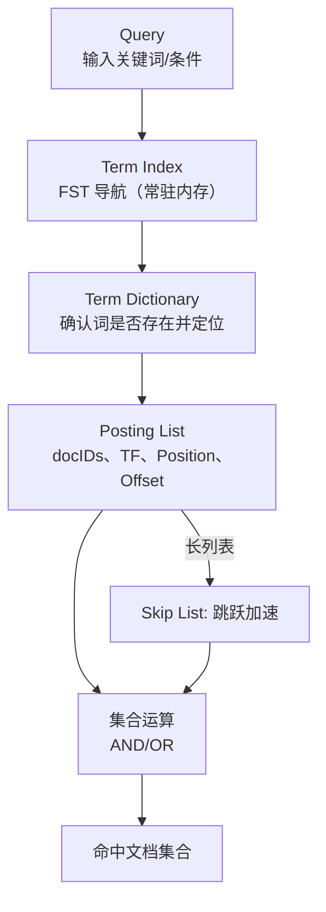
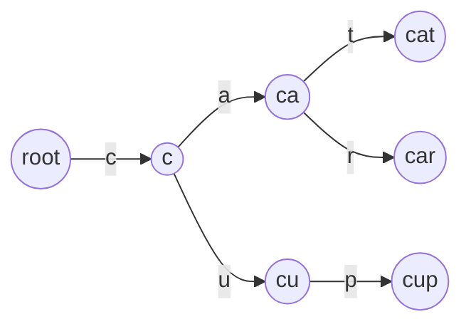
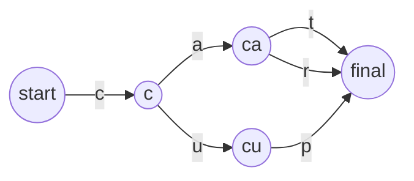
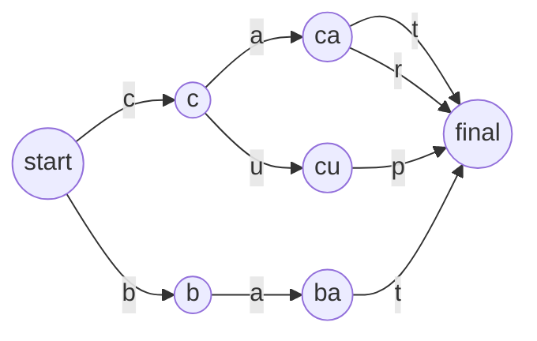
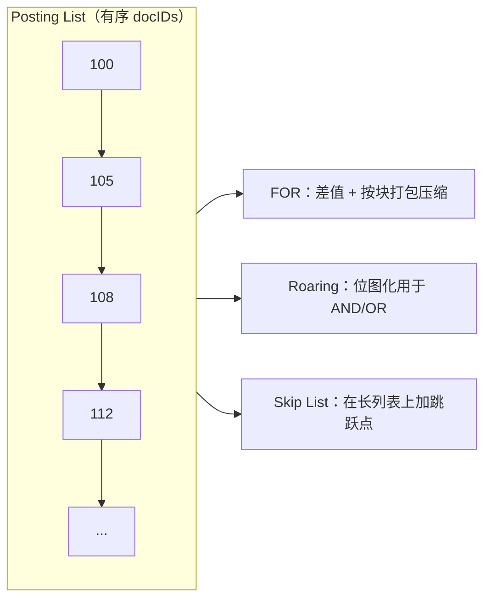
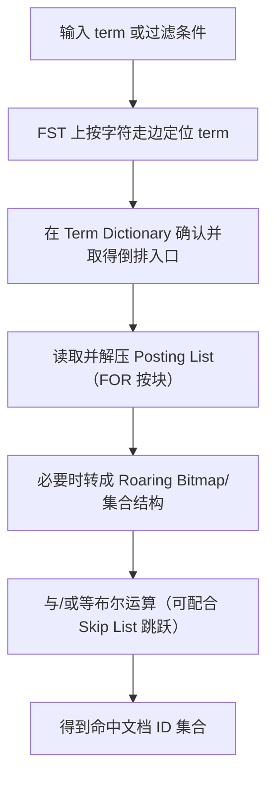

# ES 倒排索引与 FST（理解型面试笔记）

## 0. 你要先记住的一句话（定位 + 场景 + 不适用）
倒排索引把“关键词 → 文档 ID 列表”提前组织好，用 FST 等结构把“找词”和“取文档集合”做成可快速定位与高效集合运算，因此适合全文检索与过滤组合查询；它不是用来做“按行/按主键回表”的传统 OLTP 索引替代品。

## 1. 直觉层：它解决的痛点是什么
一句话锚点：你不是在海量文档里“找词”，而是在索引里“按词找文档集合”。

- 正排思路更像“文档 ID → 内容”：想找某个词出现在哪些文档，容易退化成遍历扫描。
- 倒排思路是“词 → 文档 ID 列表”：像书末尾的关键词索引页，先定位关键词，再直接得到相关文档集合。

## 2. 模型层：核心概念地图（用自己的话解释每个词）
一句话锚点：倒排索引不是一张大 Map，而是“Term Index（导航）→ Term Dictionary（词典）→ Posting List（结果集合）”的分层结构，长列表再用 Skip List 加速跳跃。

- Term Dictionary（词典）：存放所有不重复的词项（term）的集合（通常按序组织）。
- Term Index（词典索引）：词典的“目录/导航”，用于快速定位某个 term 在词典中的位置；这里会用到 FST。
- Posting List（倒排列表）：对每个 term，记录包含该 term 的文档 ID 列表；同时可包含词频（TF）、位置（Position）与偏移（Offset）等信息。
- Skip List（跳表/跳跃结构）：当某个 term 的倒排列表很长时，用额外的“跳跃点”加速在列表中前进，避免逐个扫描。

- 先在 Term Index 上按“词”定位，而不是先碰倒排列表本体。
- Term Dictionary 负责“精确锚点”，让系统能拿到倒排列表的位置。
- Posting List 给出“候选文档集合”，后续的布尔组合查询本质是集合运算。

## 3. 机制层：它为什么有效（抓住 1-3 个关键机制讲透）
一句话锚点：快来自三件事：把查找对象从“文档内容”换成“词典与集合”；让定位几乎不走 IO；让集合运算适配 CPU 的优势。

### 3.1 变“遍历”为“直接定位”
- 传统思路想在内容里找词，容易变成 O(n) 扫描。
- 倒排索引把关系反转为“term → docIDs”，查询变成“定位 term，然后拿集合”，复杂度更接近“按词长度定位 + 集合运算”。

### 3.2 FST：用极省内存的数据结构做“导航”
- FST（Finite State Transducer，有限状态转换器）可以把大量字符串（term）用一个有向无环图（DAG）表示。
- 它通过共享结构来省空间：既共享前缀，也通过最小化合并等价子图来共享后缀/尾部结构，从而把原本大量重复的节点折叠掉。
- 对查找来说，FST 按字符走边，时间复杂度可按词长度 m 计为 O(m)。
- 对“分支爆炸”的直觉担忧（例如某个字母后面是否一定有 26 条边）：实际只会为“确实存在的下一字符”建立边，不会把不存在的分支预先铺开。

#### 3.2.1 先看 Trie（字典树）长什么样
一句话锚点：Trie 是“共享前缀的树”，每个字符一层。

- 这棵树把 `cat`/`car` 的前缀 `ca` 复用掉了。
- 代价是节点数量会随着词表增长而快速膨胀，且面向对象实现里常伴随大量“节点对象 + 指针”开销。

#### 3.2.2 FST 在 Trie 上的关键改进（对话语境下）
一句话锚点：从“树”变成“DAG”，把等价的尾部结构合并，并用更紧凑的序列化表示减少对象与指针。

- 共享前缀：保留 Trie 的优点。
- 共享后缀/尾部：把“后面长得一模一样的子树”折叠成“同一个子图”（等价状态合并）。
- 连续内存表示：对话里强调的一点是“抛弃大量 Node 指针对象”，把节点与边序列化成连续字节数据以减少额外开销与指针跳转；这类实现依据可追溯到 Lucene 的 FST 源码实现方式。

#### 3.2.3 以 FST 视角画出示例 DAG
一句话锚点：共享前缀体现在“从 root 出发的路径复用”，共享后缀体现在“不同路径汇合到同一后继状态”。

以 `cat`/`car`/`cup` 为例（共享前缀，终止状态可复用）：

再加入 `bat`（可以看到 `cat` 与 `bat` 在最后一步都指向同一个终止状态，体现“尾部结构可共享”的直觉）：

### 3.3 Posting List 的压缩与集合运算：让 IO 少、让 CPU 快
- FOR（Frame Of Reference）用于把有序 docID 列表做差值编码与按块压缩：把大数变小数，再按块打包，降低存储与 IO。
- Roaring Bitmap 用于把 docID 集合变成压缩位图，做 AND/OR 等布尔运算时可以直接利用 CPU 位运算的吞吐。
- 当列表很长时，Skip List 让合并/遍历能“跳过一段不可能命中的区间”，减少无效比较。

- FOR 让“存与读”更省：差值更小，按块压缩更紧凑。
- Roaring 让“算交并”更省：集合运算更像位运算。
- Skip List 让“追赶”更快：合并长列表时可跳过大量无关区间。

## 4. 流程层：一次“关键词检索/过滤组合”从请求到结果发生了什么
一句话锚点：先用 FST 找词，再拿倒排集合，最后在内存里做集合运算与跳跃加速。

- FOR 更偏“存储与读取阶段的压缩”，把磁盘数据压小、读得更少。
- Roaring 更偏“计算阶段的集合运算”，让交集/并集更像 CPU 擅长的位运算。
- Skip List 让长倒排列表在合并时能更快“追上”另一条列表的进度。

### 4.1 一个具体例子：过滤条件 AND 查询里的“接力”
一句话锚点：先把两份倒排列表从磁盘读出来（FOR 解码），再把集合搬到内存里做 AND（Roaring 位运算），得到交集 docIDs。

假设是电商检索场景，组合条件为：

- 条件 A：品牌 = 某品牌
- 条件 B：价格 > 某阈值

对话里的组织方式是：

- 阶段一（磁盘存储）：两份条件各自产生一份 Posting List（有序 docIDs），用 FOR 做差值与按块压缩后落盘。
- 阶段二（查询执行）：查询到来时读取对应压缩块并解压成 docIDs 数组。
- 阶段三（内存计算）：把两份 docIDs 转成 Roaring Bitmap，在内存里做 AND，得到交集 docIDs。
- 阶段四（复用）：该过滤结果可进入过滤缓存，用于加速相同过滤条件的重复查询。

## 5. 取舍层：优缺点、边界与选型（对比至少 2 个替代/互补方案）
一句话锚点：倒排索引擅长“按词找集合 + 集合运算”，而不是“按行精确定位与范围扫描”的通用解。

### 5.1 为什么不是“所有有序结构都用一种”
对“高效有序数据存储/查找”，对话里提到的常见结构与直觉取舍：

- 平衡树（如红黑树）：查找/插入/删除稳定在对数复杂度，但实现复杂度较高。
- B+ 树：常用于数据库索引，偏向磁盘/页结构友好，适合范围查询与排序相关场景。
- 跳表：结构简单，平均性能好；通过“多级索引”实现类似二分的跳跃；并且在并发场景下更容易做细粒度的无锁/低锁设计。
- 哈希结构：精确查找快，但不天然支持有序遍历与范围。

### 5.2 跳表为什么常被拿来对标红黑树（结合并发视角）
- 跳表通过随机层高（常被形容为“抛硬币”决定要不要升层）构建多级索引。
- 修改局部指针就能完成插入/删除的关键步骤，使其在并发实现里更容易围绕 CAS 做细粒度更新（对话里举了 Java `ConcurrentSkipListMap` 作为类比）。
- 并发直觉：核心更新往往是对某个节点的 `next/right` 指针做 CAS（比较并交换）；失败线程不阻塞而是自旋重试；删除可拆成“先标记逻辑删除，再把前驱指针绕过做物理删除”的两阶段思路，降低并发删除的复杂度。

## 8. 自测题（只给题目）
1. 用一句话解释“倒排索引”和“正排（文档 ID → 内容）”在查找逻辑上的根本差异是什么？
2. 倒排索引的分层结构是什么？分别解决什么问题（Term Index / Term Dictionary / Posting List / Skip List）？
3. 为什么说 FST 可以作为词典索引的“内存导航”？它的查找复杂度直觉上如何理解？
4. 你担心“字母 c 下一步会不会有 26 个分支”时，你真正担心的是什么？FST/字典树的分支是如何产生的？
5. 什么是字典树（Trie）？它在内存上的主要问题是什么？
6. FST 相比 Trie 做了哪些改进来省内存？为什么需要“共享后缀/合并等价子图”？
7. 什么是倒排列表（Posting List）？它除了 docID 之外，常会携带哪些信息？
8. FOR（Frame Of Reference）技术在倒排列表压缩里扮演什么角色？为什么差值能显著变小？
9. 既然 FOR 是按块压缩的，“随机访问并解压某一小块”要怎么做到？需要什么额外信息？
10. Roaring Bitmap 在 ES/Lucene 的查询里解决的是什么问题？它擅长什么类型的运算？
11. FOR 和 Roaring Bitmap 在一次组合查询里如何协同工作？用你自己的话复述“磁盘存储阶段”和“内存计算阶段”的分工。
12. 用一个具体业务条件组合（AND）例子，说明 FOR 与 Roaring 的“接力”过程。
13. 什么是跳表？它的“多级索引”直觉是什么？
14. 跳表里的“抛硬币”是什么意思？它想保证的统计性质是什么？
15. 为什么说跳表在并发实现中更容易做到“局部指针调整 + CAS”式的无锁/低锁更新？（结合 `ConcurrentSkipListMap` 的类比回答）
16. 为什么倒排索引能显著提升搜索速度？用“定位 + IO + 计算”三个角度组织答案。

## 9. 追问引导（用于继续和 AI 深挖）
- 这套“Term Index/Dictionary/Postings”的分层在 Lucene 的落盘文件与具体实现里分别对应什么（类/模块/文件格式）？
- Posting List 里 TF/Position/Offset 分别在什么查询能力上起作用（相关性、短语、高亮）？代价是什么？
- Skip List 在“合并多个倒排列表”时具体如何决定跳跃步长？它与块级压缩元数据如何配合？
- Roaring Bitmap 的几种容器类型（数组/位图/run）在什么数据分布下分别占优？
- 当 term 极高频时，倒排列表从“顺序扫描”转向“位图/缓存”会发生哪些性能拐点？

## 10. 参考文献（官网/源码优先）
1. Apache Lucene 官方文档：Index（版本未锁定，默认 latest）https://lucene.apache.org/core/
2. Apache Lucene 源码：FST（`org.apache.lucene.util.fst`，版本未锁定，默认 main）https://github.com/apache/lucene
3. Apache Lucene 官方文档：Codec / postings / terms dictionary 相关说明（版本未锁定，默认 latest）https://lucene.apache.org/core/
4. Elasticsearch 官方文档：全文检索与倒排索引相关介绍（版本未锁定，默认 latest）https://www.elastic.co/guide/en/elasticsearch/reference/current/index.html
5. RoaringBitmap 项目（版本未锁定，默认 latest）https://github.com/RoaringBitmap/RoaringBitmap
6. Java 官方文档：`java.util.concurrent.ConcurrentSkipListMap`（版本未锁定，默认 latest）https://docs.oracle.com/en/java/javase/
