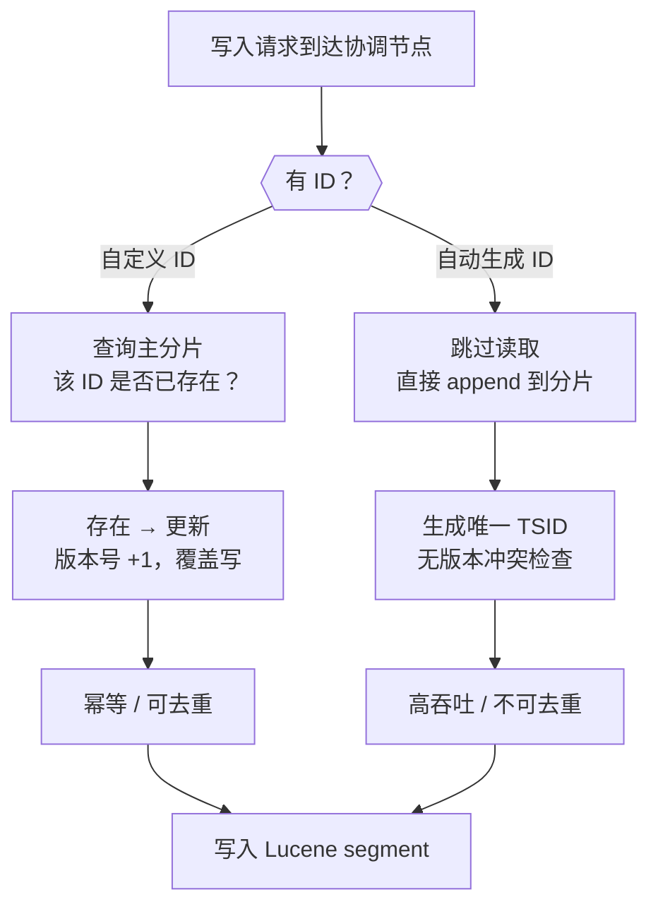
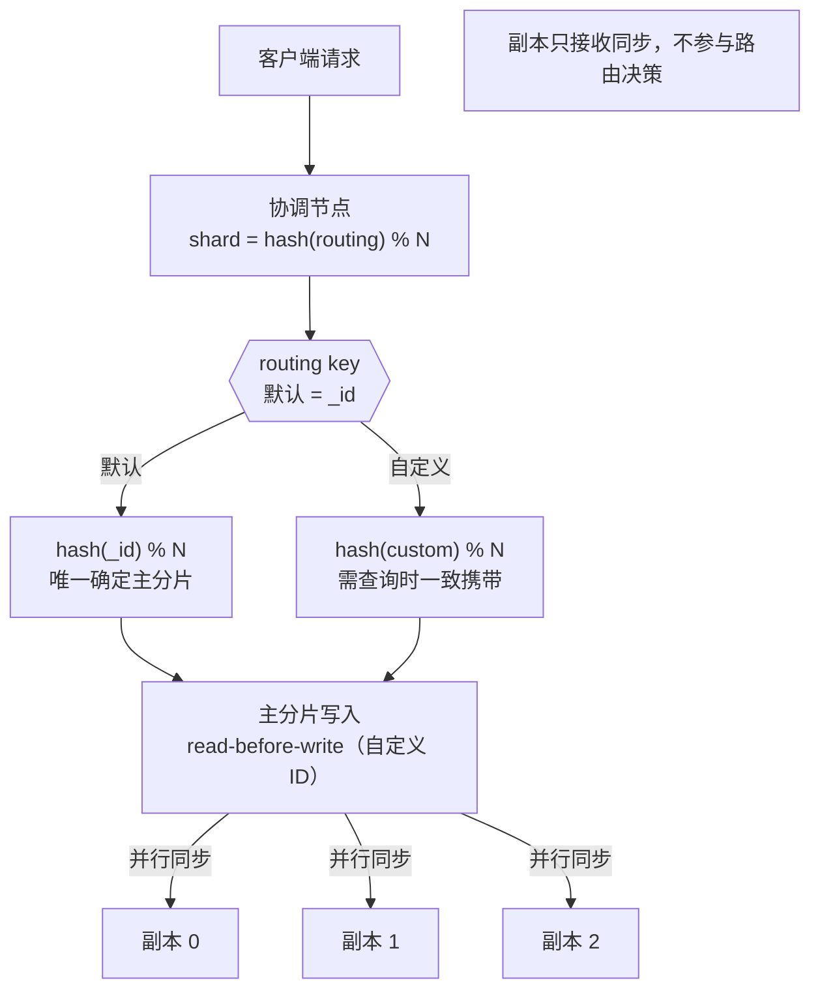

### class 1
es是用json文档的形式存储数据。
它提供索引index和数据流的方式来组织数据。

索引的组成部分有：
文档(Documents)：存储你数据的json对象，包括系统管理的元字段。

常见的元数据字段可以按用途分成几类（[所有元数据字段](https://www.elastic.co/docs/reference/elasticsearch/mapping-reference/document-metadata-fields)）：

1) 定位与归属

- `_index`  ：文档所属的 索引名 （字符串）。当一次查询跨多个索引/别名时，用它标识“这条命中来自哪个索引”。
- `_id` ：文档的 唯一标识符 （字符串）。用于 GET /{index}/_doc/{id} 、更新、删除、upsert 等。若写入时不指定，ES 会自动生成一个 id。
- `_routing` ：路由值（可选）。决定文档落到哪个分片；不设置时默认用 _id 做 routing。


2) 文档内容承载

- `_source` ：你写入的原始 JSON 文档内容（可选择关闭/过滤，但通常建议保留，便于回查与更新脚本）。

相当于_source就是实际的数据，换成关系型数据库，可以理解为_id是主键，_source是数据行内容，其他为隐藏列。

3) 乐观并发控制与写入顺序（ES 6/7+ 常用）

- `_seq_no`  ：序列号，标识该文档变更的先后顺序。
- `_primary_term` ：主分片任期号，主分片切换后会递增；配合 _seq_no 做并发控制（ if_seq_no / if_primary_term ）。
- `_version`  ：版本号（仍存在，但新体系更推荐用 _seq_no + _primary_term ）。


4) 查询相关（非持久业务字段）

- `_score`  ：相关性评分，只在搜索响应里出现（不“存业务内容”，也不是你写入的字段）。


5) 其他管理/辅助（是否出现取决于映射与场景）

- `_ignored`  ：记录哪些字段因为 ignore_malformed / ignore_above 等原因被忽略（出现在命中里）。
- `_field_names`  ：用于 exists 查询的内部辅助（新版本实现细节可能变化）。
- `_type`  ：旧版类型字段，ES 7 起基本废弃（单类型），ES 8 已移除相关概念（兼容层除外）。
- `_doc_count`  ：常见于一些聚合/特殊映射场景的内部计数用途（不是普通文档都会关心的业务字段）。

乐观并发控制在此处不展开，后续需要回来看。

Mappings（映射）：定义字段数据类型，并控制数据的索引和查询方式。
[es中所有数据类型](https://www.elastic.co/docs/reference/elasticsearch/mapping-reference/field-data-types)


Settings（设置）：索引级别的配置，如分片数量，副本数量和刷新间隔，控制存储和性能行为。

近实时搜索：
es并不是写入立刻可搜，而是写入后很快可搜，中间有时间差，所以es叫近实时搜索。

基本流程：
把 ES 想成一个“写入很快、但查询要等它把新内容整理好”的系统。底层 Lucene（ES 的搜索引擎库）工作方式大概是：
- 你 index / update 文档时，数据先进入内存里的缓冲区，此时还不一定能被搜索到 。 
- 到点后做一次 refresh：把内存里的积累的变更整理成一个新段（segment）并打开给查询用。该新segment会写进文件系统缓存，这个时候就能被查询看见了。
- 生成的 segment 之后会被操作系统慢慢刷到磁盘。

触发一次refresh的时机由 `index.refresh_interval` 配置，默认为1s，默认只对“最近 30 秒内被搜索过”的索引才按 1 秒 refresh。

### class 2

es的CRUD：

[新增或更新](https://www.elastic.co/docs/api/doc/elasticsearch/v8/operation/operation-index)：

```
curl http://localhost:9200/my_index/_doc -XPOST -H 'Content-Type: application/json' -d '{
    "title": "One", "tags": ["ruby"]
}'
```

返回：
```
{"_index":"my_index","_id":"DEPss54BbLlHK8J7VuRv","_version":1,"result":"created","_shards":{"total":2,"successful":1,"failed":0},"_seq_no":0,"_primary_term":1}
```

这里的my_index就是索引名

[批量创建文档](https://www.elastic.co/docs/api/doc/elasticsearch/v8/operation/operation-bulk):

```
curl http://localhost:9200/my_index/_bulk -XPOST -H 'Content-Type: application/json' -d '
{"index": {}}
{"title": "Two", "tags": ["ruby", "python"] }
{"index": {}}
{"title": "Three", "tags": ["java"] }
{"index": {}}
{"title": "Four", "tags": ["ruby", "php"] }
'
```

返回:

```
{"errors":false,"took":24,"items":[{"index":{"_index":"my_index","_id":"DUPys54BbLlHK8J72OQV","_version":1,"result":"created","_shards":{"total":2,"successful":1,"failed":0},"_seq_no":1,"_primary_term":1,"status":201}},{"index":{"_index":"my_index","_id":"DkPys54BbLlHK8J72OQV","_version":1,"result":"created","_shards":{"total":2,"successful":1,"failed":0},"_seq_no":2,"_primary_term":1,"status":201}},{"index":{"_index":"my_index","_id":"D0Pys54BbLlHK8J72OQV","_version":1,"result":"created","_shards":{"total":2,"successful":1,"failed":0},"_seq_no":3,"_primary_term":1,"status":201}}]}
```

[更新](https://www.elastic.co/docs/api/doc/elasticsearch/v8/operation/operation-update):
```
curl http://localhost:9200/my_index/_doc/DEPss54BbLlHK8J7VuRv -XPOST -H 'Content-Type: application/json' -d '{
    "title": "Four updated", "tags": ["ruby", "php", "python"]
}'
```

```
curl -X POST "http://localhost:9200/my_index/_update/DEPss54BbLlHK8J7VuRv" \
  -H "Content-Type: application/json" \
  -d '{
    "doc": {
      "title": "Five updated",
      "tags": ["ruby", "php", "python"]
    }
  }'
```


`_update` 是部分更新，只更新需要的字段, `_doc` 是整条更新。

`/_update`  常见三种写法

- doc ：部分字段替换
- script ：按脚本逻辑修改
- upsert ：不存在时顺便插入

[查询](https://www.elastic.co/docs/api/doc/elasticsearch/v8/operation/operation-get):
```
curl http://localhost:9200/my_index/_doc/D0Pys54BbLlHK8J72OQV
```
返回：

```
{"_index":"my_index","_id":"D0Pys54BbLlHK8J72OQV","_version":1,"_seq_no":3,"_primary_term":1,"found":true,"_source":{"title": "Four", "tags": ["ruby", "php"] }}
```

[删除](https://www.elastic.co/docs/api/doc/elasticsearch/v8/operation/operation-delete):

```
curl http://localhost:9200/my_index/_doc/D0Pys54BbLlHK8J72OQV -XDELETE
```
返回：
```
{"_index":"my_index","_id":"D0Pys54BbLlHK8J72OQV","_version":2,"result":"deleted","_shards":{"total":2,"successful":1,"failed":0},"_seq_no":6,"_primary_term":1}
```

删除整个索引：

```
curl http://localhost:9200/my_index -XDELETE
```

为什么es文档的 ID 设计会影响“是否幂等”“是否容易去重”和写入性能？



es在指定id的情况下，会在主分片上查询这个id是否存在，如果存在就更新主分片上的文档并递增版本号，不存在就新建。当使用自定义id（比如业务主键等）的时候天然就覆盖了这层逻辑，代码层面不需要再去判断我是否已经写过。如果让es自动生成id的话，这一部分内容就需要在业务代码层面自己做。
ES 官方文档明确建议：日志、指标等只追加（append-only）的场景优先用自动 ID。原因是自定义 ID 在主分片上触发的那次"先读再写"（read-before-write）会访问 Lucene 的 `_id` 字段缓存，在高并发下这个查找会成为瓶颈。自动 ID 完全跳过这一步，直接追加到 segment。


es分片路由的具体机制：


**第一层：路由公式**

```
shard_num = hash(routing_key) % number_of_primary_shards
```

`routing_key` 默认是文档的 `_id`。哈希函数用的是 Murmur3，结果对主分片数取模，得到一个 0 到 N-1 的编号。这个计算是纯本地运算，协调节点自己就能算出来，不需要问任何其他节点。

**第二层：协调节点的职责**

每个 ES 节点都持有一份集群状态（cluster state），里面有完整的分片路由表——哪个分片在哪个节点上、谁是主谁是副本。协调节点算出分片编号后，直接查这张表，把请求转发给对应的主分片所在节点。整个过程最多一跳。
I
**第三层：主分片写完后的副本同步**

主分片写入成功后，并行把操作转发给所有副本分片。副本收到的是操作日志（translog 里的操作），不是原始请求，所以副本不会重新计算路由，也不会再做 read-before-write。`wait_for_active_shards` 参数控制要等几个副本确认才返回客户端。

---

**主分片数为什么不能改？**

公式里的 N 是创建索引时固定的。如果 N 变了，`hash(_id) % N` 的结果就变了，所有已有文档的"应在位置"都会错位，整个路由表就乱了。这就是为什么 ES 不允许修改主分片数——如果业务真的需要扩容，只能用 `_reindex` 把数据迁移到一个分片数更大的新索引。

**自定义 routing 的陷阱**

用 `?routing=user_id` 可以把同一个用户的数据强制打到同一个分片（对聚合查询有利）。但写入和查询必须携带**完全相同**的 routing 值，否则查询会算出不同的分片编号，找不到数据。ES 8.x 引入了 `routing_required` 设置，可以在 mapping 层面强制要求所有请求都带 routing，避免漏掉。

### class 3

什么是es的动态映射（Dynamic Mapping）？
es自己决定新加入的文档的数据类型。
显式映射（Explicit mapping）：用户自己决定es字段的类型。
修改映射的话，需要reindex。

纯Dynamic Mapping的场景可以有：
- 日志/事件收集：处理多个服务的日志的时候会出现服务A和服务B结构不一样的情况
- 数据管道/ETL中间层

通常用的更多的是混合模式（固定+动态）：

```
PUT /products
{
  "mappings": {
    "dynamic": "strict",          // ① 顶层：严格模式，不允许随意新增字段
    "properties": {
      "name":     { "type": "keyword" },
      "price":    { "type": "float" },
      "category": { "type": "keyword" },

      "attributes": {
        "dynamic": true,          // ② 仅在 attributes 内部允许动态扩展
        "properties": {}          // 初始为空，字段由写入数据时自动创建
      }
    }
  }
}
```

这样商品的动态属性就由es自己判断类型， `dynamic` 可以在每一层单独设置，子层会覆盖父层的规则。

es自动推断mapping规则的时候是以写入的第一条数据为准，后续如果有不符合推断出来的类型的数据，能转换的会进行隐式类型转换，不能转换的会拒绝。

Question 1:为什么生产更偏向显式 mapping？dynamic 的典型事故有哪些？
A：因为dynamic是由写入的第一行数据来决定映射类型。这不可控。dynamic可能会引起字段爆炸，推断类型不正确，日期格式推断错误等问题。

过多字段会引起映射爆炸：
es官方规定： `index.mapping.total_fields.limit` = 1000 超过这个数字，写入直接报错。
字段映射，对象映射，字段别名，映射的运行时字段都计入这个上限。
`index.mapping.total_fields.ignore_dynamic_beyond_limit`，默认值为 `false`。设为 `true` 时，超出限制的动态字段不会导致写入失败，而是被跳过不加入 mapping，同时记录到 `_ignored` 字段中。这个配置在日志场景下很实用。

#### Cluster State 是什么、如何同步

**Cluster State 的作用**

Cluster State 是整个集群的共享元数据，包含：

| 内容 | 举例 |
|------|------|
| **索引元数据** | 所有索引的 mapping、settings、aliases |
| **分片分配表** | 每个 shard 在哪个节点上（主/副） |
| **节点成员表** | 当前集群中有哪些节点、各自的角色 |
| **模板/Pipeline** | Index template、Ingest pipeline 定义 |
| **快照/恢复状态** | 正在进行的快照任务信息 |

任何需要"知道集群全局情况"的操作都依赖它。比如协调节点收到搜索请求，查本地 cluster state 的分片分配表，才知道该把请求转发给哪些节点上的哪些 shard。

**同步机制：每个节点都有一份完整副本**

不是物理数据只有一份传参，而是：

> Master 持有权威副本 → 通过"发布-提交"两阶段协议广播给所有节点 → 每个节点在自己的 JVM 堆内存里维护一份完整的本地副本

具体流程（ES 7.x+ 的 Raft-like 实现，称为 Zen2）：

```
Master 检测到 cluster state 需要变更
        │
        ▼
① Publish 阶段
   Master 将新 cluster state（或增量 diff）序列化后
   发送给集群中所有节点，节点收到后写入内存但先不生效，
   然后向 Master 回 ACK

        │ 等待"多数派"的 master-eligible 节点 ACK
        ▼
② Commit 阶段
   Master 收到法定数量 ACK 后，广播 commit 指令
   所有节点将新 cluster state 正式应用到本地内存副本

        │
        ▼
   各节点用新的 cluster state 处理后续请求
```

关键细节：

- **增量 diff**（7.x+ 优化）：不是每次都发整个 cluster state，而是只发"变更部分"，大幅降低网络开销，mapping 很大时这个优化很重要。
- **法定数量（quorum）**：必须是 `(master-eligible 节点数 / 2) + 1` 个节点 ACK 才能提交，保证即使 master 在 publish 中途挂掉，新选出的 master 也能确定正确状态。
- **每个节点都有完整副本**：data 节点、coordinating 节点都有，不需要每次查询都问 master，routing 完全靠本地 cluster state 完成。

**CRUD 时 cluster state 的角色**

不是作为参数传递，而是各节点预先持有副本，本地查表路由：

```
客户端 → 协调节点
            │
            │ 查本地 cluster state 的分片分配表
            │ 得到：index "orders" 的 shard 0 主分片在 node-2
            ▼
         直接把请求转发给 node-2（文档数据走节点间直连）
            │
            ▼
         node-2 写入本地 shard，再复制给副本节点
```

cluster state 在这里只起"路由字典"的作用，文档数据本身从不经过它。

**一句话总结**

Cluster state 是全局元数据，每个节点内存里有一份完整副本；master 通过"两阶段广播 + 多数派 ACK"保证所有副本一致；CRUD 时节点查自己的本地副本做路由，文档数据直接在节点间流动，不经过 cluster state。


## class 4

创建一个 component template:
```
curl -X PUT "localhost:9200/_component_template/runtime_component_template" -H 'Content-Type: application/json' -d'
{
  "template": {
    "mappings": {
      "runtime": {
        "day_of_week": {
          "type": "keyword",
          "script": {
            "source": "emit(doc['\''@timestamp'\''].value.dayOfWeekEnum.getDisplayName(TextStyle.FULL, Locale.ENGLISH))"
          }
        }
      }
    }
  }
}'
```
上面这个模板的含义是定义了一个运行时字段，在查询时动态算出星期几，且不需要预先存储这个字段。
template:定义组件模板的内容
mappings:索引映射配置
runtime: 特殊区域：定义运行时字段
day_of_week:字段名称
type：关键字类型
script->source：字段定义


```
curl -X PUT "localhost:9200/_component_template/component_template1" -H 'Content-Type: application/json' -d'
{
  "template": {
    "mappings": {
      "properties": {
        "@timestamp": {
          "type": "date"
        }
      }
    }
  }
}'
```