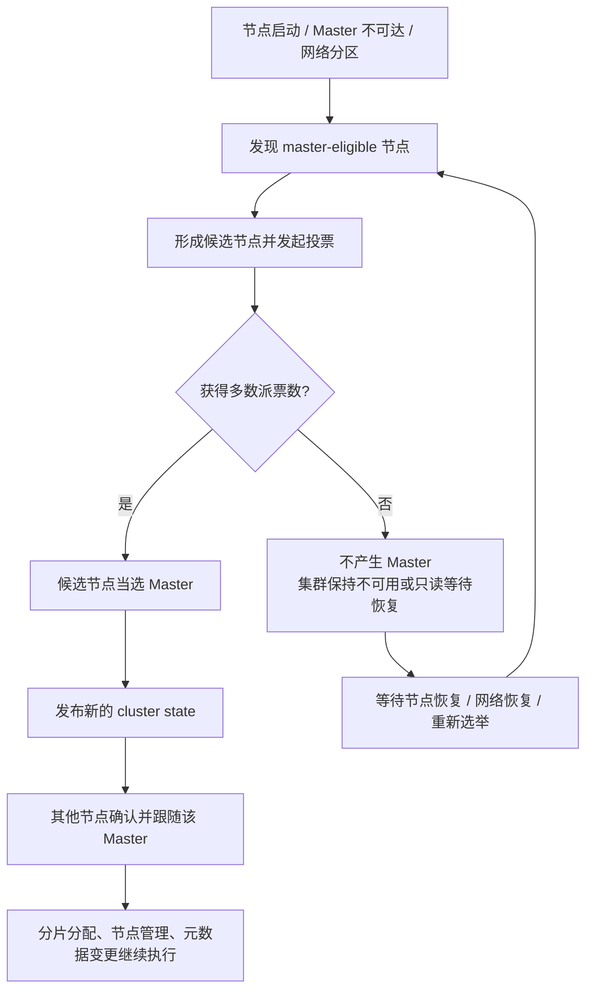

## 题目

ES 集群有哪些节点角色？Master（集群管理器）如何选举、如何避免脑裂？

## 一句话记忆

ES 集群可以按“管集群、存数据、接请求、做预处理”理解；Master 负责控制面，不负责承载全部数据。选主靠 master-eligible 节点多数派投票，超过法定票数才允许产生 Master；多数派的目的，是让任意网络分区里最多只有一边能当选，从而避免脑裂。

## 节点角色怎么记

- master-eligible：有参选资格，负责选举 Master；当选后维护 cluster state、索引元数据、节点加入/离开和分片分配。
- data：保存主分片/副本分片，执行写入、查询、聚合等数据面任务。
- ingest：用来在文档真正写入索引之前，先做一层数据预处理。比如 用grok拆出ip，接口，状态码、补充/改写字段、删除无用字段、做geoip解析将ip转成地理位置信息等预处理。
- coordinating-only：自己不存数据、不当 Master，只接收请求、路由到相关分片，再汇总结果。

理解方式：Master 管的是“集群该长什么样”，data 节点干的是“数据怎么读写查”。所以生产里经常把 Master 节点做成专用节点，避免它被大查询、大写入拖慢。

## 选举流程

选主可以理解成“先发现同伴，再凑够票，再确认唯一主”。

当 Master 不可达、节点启动加入集群，或者网络分区导致部分节点看不到当前 Master 时，master-eligible 节点会进入选举。候选节点需要拿到多数派投票，也就是 quorum，一般按 `floor(N / 2) + 1` 理解，`N` 是有投票资格的 master-eligible 节点数。只有凑够法定票数，新的 Master 才能发布集群状态；凑不够的一边即使怀疑原 Master 挂了，也不能自立为王。



## 脑裂是什么

脑裂就是同一个集群因为网络故障被切成多块，每一块都以为自己可以产生 Master，最后出现“多主”或“无主”的状态。

举个极简例子：原来左边是 Master，右边是普通节点。网络断开后，右边联系不上 Master，它可能会怀疑 Master 挂了，于是尝试把自己选成 Master。如果没有多数派约束，等网络恢复时，两边都认为自己是 Master，就会出现集群状态分叉。

所以 ES 防脑裂的思路不是保证任何网络故障下都能继续写入，而是保证任何时候最多只有一个合法 Master。少数派分区会牺牲可用性，换取集群状态的一致性；也就是宁可短暂不可写，也不能让两个分区各自写出两套状态。

脑裂不一定只来自“机器真的挂了”。很多时候是节点之间短时间互相看不见：可能是网络分区，也可能是 Master 因为负载过高、JVM Full GC、磁盘或 CPU 压力太大，导致心跳和集群状态发布超时。其他节点看到 Master 长时间没有响应，就可能误判 Master 已经不可用，从而触发重新选举。

脑裂的风险包括：

- 集群状态分叉：不同节点看到的索引、分片路由、元数据不一致。
- 写入异常：请求可能被不同 Master 下的分片路由接收。
- 数据不一致：严重时出现重复写、错路由、恢复困难等问题。
- 集群不可用：如果没有任何分区能拿到多数派，集群可能进入无主状态，部分写入和管理操作无法继续。

## 脑裂常见诱因

- 网络分区或网络抖动：节点之间 ping 不通、延迟突然升高，导致彼此误判失联。
- Master 节点负载过高：Master 被查询、写入、聚合或其他重任务拖慢，无法及时处理心跳和 cluster state。
- JVM Full GC：长时间 Stop-The-World 会让节点“看起来像挂了”，其他节点可能触发选举。
- 资源不足：CPU、磁盘 I/O、内存压力过大，会放大心跳超时和状态发布延迟。
- 旧版本法定票数配置错误：比如 ES 7.x 以前 `discovery.zen.minimum_master_nodes` 配得过低，网络分区后多个分区都有机会选出 Master。

## 多数派为什么能防脑裂

多数派的关键不是“票数看起来多”，而是数学上保证“过半集合不可能同时出现两个”。

如果有 5 个 master-eligible 节点：

- 法定票数是 `floor(5 / 2) + 1 = 3`。
- 网络切成 `2 + 3` 时，只有 3 的那边能选主。
- 网络切成 `1 + 4` 时，只有 4 的那边能选主。
- 网络切成 `2 + 2 + 1` 时，没有任何一边能选主。

所以无论怎么切，最多只有一个网络分区能满足多数派。凑不够票的一边宁可暂时不可用，也不能产生第二个 Master。

旧版本里这个多数派要靠 `minimum_master_nodes` 手动配置。如果有 3 个 master-eligible 节点，至少要 2 票才能选主；如果配置成 1，就可能出现每个小分区都觉得自己能选主的风险。

## 版本差异怎么答

ES 7.x 以前常见配置是：

```yaml
discovery.zen.minimum_master_nodes: 2
```

它的含义是手动配置最小 Master 投票数，一般按：

```text
floor(master_eligible_nodes / 2) + 1
```

ES 7.x 以后使用新的 cluster coordination，不再手动配置 `discovery.zen.minimum_master_nodes`。首次启动集群时常见配置是：

```yaml
cluster.initial_master_nodes:
  - node-1
  - node-2
  - node-3
```

运行期由协调模块维护投票配置和多数派选举。

## 生产实践

- 推荐部署 3 个专用 master-eligible 节点：能容忍 1 个 Master 节点故障，并保持 2 票多数派。
- Master 节点尽量分散到不同机器或可用区，降低同机/同机房故障影响。
- 避免让专用 Master 节点承载重查询、重写入和复杂聚合，控制面稳定比单点性能更重要。
- data、ingest、coordinating 节点根据业务压力拆分，避免所有角色都堆在一类节点上。
- 旧版本要正确配置 `discovery.zen.minimum_master_nodes`，一般设置为 `floor(N / 2) + 1`。
- 网络不稳定时要关注节点发现和故障检测参数，比如 `discovery.zen.ping_timeout`、`discovery.zen.fd.ping_interval`、`discovery.zen.fd.ping_retries`。这些参数不是越大越好，核心是减少误判，同时不要让真实故障恢复太慢。
- 关注 Master 节点 JVM 和系统资源，避免频繁 Full GC、CPU 打满、磁盘 I/O 抖动导致 Master 短暂“失联”。

## 脑裂后的排查思路

如果线上怀疑发生过脑裂或选主异常，可以按这个顺序看：

1. 先看 `_cluster/health`，确认是否无主、分片是否大量 unassigned。
2. 再看 `_cat/nodes?v`，确认当前谁是 Master，以及节点角色和负载是否异常。
3. 看 Master 和其他节点日志，重点找 master not discovered、elected-as-master、node-left、node-join、GC overhead 这类信息。
4. 看 `_cluster/state/master_node,routing_table`，确认 Master ID 和分片路由是否稳定。
5. 如果是旧版本，检查 `minimum_master_nodes` 是否按多数派配置。

## 面试回答模板

ES 节点角色常见有 master-eligible、data、ingest 和 coordinating-only。master-eligible 节点参与 Master 选举；当选后的 Master 负责 cluster state、索引元数据、节点管理和分片分配。data 节点负责真正的数据读写和查询聚合，ingest 做写入前预处理，coordinating 节点负责请求转发和结果汇总。

Master 选举靠多数派机制。当现任 Master 不可达或集群发生网络分区时，候选 master-eligible 节点会发起投票，只有获得法定票数，也就是通常理解的 `floor(N / 2) + 1`，才能成为 Master。这样做是为了避免脑裂，因为过半票在数学上只能被一个分区拿到；拿不到多数派的一边不能产生 Master，只能等待恢复或重新选举。

脑裂的诱因除了网络分区，还包括 Master 负载过高、JVM Full GC、CPU 或磁盘压力导致的心跳超时。版本上，ES 7.x 以前需要关注 `discovery.zen.minimum_master_nodes`，通常配置为 master-eligible 节点数过半；7.x 以后由新的集群协调模块自动维护投票配置，不再手动配置这个参数。生产一般建议 3 个专用 master-eligible 节点，并分散部署，同时监控 Master 的 GC、CPU、磁盘 I/O 和网络延迟。

## 可能追问

- Q：为什么推荐 3 个专用 Master 节点？A：3 个能容忍 1 个故障并保持 2 票多数派；专用 Master 不被查询/写入拖慢，控制面更稳。
- Q：脑裂会带来什么后果？A：集群状态分叉，可能出现两个 Master、分片路由混乱、写入异常，严重时造成数据不一致。
- Q：7.x 以后还要配 `minimum_master_nodes` 吗？A：不用；旧版本需要手动配多数派，7.x+ 由新协调模块自动维护投票配置。
- Q：为什么 Full GC 也可能诱发脑裂？A：Full GC 会让 Master 长时间暂停响应，其他节点可能误以为 Master 挂了，从而触发重新选举。
