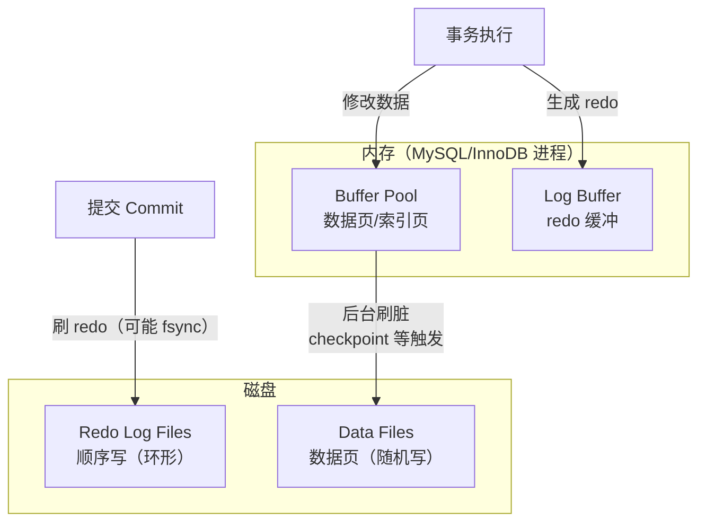
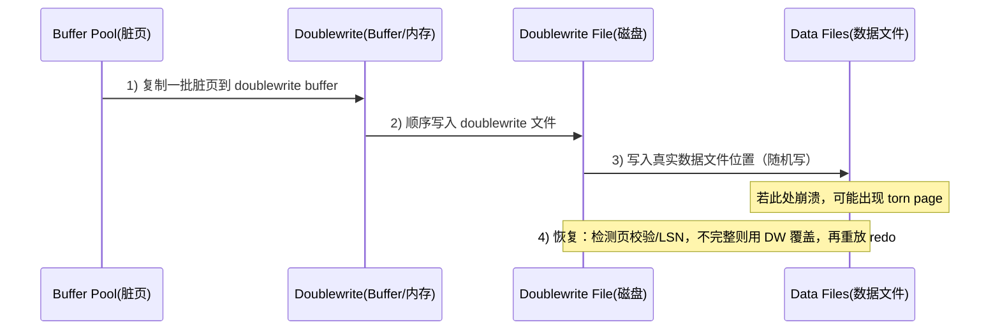

MySQL Redo Log 速刷题库（WAL / Doublewrite / 三大日志）

# Redo Log 知识背景（补充）

## 1. 一句话总览：InnoDB 写入靠什么保证可靠性？

InnoDB 的写入本质是“先写 redo（WAL）再写数据页”，再用“Doublewrite 抵御部分页写（torn page）”，配合 checkpoint 把内存脏页异步落盘，从而在性能与崩溃恢复之间做平衡。

## 2. Redo Log 在架构里的位置

- Buffer Pool：缓存数据页/索引页，更新先改内存页，页变脏
- Log Buffer：缓存 redo 记录（内存），把多次小写合并成批量写
- Redo Log Files：redo 持久化文件（磁盘，顺序追加 + 环形复用）
- Data Files：真实数据文件（磁盘，16KB 页随机写为主）
- Doublewrite：数据页落盘前的“完整页备份区”，用于修复部分写

## 3. WAL（Write-Ahead Logging）核心流程

一句话：事务执行时“写 Log Buffer + 改 Buffer Pool”，提交时“redo 先落盘”，数据页“稍后异步刷盘”。



关键点：

- redo log 落盘完成即可认为事务持久化完成（数据页可以还没落盘）
- redo 是“物理日志”（更准确说是面向页的物理/物理逻辑记录），恢复时不需要再走 SQL 解析/优化/执行流程

## 4. Redo Log 的“环形写”与 checkpoint

redo log 空间固定、循环复用：写指针 write_pos 不断前移；checkpoint 表示“哪些 redo 对应的脏页已经刷到数据文件”，checkpoint 之前的 redo 空间可复用。

```mermaid
flowchart LR
  subgraph Ring[Redo Log（环形空间）]
    A[可复用空间\n(<= checkpoint)] --- B[已写未刷脏\n(写入压力区)] --- C[可用空间\n(write_pos ~ checkpoint)]
  end

  WP[write_pos\n当前写入位置] --> Ring
  CP[checkpoint\n已落盘推进位置] --> Ring

  Note1[写入推进 write_pos] --> WP
  Note2[刷脏推进 checkpoint] --> CP
```

工程含义：

- write_pos 追上 checkpoint：redo 近乎写满，系统会被迫等待刷脏推进 checkpoint，写入延迟会抖动/升高
- redo 太小：容易满导致抖动；redo 太大：崩溃恢复需要扫描/应用更多日志，恢复时间更长

## 5. 为什么需要 Doublewrite：redo 解决“丢失”，不解决“损坏”

背景：InnoDB 默认页大小 16KB，但一次磁盘写入并不保证 16KB 原子性；断电/崩溃可能只写了部分（例如只写入了若干个 4KB/扇区），导致数据页处于“半新半旧”的 torn page 状态。

redo log 的重放前提是“页本身完整可读”，它记录的是“在某页某偏移写什么”，如果页已经损坏，redo 重放是在坏页上打补丁，仍是坏页。

Doublewrite 的做法：数据页刷盘前先写到 doublewrite 区域（顺序写），再写回数据文件真实位置（随机写）。如果第二步写到一半挂了，恢复时用 doublewrite 中的完整页覆盖坏页，再走 redo 恢复。



权衡：

- 性能：多一次写（写放大），但第一步顺序写通常相对可控
- 安全：换取关键数据一致性与可恢复性（抵御部分页写）

## 6. redo log 记录什么（以 INSERT 为例）

redo 不是记录“执行了什么 SQL”，而是记录“对哪些页做了哪些物理修改”：

- 页号（Page ID）
- 页内偏移（Offset）
- 修改长度（Length）
- 写入的数据内容（Data）
- 以及页目录/页头等元数据变化

这样设计的原因：恢复时可以直接对页做覆盖/修补，避免重新走 SQL 执行路径，恢复速度更快。

## 7. 三大日志如何分工（binlog / redo / undo）

- binlog（Server 层，逻辑日志）：用于主从复制与基于时间点恢复（PITR），可追加、可长期保存
- redo log（InnoDB，引擎层，物理日志）：用于崩溃恢复（crash-safe），循环写、空间固定
- undo log（InnoDB，引擎层，旧版本）：用于事务回滚与 MVCC 快照读

常见口径：redo 解决“已提交事务的持久性与崩溃恢复”，undo 解决“回滚与一致性读”，binlog 解决“跨实例复制与归档恢复”。

# Redo Log 速刷题库（可背诵）

## 什么是 redo log？它的核心作用是什么？

- 15秒简答：redo log 本质是“InnoDB 的崩溃恢复用物理日志”；核心机制是 WAL：先把页的物理修改顺序写入 redo，提交时保证 redo 落盘；特性是 crash-safe、顺序写快，但空间固定环形复用，写满会受 checkpoint 牵制。
- 3分钟详答：
  - 开场：我一般一句话概括：redo log 是 InnoDB 为了“写性能 + 崩溃恢复”设计的记账本，先记账再慢慢落盘数据页。
  - 场景与流程：更新数据时先改 Buffer Pool 里的页（变脏），同时生成 redo 写进 Log Buffer；事务提交时把 Log Buffer 刷到 redo 文件并按策略 fsync，redo 落盘就认为事务持久化；之后后台线程在合适时机把脏页刷到数据文件（checkpoint 推进）。
  - 为什么这么设计：直接写数据页是 16KB 随机写，IO 成本大；redo 只记录改了什么、顺序追加写，吞吐高；同时崩溃后可以用 redo 把没落盘的脏页“补齐”。
  - 实战：写入抖动排查我会看 redo 是否接近写满、checkpoint 是否推进慢、以及刷脏压力（脏页比例/IO 饱和），这些会直接影响提交延迟。

## 什么是 WAL？MySQL 用到了吗？

- 15秒简答：WAL 本质是“先写日志再写数据”；核心机制是提交前保证 redo 先落盘，数据页后刷盘；特性是把随机写变顺序写提升吞吐，代价是需要崩溃恢复时回放日志。MySQL 的 InnoDB redo log 就是典型 WAL。
- 3分钟详答：
  - 开场：WAL 的关键不是“有日志”，而是“日志优先级高于数据文件”，提交时先把可恢复信息落盘。
  - 核心流程：事务执行修改内存页 → 产生 redo 写 Log Buffer → commit 时把 redo 刷到 redo log files（顺序写，必要时 fsync）→ 后台再把脏页刷到 data files（随机写）。
  - 为什么这样设计：把高频小修改从随机写数据页变成顺序写 redo，能显著提高写吞吐；崩溃时按 redo 重放即可恢复已提交但未落盘的数据。
  - 实战：高并发写入系统通常更依赖 WAL 的顺序写能力；当磁盘 fsync 抖动或 redo 太小导致写满时，延迟会明显上升。

## redo log 为什么是“物理日志”？插入一条 SQL 时它记录什么？

- 15秒简答：redo log 本质是“面向页的物理修改记录”，不是 SQL；核心机制是记录 PageID+Offset+Length+Data 等，从而能在恢复时直接修补页；特性是恢复快、无需 SQL 重放，但依赖页完整性。
- 3分钟详答：
  - 开场：redo 记录的是“把某个页的某个位置改成什么”，而不是“执行了 insert/update 语句”。
  - INSERT 时大致记录：目标数据页页号、页内偏移、写入长度与具体字节内容，以及页目录/页头等元信息变更。
  - 为什么是物理日志：崩溃恢复要快，不能再走 SQL 解析、优化、找插入位置、加锁这些步骤；物理日志允许直接对页做覆盖修改，恢复效率高一个量级。
  - 实战：理解 redo 是物理日志后，就能解释“为什么 redo 能恢复已提交但未刷盘的数据页”，也能解释“为什么页损坏时 redo 也救不了”。

## Log Buffer 是什么？它解决了什么问题？

- 15秒简答：Log Buffer 本质是“redo 的内存缓冲区”；核心机制是把多次小 redo 写合并成批量刷盘，减少频繁 fsync；特性是提升写性能，但刷盘策略决定持久性与延迟的权衡。
- 3分钟详答：
  - 开场：如果每产生一点 redo 就立刻刷盘，系统调用与 fsync 成本会非常高，所以需要 Log Buffer 做缓冲。
  - 核心流程：事务执行期间 redo 先进 Log Buffer；触发提交/缓冲过大/后台定时等条件时，再把 Log Buffer 批量写到 redo 文件。
  - 为什么这样设计：批量写可以显著减少磁盘同步次数，提高吞吐；真正的持久性边界仍然取决于“提交时 redo 是否保证落盘”。
  - 实战：写入延迟问题我会结合刷盘策略与磁盘能力看：追求强一致通常要更频繁 fsync，追求吞吐则会放宽刷盘频率但风险更高。

## redo log 的循环写是什么？write_pos 和 checkpoint 分别表示什么？

- 15秒简答：循环写本质是“固定空间的环形日志”；核心机制是 write_pos 负责写入推进，checkpoint 负责标记已刷脏可复用位置；特性是空间可控但可能写满，写满会迫使刷脏导致抖动。
- 3分钟详答：
  - 开场：redo 空间不是无限追加，而是固定大小循环复用，所以必须靠 checkpoint 释放空间。
  - 两个指针：
    - write_pos：当前写入位置，持续前移。
    - checkpoint：脏页已落盘推进到的位置，表示这之前的 redo 对应的数据页已写入数据文件，可复用空间。
  - 现象解释：当写入很猛但刷脏跟不上时，write_pos 会追上 checkpoint，redo 近乎写满，系统会等待刷脏推进 checkpoint，写入延迟会突然变大。
  - 实战：容量规划会结合写入量设置 redo 大小，目标是避免频繁“追尾”，同时也避免 redo 过大导致恢复时间过长。

## Doublewrite Buffer 是什么？它解决了什么问题？

- 15秒简答：Doublewrite 本质是“InnoDB 的整页双写保护区”；核心机制是数据页刷盘前先顺序写到 doublewrite，再写回真实位置；特性是用少量写放大换取抵御部分页写（torn page）带来的页损坏风险。
- 3分钟详答：
  - 开场：InnoDB 页是 16KB，但磁盘写入不保证 16KB 原子性，断电可能只写一半，页会变成半新半旧的损坏状态。
  - 核心流程：脏页准备刷盘时先复制到内存 doublewrite buffer；写满或到达触发条件后顺序写入 doublewrite 文件；随后再把页写到数据文件的真实位置（随机写）。
  - 为什么 redo 不够：redo 是在“完整页”基础上做修改的记录，如果页本身 torn 了，redo 重放仍然是在坏页上修补，无法保证恢复出完整页。
  - 恢复策略：崩溃后 InnoDB 会检查页完整性/校验信息，发现坏页则从 doublewrite 拿完整页覆盖，再继续 redo 恢复流程。

## redo log 能解决哪些问题，不能解决哪些问题？

- 15秒简答：redo 解决的是“已提交事务的数据丢失（崩溃后可恢复）”；核心机制是 WAL + 物理重放；特性是能恢复未刷盘的脏页，但对“部分页写导致的页损坏”需要 doublewrite 才能兜底。
- 3分钟详答：
  - 能解决：提交成功但数据页尚未落盘的场景，崩溃后通过 redo 重放把修改补到数据页上，保证持久性（crash-safe）。
  - 不能单独解决：torn page 这种“页内容被破坏”的情况，因为 redo 的重放依赖页可读且结构完整。
  - 工程组合：redo 负责“先记账保证可恢复”，doublewrite 负责“保证页完整性”，两者一起保证崩溃恢复链路可靠。

## binlog / redo log / undo log 的区别与典型用途是什么？

- 15秒简答：三者本质是“三层不同目标的日志”：binlog 是 Server 层逻辑归档用于复制/回放，redo 是 InnoDB 物理日志用于崩溃恢复，undo 是旧版本用于回滚与 MVCC；核心机制分别是逻辑重放/物理重放/版本链；特性是 binlog 可追加长期保存，redo 循环写固定空间，undo 支撑一致性读与回滚。
- 3分钟详答：
  - 开场：我会先按“层级与用途”分：binlog 解决跨实例一致与归档恢复，redo/undo 解决 InnoDB 内部事务与崩溃恢复。
  - binlog：Server 层生成，记录逻辑操作（SQL 或行变更），用于主从复制与基于时间点恢复；通常是追加写、可长期保留。
  - redo：InnoDB 引擎层生成，记录页级物理修改，保证 crash-safe；空间固定、循环写，依赖 checkpoint 复用空间。
  - undo：InnoDB 引擎层生成，保存修改前镜像，用于事务回滚；MVCC 快照读通过 undo 版本链读历史版本。
  - 实战：做复制/容灾靠 binlog；解决“实例崩了重启数据不丢”靠 redo；解决“回滚与一致性读”靠 undo。

## 为什么“不能直接写数据文件”，一定要有 redo？

- 15秒简答：直接写数据文件本质是“16KB 页随机写 + 写放大”，核心机制上既慢又容易遇到崩溃一致性问题；redo 通过顺序写记录增量并支持崩溃恢复；特性是吞吐提升显著，但引入 checkpoint 与恢复成本的权衡。
- 3分钟详答：
  - 开场：直接写数据文件最大的问题是性能与可靠性都不理想。
  - 性能角度：改一个字段也要写整页 16KB；数据页在磁盘上分散导致随机写；高并发下随机写吞吐很快到瓶颈。
  - 可靠性角度：写页过程中崩溃可能产生不一致或页损坏，需要额外机制保证恢复。
  - redo 的优势：只写变更内容、顺序追加，吞吐高；提交时只要 redo 落盘就能保证持久化，崩溃后能重放恢复。
  - 实战：写入型业务（订单、账务、流水）一般依赖 redo/WAL 才能在保证持久性的同时把写性能做上去。

## innodb_flush_log_at_trx_commit 是什么？0/1/2 有什么区别？

- 15秒简答：它本质是“事务提交时 redo 刷盘强度的策略开关”；核心机制是控制 commit 时是否写 redo、是否 fsync；特性是 1 最安全但延迟更高，2/0 性能更好但崩溃时可能丢最近 1 秒的数据。
- 3分钟详答：
  - 开场：这个参数决定了“我到底把持久性的边界卡在哪一步”，直接影响写入延迟与崩溃丢数据窗口。
  - 三种策略（常用口径）：
    - 1：每次提交都把 redo 写到 redo log 并 fsync 落盘，持久性最强，成本也最高。
    - 2：每次提交把 redo 写到 OS 缓存，但每秒 fsync 一次；系统崩溃（如断电）可能丢 1 秒内提交。
    - 0：提交时不强制写 redo 到文件，靠后台每秒刷一次；丢数据窗口更大但吞吐更高。
  - 为什么要有它：不同业务对“延迟/吞吐”和“丢数据容忍度”不同，需要可配置的权衡点。
  - 实战：我会按业务分层，核心交易类通常选 1；对吞吐敏感且能容忍极小窗口丢失的日志/埋点类可能考虑 2（仍要配合主从、上层重试与幂等）。

## InnoDB 崩溃恢复（crash recovery）大致怎么做？

- 15秒简答：崩溃恢复本质是“用 redo 把已提交但未落盘的修改补回去，并清理未提交事务”；核心机制是对齐 checkpoint/LSN 后重放 redo，再结合 undo 回滚；特性是恢复速度与 redo 量、脏页落盘程度正相关。
- 3分钟详答：
  - 开场：InnoDB 恢复的目标是把磁盘上的数据文件恢复到“崩溃前最后一次已提交事务”的一致状态。
  - 关键概念：LSN（Log Sequence Number）可以理解为 redo 的全局递增序号；数据页也会携带 LSN，用于判断页是否已经包含某段 redo 的修改。
  - 核心流程（讲人话）：
    - 定位恢复起点：根据 checkpoint 找到需要重放的日志范围。
    - 重放 redo：顺序扫描 redo，把对应修改应用到数据页（确保已提交事务的修改不丢）。
    - 回滚未提交：对崩溃时未提交的事务，依赖 undo 把它们的影响撤销，保证原子性。
    - 页损坏兜底：如果发现数据页 torn/损坏，先用 doublewrite 的完整页覆盖，再继续 redo 重放。
  - 实战：如果发现重启恢复很慢，我会从“redo 量是否太大、刷脏是否长期跟不上、磁盘吞吐是否不足、doublewrite 是否频繁介入”这些方向去看指标与配置。

```mermaid
flowchart TB
  S[实例重启] --> Ck[读取 checkpoint/LSN]
  Ck --> Scan[扫描 redo 日志范围]
  Scan --> Apply[重放 redo 到数据页]
  Apply --> Roll[回滚未提交事务（undo）]
  Apply -->|发现页损坏| DW[从 doublewrite 覆盖坏页]
  DW --> Apply
  Roll --> Done[对外提供服务]
