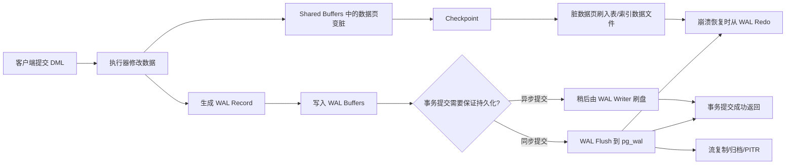

# PostgreSQL WAL 机制详解

## 1. 一句话说清楚 WAL 是什么

WAL（Write-Ahead Logging，预写日志）是 PostgreSQL 保证数据可靠性的核心机制：**数据页真正落盘之前，必须先把“这次改了什么”写入 WAL 日志并刷到持久化存储。**

用人话说：PostgreSQL 写数据时不会每次都立刻把表文件、索引文件刷盘，而是先写一份“操作记录”。万一数据库宕机，只要 WAL 还在，PostgreSQL 就能按日志把没来得及写进数据文件的变更重新做一遍。

## 2. WAL 写入流程图

关键路径：**先写 WAL，再写数据页；提交看 WAL 是否安全落盘，数据页可以延后由 checkpoint 批量刷盘。**

## 3. WAL 要解决的核心问题

### 3.1 为什么不直接每次提交都刷数据页？

如果每次事务提交都把涉及到的表数据页、索引页全部刷盘，会有两个问题：

- 数据页通常是随机写，磁盘 IO 成本高。
- 一个事务可能改很多分散的数据页，提交延迟会非常不稳定。

WAL 的思路是：把随机写转换成更便宜的顺序追加日志。事务提交时只要 WAL 安全落盘，就可以先返回成功；真正的数据页稍后再刷。

### 3.2 WAL 为什么能保证崩溃恢复？

因为 PostgreSQL 遵守一条规则：**描述数据变更的 WAL 记录必须先于对应数据页落盘。**

宕机后可能出现两种情况：

- 数据页已经刷盘：数据文件里已经有最新内容。
- 数据页还没刷盘：WAL 里有变更记录，恢复时重新执行 redo。

所以 WAL 本质上是数据库的“安全账本”。数据文件可以晚点更新，但账本必须先写好。

## 4. 按逻辑顺序拆解 WAL 底层机制

### 4.1 事务执行：先改内存，不急着刷数据文件

PostgreSQL 的表和索引数据会以页为单位缓存到 `shared_buffers`。当执行 `INSERT`、`UPDATE`、`DELETE` 时，数据库通常先修改内存中的数据页。

被修改过但还没刷到磁盘的数据页叫“脏页”。脏页不代表不安全，因为真正负责兜底的是 WAL。

### 4.2 生成 WAL Record：记录“如何重做这次变更”

每次底层数据修改都会生成 WAL record。它不是完整 SQL 文本，而是更靠近存储层的变更描述，例如某个数据页、某个 tuple、某个索引页发生了什么变化。

这也是为什么 WAL 能用于崩溃恢复：恢复时数据库不需要重新执行用户 SQL，而是按 WAL record 把存储层变更重新应用到数据文件。

### 4.3 写入 WAL Buffer：先进入共享内存缓冲区

WAL record 会先写入内存中的 WAL buffers。这样可以把大量小日志写入合并起来，减少系统调用和磁盘刷写频率。

在高并发场景下，多个事务的 WAL 可以被合并刷盘，这就是 group commit 的基础。

### 4.4 事务提交：关键是 WAL 是否持久化

同步提交模式下，事务提交前必须确保对应 WAL 已经 flush 到持久化存储。只要 WAL 安全落盘，事务就可以返回成功。

这里要注意：提交成功并不意味着数据页已经写入表文件，只意味着恢复这次提交所需的 WAL 已经可靠存在。

### 4.5 Checkpoint：把脏页批量推进数据文件

Checkpoint 是 WAL 机制里的“阶段性整理点”。到 checkpoint 时，PostgreSQL 会把一批脏数据页刷入表文件和索引文件，并在 WAL 中写入 checkpoint record。

它的作用是缩短崩溃恢复距离。恢复时不需要从数据库创建之初开始重放 WAL，而是从最近 checkpoint 相关位置开始 redo。

但是 checkpoint 也有代价：它会集中产生数据页写 IO。checkpoint 太频繁，写放大会变重；checkpoint 太少，崩溃恢复时间会变长。

### 4.6 崩溃恢复：从最近检查点开始 redo

数据库异常宕机后，PostgreSQL 启动时会读取控制信息和 checkpoint 记录，找到需要开始恢复的位置。

恢复过程大致是：

1. 找到最近可用 checkpoint。
2. 从 checkpoint 指向的 redo 位置开始读取 WAL。
3. 对尚未落入数据文件的变更执行 redo。
4. 恢复到一致状态后对外提供服务。

这就是 WAL 名字里 “Ahead” 的意义：日志先行，所以恢复有据可依。

## 5. WAL 和 PostgreSQL 其他能力的关系

### 5.1 WAL 与普通表、无日志表

普通表的数据页和索引页修改会写 WAL，因此可以崩溃恢复、复制和做 PITR。

UNLOGGED 表会跳过数据页和索引页相关 WAL，所以写入性能更好，但异常崩溃后会被清空。这也是你那篇“PG 无日志表”笔记里的核心取舍：**普通表用 WAL 买可靠性，无日志表少写 WAL 换吞吐。**

### 5.2 WAL 与流复制

PostgreSQL 的物理流复制，本质上是把主库产生的 WAL 持续发送给备库。备库重放 WAL，就能追上主库的数据状态。

所以主从复制延迟，经常可以理解成：备库接收、写入、重放 WAL 的速度跟不上主库产生 WAL 的速度。

### 5.3 WAL 与 PITR

PITR（Point-in-Time Recovery，时间点恢复）依赖基础备份和 WAL 归档。恢复时先还原一个较早的物理备份，再不断重放 WAL，直到指定时间点。

这也是 WAL 不只是“宕机恢复日志”的原因：它还是备份恢复体系、审计追溯和灾备体系的重要基础。

### 5.4 WAL 与性能优化

WAL 能减少提交时的数据页随机写，但它自身也会成为性能瓶颈。常见关注点包括：

- WAL 写入量是否过大。
- `checkpoint_timeout` 和 `max_wal_size` 是否导致 checkpoint 过于频繁。
- `wal_buffers` 是否足够承接高 WAL 写入。
- `full_page_writes` 开启后，checkpoint 后首次修改数据页会写整页镜像，WAL 量会增加。
- 归档或复制消费不及时，会导致 `pg_wal` 堆积。

## 6. 高频面试回答模板

如果面试官问：“PostgreSQL 的 WAL 是什么？”

可以这样答：

> PostgreSQL 的 WAL 是预写日志机制。它要求数据页落盘之前，先把描述这次变更的 WAL record 写入并持久化。事务提交时通常只需要保证 WAL 安全落盘，数据页可以后续由 checkpoint 批量刷盘。这样既把随机数据页写转成顺序日志写，又能在宕机后通过 redo 恢复未落盘的数据变更。除此之外，WAL 还是流复制、归档备份和 PITR 的基础。

如果继续追问：“为什么 UNLOGGED 表快？”

可以这样答：

> 因为 UNLOGGED 表跳过了数据页和索引页级别的 WAL，减少了日志写入和刷盘成本。但代价是异常崩溃后表数据无法通过 WAL 恢复，会被重置为空表，所以只能用于可丢、可重建的中间数据或缓冲数据。

## 7. 记忆口诀

- WAL 的核心：日志先行。
- WAL 的收益：少刷数据页，多写顺序日志。
- WAL 的承诺：提交看日志，恢复靠 redo。
- Checkpoint 的作用：缩短恢复距离，但不能太频繁。
- UNLOGGED 的本质：少写 WAL，牺牲崩溃恢复。

## 8. 参考文献

- PostgreSQL 官方文档：Write-Ahead Logging (WAL)  
  https://www.postgresql.org/docs/current/wal-intro.html
- PostgreSQL 官方文档：WAL Configuration  
  https://www.postgresql.org/docs/current/wal-configuration.html
- PostgreSQL 官方文档：Write Ahead Log 参数配置  
  https://www.postgresql.org/docs/current/runtime-config-wal.html
- PostgreSQL 官方文档：Continuous Archiving and Point-in-Time Recovery (PITR)  
  https://www.postgresql.org/docs/current/continuous-archiving.html
- PostgreSQL 官方文档：WAL Internals  
  https://www.postgresql.org/docs/current/wal-internals.html
- 本地参考笔记：[[2026-07-12-PG无日志表在项目中的应用（面试与实战笔记）]]
