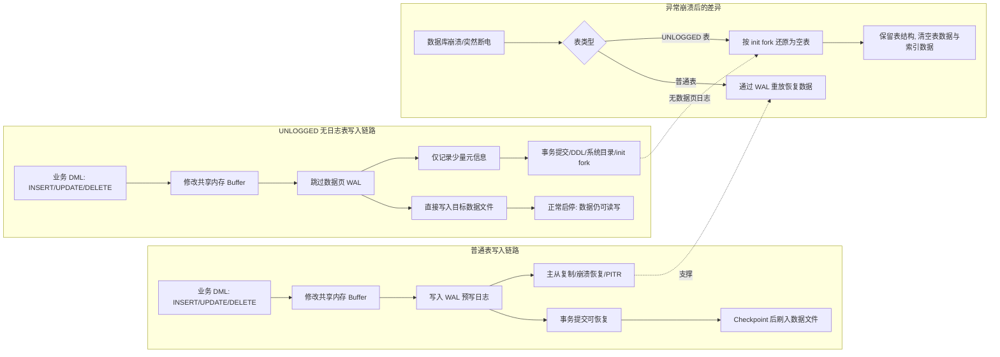

# PG 无日志表在项目中的应用（面试与实战笔记）

## 1. 核心架构/流程可视化（必选）



- 关键路径一句话：普通表用 WAL 换取崩溃恢复、复制和一致性；UNLOGGED 表跳过数据页与索引页 WAL，用可丢失、可重建的数据换取更低磁盘 IO 和更高写入吞吐。

## 2. 核心主题与背景（它在讲什么？）

### 2.1 一句话概括

- 这期视频讲的是：PostgreSQL 的无日志表如何通过绕开部分 WAL 写入来提升写性能，以及它适合和不适合放在哪些业务场景里。

### 2.2 技术体系位置与背景痛点

- 技术体系位置：它属于 PostgreSQL 存储引擎/事务日志机制下的表类型选择问题，是数据库性能优化、数据可靠性设计和架构选型的交叉点。
- 核心痛点：
  - 普通表每次写入都要产生 WAL，可靠性高，但磁盘 IO 压力也大。
  - 在 ETL 中间表、临时加工结果、高吞吐写缓冲这类场景里，数据往往可以从上游重放或重建。
  - 如果仍然按核心业务表的强一致标准处理，会把大量 IO 花在“不值得保护到极致”的数据上。

## 3. 核心知识点/解决方案拆解（它是怎么做的？）

### 3.1 先理解 WAL：为什么普通表写入会慢？

- WAL（Write-Ahead Logging，预写日志）是 PostgreSQL 保证可靠性的核心机制。
- 普通表执行新增、修改、删除时，通常不是只改数据文件，而是先把“我要做什么变更”写入 WAL。
- WAL 持久化后，数据库即使宕机，也能通过日志重放把数据追回来。
- 代价是：每次写入都会产生额外磁盘 IO，尤其在高频写、大批量写、索引较多的场景下，WAL 会成为明显成本。

### 3.2 UNLOGGED 表做了什么：跳过数据相关 WAL

- 创建方式：

```sql
CREATE UNLOGGED TABLE device_event_buffer (
    device_id bigint,
    event_time timestamp,
    payload jsonb
);
```

- UNLOGGED 表不是“不落盘”，而是“不记录数据页和索引页的 WAL”。
- 视频中强调，UNLOGGED 表仍会在 WAL 中保留少量必要信息：
  - 事务提交信息
  - DDL 表结构变更信息
  - 系统目录修改信息
  - `init fork` 创建信息，也就是用于异常恢复时还原空表的模板
- 不记录到 WAL 的主要是：
  - 数据页修改
  - 索引页修改
  - FSM（Free Space Map，空闲空间映射）变化
  - VM（Visibility Map，可见性映射）变化

### 3.3 性能收益来自哪里？

- 本质原因：少写日志，少刷盘，减少 WAL 体积和磁盘 IO。
- 视频举例：
  - 100 万行全量 update，普通表可能产生约 320MB WAL，而 UNLOGGED 表可能只有约 16MB。
  - 小批量 insert、大容量 insert 等写入场景，可能出现数倍级性能提升。
- 这类收益在以下场景更明显：
  - 批量导入
  - 高频 insert
  - 中间结果表
  - 数据可重建的缓冲表
  - 对主从同步和点时间恢复没有要求的数据

### 3.4 崩溃后会发生什么：不是回滚，而是清空

- 正常运行、正常关闭、正常启动：UNLOGGED 表的数据仍然存在，可以像普通表一样查询和写入。
- 异常断电、进程崩溃、数据库非正常恢复：UNLOGGED 表会被截断，恢复成空表。
- 原因很简单：
  - 数据页和索引页变化没有完整 WAL。
  - PostgreSQL 无法判断表内数据是否处于一致状态。
  - 所以恢复时用 `init fork` 把它还原成“结构还在、数据清空”的状态。

### 3.5 它和临时表有什么区别？

| 对比项 | 临时表 TEMP TABLE | 无日志表 UNLOGGED TABLE |
|---|---|---|
| 生命周期 | 通常绑定当前会话或事务 | 持久对象，像普通表一样长期存在 |
| 跨会话可见性 | 其他会话不可见 | 多个会话可见，可共享 |
| 正常重启后数据 | 通常不保留 | 正常启停保留 |
| 异常崩溃后数据 | 会话结束即消失 | 表被清空 |
| 典型用途 | 单会话临时计算 | 多会话共享的高性能中间表/缓冲表 |

### 3.6 典型应用场景

#### 场景一：ETL 中间加工表

- 业务流程：
  - 从原始数据源导出数据。
  - 导入 PostgreSQL 中间表做清洗、转换、聚合。
  - 处理完成后写入目标库、数仓或正式业务表。
- 为什么适合：
  - 原始数据还在，上游可重放。
  - 中间表只是加工态，不是最终可信数据源。
  - 数据量大，对写入性能要求高。
- 设计要点：
  - UNLOGGED 表只承载中间状态。
  - 处理失败后允许清空重跑。
  - 最终结果落到普通表或其他可靠存储。

#### 场景二：高并发写入缓冲表

- 业务示例：IoT 设备上报、埋点日志、短周期采集数据。
- 典型做法：
  - 高频数据先写入 UNLOGGED 缓冲表。
  - 每分钟或每个小窗口批量刷新到下游数据仓库。
  - 即使异常崩溃，损失也被控制在最近一个时间窗口内。
- 适合前提：
  - 数据不是核心交易数据。
  - 允许小概率丢失或可由设备/消息队列补偿。
  - 更关注吞吐、延迟和 IO 压力。

## 4. 亮点、坑点与最佳实践（如何体现经验？）

### 4.1 亮点

- 性能收益直接：绕过数据页 WAL 后，写入链路更短，WAL 文件膨胀更少。
- 使用成本低：SQL 层只需在建表时加 `UNLOGGED`，对应用读写模型影响较小。
- 适合“中间态数据”：对 ETL、批处理、可重建缓存表来说，可靠性要求天然低于最终数据。
- 能降低主库 IO 压力：在高写入场景里，可以减少 WAL 写放大带来的抖动。

### 4.2 避坑/局限性

- 不能放核心业务数据：订单、账户、支付流水、库存扣减这类强一致数据绝不能用。
- 异常崩溃会清空：它不是少量丢数据，而是整张表恢复为空表。
- 不适合依赖主从复制的场景：UNLOGGED 表的数据变化不会通过 WAL 正常复制到从库，从库侧通常只有空表结构。
- 不适合依赖 PITR 的场景：PITR（Point-In-Time Recovery，时间点恢复）依赖 WAL，UNLOGGED 表数据无法按时间点恢复。
- 索引也不受 WAL 保护：表数据和索引数据都可能在崩溃恢复后被重置。
- 序列要谨慎：和 UNLOGGED 表一起创建的序列也可能带有 unlogged 行为，异常后序列状态可能回退。
- 分区表要单独关注：PostgreSQL 官方文档明确说明 `UNLOGGED` 这种建表形式不支持直接用于分区父表；如果确实要在分区场景里使用类似能力，需要针对具体版本和具体子分区 DDL 单独验证。
- 备份策略要验证：部分物理备份工具可能不会保留 UNLOGGED 表数据；逻辑导出一般可以导出当时可见的数据。
- LOGGED 与 UNLOGGED 转换有成本：互相转换需要重写数据，数据量大时耗时明显，不适合高峰期随意操作。

### 4.3 最佳实践

- 选型原则：只把“可丢、可重建、可补偿”的数据放进 UNLOGGED 表。
- 给表名加语义：例如 `xxx_buffer`、`xxx_stage`、`xxx_tmp_pipeline`，让团队一眼知道它不是最终可信表。
- 建立重建机制：崩溃清空后，应能从上游数据、消息队列、对象存储或原始表自动重放。
- 控制损失窗口：高并发写缓冲建议按分钟级或更短周期批量落入可靠存储。
- 监控和告警：
  - 监控表行数异常归零。
  - 监控批处理延迟和下游写入失败。
  - 监控数据库异常重启事件。
- 正式上线前做一次演练：
  - 写入 UNLOGGED 表。
  - 模拟异常中断。
  - 验证恢复后表结构保留、数据清空。
  - 验证业务是否能自动补偿。

## 5. 总结与升华（一句话亮点）

- 面试行话版：PostgreSQL 的 UNLOGGED 表本质是用“放弃数据页 WAL 保护”换取写入吞吐，它适合 ETL 中间态和可重建缓冲数据，但凡涉及强一致、主从复制、PITR 或核心业务资产，都应该回到普通表。
