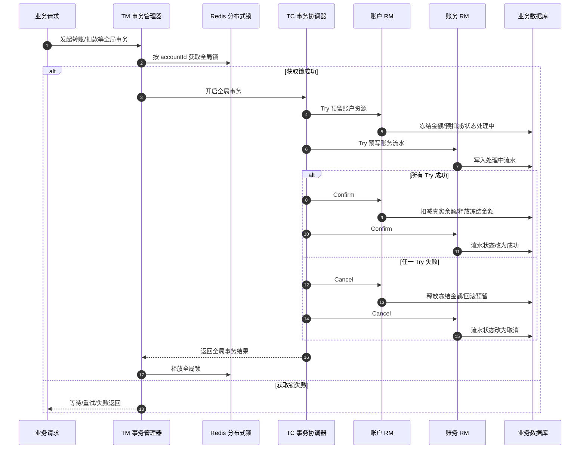

# TCC 如何保障强一致性分布式事务

## 内容属性判断

该视频属于 **分布式事务底层原理 + 金融业务场景实战讲解**。它不是单纯介绍 TCC 概念，而是以账户系统、账务系统拆分后的金融交易为背景，讨论如何通过 **TCC 三阶段、事务协调器、资源管理器、全局分布式锁、数据库兜底锁、重试与人工补偿** 来尽可能保障所谓的“强一致性”。

## 1. 核心架构/流程可视化

关键路径说明：TM 在进入 TCC 全局事务前，先按业务主键如 `accountId` 获取全局锁，把同一账户上的并发操作压成串行；TC 负责调度各个 RM 的 `Try / Confirm / Cancel`；RM 负责真正的业务资源预留、提交或回滚。

## 2. 核心主题与背景

一句话概括：**在金融、合规等对数据一致性要求极高的场景中，可以用 TCC 分布式事务配合全局分布式锁，将跨服务、跨数据库操作的不一致窗口尽量压缩到可控范围。**

它处在微服务架构中的 **分布式事务治理** 位置。单体系统中，一个本地数据库事务通常就能保证账户余额、账务流水等数据同时成功或失败；但系统拆分成账户服务、账务服务后，数据分散在不同服务和数据库中，单个本地事务无法覆盖完整链路，于是会出现“余额扣了但流水没写”“流水成功但账户没变”等问题。

该方案解决的核心痛点是：

- 跨应用、跨数据库的一致性问题。
- 同一账户并发交易导致的数据竞争问题。
- TCC 二阶段中部分成功、部分失败时的补偿问题。
- 金融场景下“宁可牺牲吞吐，也要控制一致性风险”的架构取舍问题。

## 3. 核心知识点/解决方案拆解

### 3.1 TCC 的三个阶段

TCC 是 `Try / Confirm / Cancel` 的缩写，本质上是把一个完整业务动作拆成三个可控阶段。

- `Try`：尝试执行业务，重点不是最终提交，而是 **检查条件 + 预留资源**。例如账户余额 1000 元，转账 100 元时，Try 阶段不直接扣真实余额，而是冻结 100 元或把可用余额预扣到 900 元。
- `Confirm`：确认提交业务，表示所有参与方的 Try 都成功后，真正完成业务变更。例如扣减真实余额、流水状态改为成功。
- `Cancel`：取消业务，表示 Try 阶段有参与方失败，或者全局事务要回滚，需要释放冻结资源、恢复业务状态。

面试里要注意：TCC 不是数据库自动帮你回滚，它要求业务方自己设计三套接口和补偿逻辑，因此侵入性强，但控制力也强。

### 3.2 三类核心角色

- `TM`，Transaction Manager，事务管理器，也就是全局事务的发起方。它决定一笔全局事务什么时候开始、成功或失败。
- `TC`，Transaction Coordinator，事务协调器，例如 Seata Server 一类组件。它负责记录全局事务状态，并通知各个参与者执行 Confirm 或 Cancel。
- `RM`，Resource Manager，资源管理器，也就是具体业务服务，例如账户服务、账务服务。它负责实现 Try、Confirm、Cancel 三个接口。

可以用大白话理解：

- TM 是“发起交易的人”。
- TC 是“调度和记账的总指挥”。
- RM 是“真正干活的业务系统”。

### 3.3 金融场景示例：账户系统 + 账务系统

视频中的典型场景是银行类系统拆分：

- 账户系统：维护账户余额、冻结金额、可用余额等核心账户信息。
- 账务系统：维护会计分录、交易流水、记账状态等数据。

转账或扣款时，两个系统必须保持一致。否则就可能出现：

- 账户余额已扣，但账务流水没有成功。
- 账务流水成功，但账户余额没有扣。
- 多个交易同时修改同一账户，导致余额覆盖或重复扣减。

因此方案设计为：

1. TM 收到交易请求。
2. TM 先基于账户维度获取 Redis 分布式锁，如 `lock:global:transfer:{accountId}`。
3. 获取锁成功后，TM 进入 TCC 全局事务。
4. TC 通知账户 RM 执行 Try：冻结或预扣金额。
5. TC 通知账务 RM 执行 Try：写入处理中流水。
6. 所有 Try 成功后，TC 发起 Confirm：账户真实扣减，流水改成功。
7. 任一 Try 失败后，TC 发起 Cancel：释放冻结金额，流水改取消。
8. Confirm 或 Cancel 完成后，TM 释放全局锁。

### 3.4 为什么锁放在 TM，而不是只在 RM 各自加锁

视频强调：为了强一致性，核心思路是先在 TM 侧获取一把全局锁，把并行请求变成串行请求。

原因主要有三个：

1. **全局入口更容易统一规则**  
   同一账户的所有转账请求都必须先经过 TM 的锁。只要锁粒度设计成 `accountId`，就可以做到同一账户串行，不同账户并行。

2. **避免多个 RM 各自加锁引发死锁**  
   如果账户 RM 和账务 RM 分别加锁，不同事务的加锁顺序不一致，就可能出现事务 A 锁账户等账务，事务 B 锁账务等账户，最终互相等待。

3. **减少悬挂和半冻结风险**  
   如果一个 RM 已经冻结资源，另一个 RM 加锁失败或调用失败，就需要 Cancel 回滚。若 Cancel 指令丢失或服务宕机，可能导致资金长期冻结。入口锁可以提前挡掉一部分竞争，降低后续补偿压力。

### 3.5 所谓“强一致性”不是绝对强一致

视频里一个很重要的观点是：这里的“强一致性”要加引号。TCC + 分布式锁并不能在所有极端情况下 100% 消灭不一致，只是将不一致窗口缩小到业务可接受范围。

典型风险包括：

- Redis 锁超时自动释放，但后续 RM 还没执行完，新的交易进来导致并发写。
- Confirm 阶段一个 RM 成功，另一个 RM 因网络、宕机、超时没有收到命令，TC 只能不断重试。
- 两个 RM 的 Confirm 执行耗时不同，中间存在毫秒级不一致窗口。
- 其他业务入口绕过了 TM 全局锁，直接修改 RM 数据，导致锁旁路。

因此生产方案不能只依赖“加一把 Redis 锁”，还需要数据库行锁、幂等、空回滚、防悬挂、重试告警、人工补偿等兜底机制。

## 4. 面试高频考点与追问

### 问题 1：TCC 是什么？和 2PC 有什么区别？

参考回答：

TCC 是 Try、Confirm、Cancel 三阶段的业务型分布式事务方案。Try 阶段预留资源，Confirm 阶段真正提交，Cancel 阶段释放资源或补偿回滚。它和传统 2PC 的区别是，2PC 偏数据库资源层，由事务管理器协调 prepare 和 commit；TCC 偏业务层，需要业务方自己实现三个接口，侵入性更强，但对复杂业务资源的控制能力更强。

关键词：业务补偿、资源预留、侵入性、最终确认、可控性。

### 问题 2：TCC 的 Try 阶段应该做什么？

参考回答：

Try 阶段主要做三件事：业务校验、资源预留、状态记录。以账户扣款为例，Try 不应该直接扣真实余额，而应检查余额是否足够，并冻结金额或预扣可用余额，同时记录事务状态为处理中。这样 Confirm 可以基于预留资源完成真实提交，Cancel 可以释放资源恢复状态。

关键词：校验、冻结、预扣、处理中状态、避免直接提交。

### 问题 3：为什么 TCC 的 Confirm 和 Cancel 必须保证幂等？

参考回答：

因为 TC 在网络超时、服务宕机、响应丢失等情况下，可能重复发送 Confirm 或 Cancel。如果接口不幂等，多次 Confirm 可能重复扣款，多次 Cancel 可能重复释放冻结金额。通常要用全局事务 ID、分支事务 ID、状态机和唯一约束来判断该事务是否已经处理过。

关键词：重试、重复通知、全局事务 ID、状态机、唯一约束。

### 问题 4：为什么要在 TM 侧加全局分布式锁？

参考回答：

因为金融类场景对同一账户的并发修改非常敏感。TM 侧按账户维度加锁，可以在全局事务开始前把同一账户的并发请求转成串行，降低多个 RM 内部分别加锁带来的死锁、悬挂和局部成功风险。锁粒度一般不能是全局业务锁，而应该按账户、订单、合同等业务主键细化。

关键词：并行转串行、锁粒度、避免死锁、同账户串行、不同账户并行。

### 问题 5：TCC + Redis 锁能否真正保证绝对强一致？

参考回答：

不能。它只能尽量缩小不一致窗口。比如 Redis 锁过期提前释放、Confirm 阶段部分成功、网络分区、服务宕机、其他业务绕过锁入口，都可能导致短暂甚至长期不一致。因此还要配合数据库行锁、事务状态表、幂等控制、TC 重试、告警和人工补偿，才能形成生产级闭环。

关键词：不一致窗口、锁超时、部分提交、CAP、补偿闭环。

## 5. 亮点、坑点与最佳实践

### 亮点

- **一致性控制更强**：相比异步消息最终一致性，TCC 能在业务执行链路中显式控制资源预留、提交和回滚。
- **适合金融核心链路**：账户、账务、交易、清结算等场景通常更愿意牺牲部分性能，换取更强的数据确定性。
- **锁粒度可业务化**：按 `accountId` 加锁，可以做到同一账户串行，不同账户仍然并行。
- **异常处理可审计**：通过事务状态、流水状态、冻结金额等字段，可以追踪每笔交易处于 Try、Confirm、Cancel 的哪个阶段。

### 坑点与局限性

- **性能下降**：同一业务主键上的请求会从并行变串行，高热点账户容易成为瓶颈。
- **Redis 锁不是万能锁**：锁超时时间过短会提前释放，过长又会影响吞吐；网络抖动和客户端暂停也可能造成锁语义失效。
- **Confirm 部分成功很难彻底避免**：一个 RM 成功，另一个 RM 挂掉，只能依靠重试和补偿，不存在魔法般的瞬间全局原子性。
- **业务侵入性强**：每个 RM 都要设计 Try、Confirm、Cancel，还要处理幂等、空回滚、防悬挂。
- **锁旁路风险高**：只要有其他入口绕过 TM 或不遵守同一套锁规则，整个一致性假设就会被破坏。

### 最佳实践

- **锁粒度按业务主键设计**：例如 `lock:transfer:{accountId}`，避免所有交易共用一把大锁。
- **锁超时时间要覆盖 P99 执行耗时**：同时配合看门狗续期或明确的超时中断策略。
- **Try 阶段使用数据库兜底锁**：核心账户行可配合 `select ... for update` 或乐观锁版本号，防止 Redis 锁失效后数据被并发破坏。
- **Confirm 和 Cancel 必须幂等**：用事务状态表、唯一索引、状态机流转控制重复请求。
- **处理空回滚和防悬挂**：Cancel 到达时，如果 Try 没执行过，要记录空回滚标记；Try 后到时发现已 Cancel，必须拒绝继续预留资源。
- **建立告警和人工补偿机制**：TC 重试次数过多、事务长时间处理中、冻结金额长时间未释放，都要告警并进入人工处理流程。
- **统一业务入口**：所有会修改同一资源的业务，如转账、退款、调账、冲正，都必须遵守同一套锁和事务规则。

## 6. 总结与升华

面试中可以这样概括：

> TCC 解决的不是“让分布式系统拥有单机事务一样的绝对原子性”，而是通过业务资源预留、全局事务协调、细粒度分布式锁、幂等补偿和人工兜底，把跨服务事务的不一致窗口压缩到业务可接受范围。

## 7. 为什么这个场景不优先使用 XA 模式？

严格来说，这个场景不是“不能用 XA”，而是 **XA 通常不适合作为金融微服务核心交易链路的首选方案**。

XA 是数据库层面的二阶段提交协议，它依赖支持 XA 的资源管理器，由事务协调器统一执行 `prepare -> commit/rollback`。它的优势是协议层强一致，但在账户、账务这类微服务场景中，问题也很明显。

### 7.1 XA 锁持有时间长，容易拖垮热点资源

XA 在一阶段 `prepare` 之后，数据库通常会继续持有相关行锁或事务资源，直到二阶段 `commit` 或 `rollback` 完成。

如果链路中存在网络抖动、服务超时、协调器异常，账户热点行就可能长时间被锁住。金融系统中同一账户、商户账户、平台中间户都可能是热点资源，长事务锁会明显降低吞吐，甚至造成请求堆积。

### 7.2 XA 性能开销大，不适合高并发核心链路

XA 是同步阻塞式协议，参与者越多，整体延迟越高。账户系统、账务系统、订单系统、支付系统一旦都被纳入 XA，全局事务会把多个本地事务绑定成一个长链路。

而 TCC 可以在业务维度做更细粒度的控制，例如按 `accountId` 串行化同一账户请求，不同账户之间仍然可以并行处理。

### 7.3 XA 对资源类型要求高

XA 主要适合数据库这类支持 XA 协议的资源。但真实微服务链路中，参与方可能包括：

- MySQL、Oracle 等数据库。
- Redis 缓存或分布式锁。
- MQ 消息系统。
- 第三方支付、风控、清结算系统。
- 积分、优惠券、库存等业务服务。

这些资源不一定都支持 XA。即使部分支持，也很难保证整条链路都能纳入同一个 XA 全局事务。

### 7.4 XA 缺少业务语义表达能力

XA 只能表达数据库事务层面的提交和回滚，但它不理解业务上的：

- 冻结金额。
- 释放冻结金额。
- 账务流水处理中。
- 库存预占。
- 优惠券锁定。
- 积分核销。

而金融场景通常不希望 Try 阶段直接扣真实余额，而是希望先冻结资金，再根据全局事务结果确认扣款或释放冻结。这个“冻结 - 确认 - 释放”的过程是业务语义，TCC 更适合表达。

### 7.5 XA 故障恢复容易阻塞

XA 的典型问题是二阶段期间的阻塞风险。如果协调者故障，参与者可能处于不确定状态，只能等待协调者恢复后继续提交或回滚。

TCC 同样需要处理异常，但它可以通过业务状态表、幂等控制、空回滚、防悬挂、重试告警和人工补偿来形成业务闭环。换句话说，TCC 把不可避免的分布式异常显式暴露给业务系统处理，而不是完全压在数据库协议层。

### 7.6 面试总结话术

可以这样回答：

> 这个场景不是不能用 XA，而是 XA 把一致性压在数据库协议层，强一致但重阻塞、低吞吐、资源要求高；账户、账务这类金融微服务更需要业务层的资源冻结、幂等补偿和异常兜底，所以通常选择 TCC 来用业务语义控制一致性窗口。
