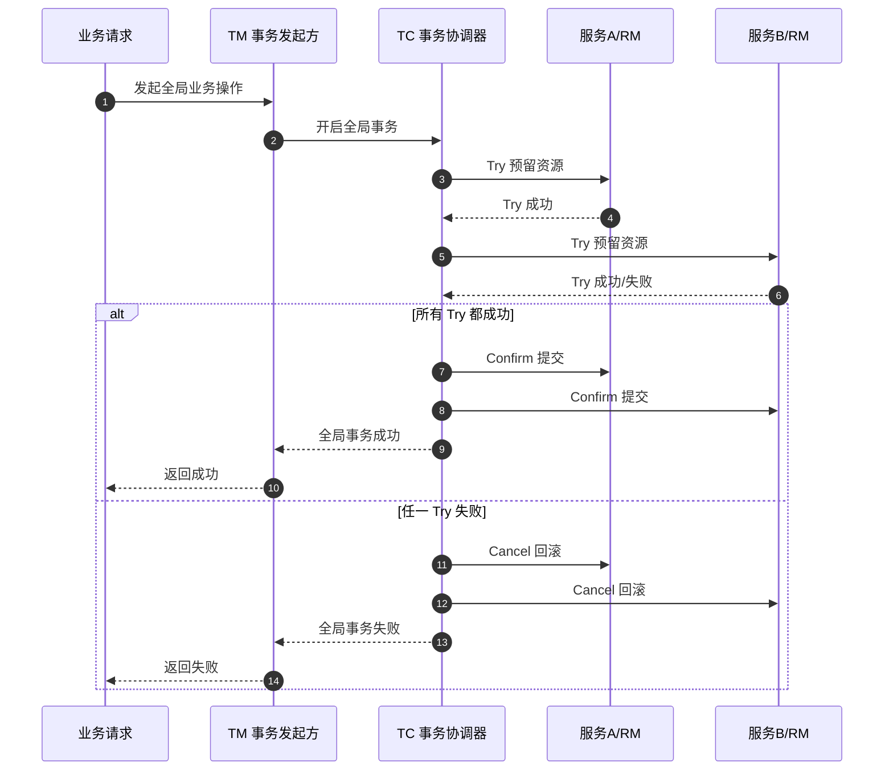

# TCC 模式介绍

## 1. TCC 是什么？

TCC 是一种常见的 **分布式事务解决方案**，全称是：

- `Try`：尝试执行业务，完成业务校验和资源预留。
- `Confirm`：确认执行业务，在 Try 成功后真正提交。
- `Cancel`：取消执行业务，在 Try 失败或全局事务失败时回滚预留资源。

简单理解：TCC 不是依赖数据库自动回滚，而是把一次完整的业务操作拆成三个业务接口，由业务系统自己控制“先冻结、再确认、失败释放”。

例如账户扣款 100 元：

- Try：检查余额是否足够，并冻结 100 元。
- Confirm：真正扣减 100 元，并释放冻结记录。
- Cancel：取消冻结，把 100 元恢复为可用余额。

## 2. TCC 核心流程图

关键点：TCC 的核心不是“自动事务”，而是 **业务层面的资源预留与补偿提交**。

## 3. TCC 适合哪些使用场景？

TCC 适合对一致性要求高、业务资源可以被明确预留和释放的场景。

### 3.1 金融交易

例如转账、扣款、提现、充值、清结算。

这类场景要求账户余额、账务流水、交易订单尽量保持一致。Try 阶段可以冻结资金，Confirm 阶段真实扣款，Cancel 阶段释放冻结金额。

### 3.2 库存扣减

例如电商下单扣库存。

Try 阶段冻结库存，Confirm 阶段真实扣减库存，Cancel 阶段释放库存。这样可以避免并发下单导致超卖。

### 3.3 优惠券、积分、权益核销

例如用户下单时同时使用优惠券和积分。

Try 阶段锁定优惠券和积分，Confirm 阶段核销，Cancel 阶段恢复可用状态。

### 3.4 跨服务核心业务链路

例如订单服务、支付服务、库存服务、会员服务之间需要同时成功或失败。

TCC 可以把每个服务都设计成一个资源管理器，每个服务分别提供 Try、Confirm、Cancel 接口，由事务协调器统一调度。

## 4. TCC 不适合哪些场景？

TCC 不适合所有分布式事务问题，尤其不适合下面几类情况：

- **业务无法预留资源**：例如某些外部系统只提供一次性提交接口，没有冻结、撤销能力。
- **一致性要求不高**：如果业务允许延迟一致，用消息队列、事务消息、补偿任务可能更简单。
- **高并发低价值链路**：TCC 接口多、状态多、重试多，成本较高，不适合所有普通业务。
- **调用链路太长**：参与者越多，Try、Confirm、Cancel 的组合复杂度越高，失败处理也越难。

## 5. TCC 的优点

- **一致性控制能力强**：可以明确控制每个服务的提交和回滚逻辑。
- **业务语义清晰**：冻结、确认、取消都由业务自己定义，可解释、可审计。
- **适合核心交易链路**：尤其适合金融、库存、权益等强约束资源。
- **降低长期不一致风险**：相比纯异步补偿，TCC 能在主流程中主动控制事务结果。

## 6. TCC 的缺点

- **业务侵入性强**：每个参与服务都要实现 Try、Confirm、Cancel 三个接口。
- **开发复杂度高**：需要处理幂等、空回滚、防悬挂、超时、重试、告警等问题。
- **性能有损耗**：一次业务会拆成多阶段调用，链路更长，延迟更高。
- **不是绝对强一致**：网络分区、服务宕机、部分 Confirm 成功等极端情况仍然需要补偿和人工兜底。

## 7. 落地注意事项

### 7.1 Confirm 和 Cancel 必须幂等

事务协调器可能因为网络超时或响应丢失而重复调用 Confirm 或 Cancel。接口必须能承受重复请求，避免重复扣款、重复释放库存等问题。

常见做法：

- 使用全局事务 ID 做唯一约束。
- 使用事务状态表记录处理状态。
- 使用状态机限制状态流转。

### 7.2 要处理空回滚

空回滚是指 Cancel 请求先到了，但 Try 请求因为网络延迟还没执行。

如果 Cancel 什么都不记录，后续 Try 又执行成功，就会造成资源被错误冻结。正确做法是：Cancel 到达时即使没有 Try 记录，也要记录一条“已回滚”状态，后续 Try 发现已回滚后直接拒绝。

### 7.3 要处理悬挂问题

悬挂是指 Cancel 已经执行完成，但 Try 请求后来才到。如果 Try 继续执行，就会出现已经取消的事务又占用了资源。

解决思路：Try 执行前检查事务状态，如果发现该全局事务已经 Cancel，则不能再预留资源。

### 7.4 Try 阶段只做资源预留

Try 阶段不要直接完成不可逆操作。它应该尽量只做校验、冻结、预占和状态记录，为 Confirm 或 Cancel 留出明确的处理空间。

### 7.5 必须有监控和补偿机制

TCC 不能只靠代码逻辑“相信一定成功”。生产环境必须监控：

- 长时间 Try 中的事务。
- Confirm 重试多次仍失败的事务。
- Cancel 重试多次仍失败的事务。
- 长时间冻结未释放的资源。

这些异常需要告警，并提供人工补偿入口。

## 8. 一句话总结

TCC 的本质是：**用业务层的“资源预留 + 确认提交 + 失败补偿”，在分布式系统中尽可能模拟本地事务的提交和回滚能力。**

