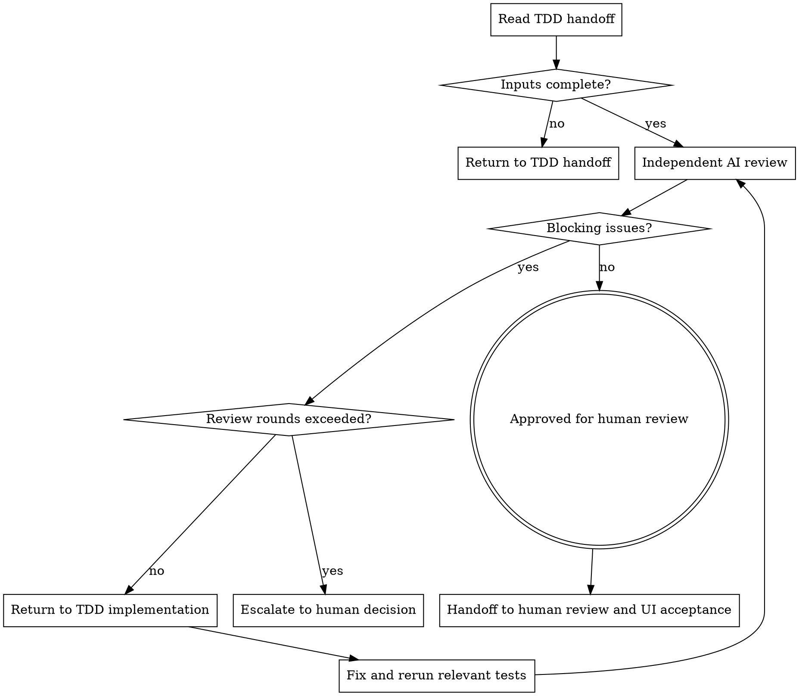

# AI Code Review Loop

在 TDD 实现闭环通过后，启动独立代码评审。这个技能负责检查本次实现是否忠实承接测试用例、任务计划、Spec、Architecture Design 和 ADR，并判断是否可以进入人审与 UI 自动化验收阶段。

本阶段只做 AI 代码评审和复审编排，不直接修改代码、测试或设计文档。

## Hard Gate

只处理已经完成阶段性 TDD 验证的单 Spec / 单任务范围变更。必须能看到 TDD 证据、代码 diff、测试 diff 和已运行命令结果。

不要编写功能代码、修改测试、重跑 TDD 修复、做人类 review、编写 Playwright / UI E2E 或跨系统验收测试。发现阻塞问题时，退回 TDD 实现闭环修复并重跑相关测试。

## 边界

| 负责 | 不负责（留给其他阶段） |
| --- | --- |
| 审核代码 diff、测试 diff 和 TDD 证据 | 修改功能代码或测试代码 |
| 检查实现是否满足测试用例与 Spec 行为契约 | 重新设计 PRD、Spec、Architecture Design、ADR 或任务计划 |
| 检查是否违反 Architecture Design / ADR | 写新的测试用例设计文档 |
| 检查正确性、边界条件、错误处理、事务、幂等、并发、资源释放、安全和观测性风险 | Playwright、UI E2E、跨系统验收测试 |
| 输出 blocking issues、非阻塞建议和人审焦点 | 人类 review、发布决策、业务 UAT |
| 组织最多 3 轮修复后复审 | 为了通过评审而弱化测试或扩大任务范围 |

如果评审发现问题需要改代码，应明确退回 TDD 实现闭环。不要在本阶段直接修复。

## 必做清单

按顺序推进：

1. **确认准入** - TDD 证据存在，相关单元测试、单模块接口集成测试、构建或静态检查已经运行并记录结果。
2. **读取输入** - 读取测试用例文档、任务计划、Spec、Architecture Design、ADR、TDD 证据、代码 diff、测试 diff 和命令结果。
3. **确认评审范围** - 确认本轮只覆盖单 Spec / 单任务范围；累计变更、多 Spec 或最终人审复核留给后续阶段。
4. **启动 Reviewer** - 新开独立 Reviewer Agent，按 `REVIEWER.md` 审核，不复用实现阶段的自我判断。
5. **处理评审结果** - 有 blocking issues 时退回 TDD 实现闭环；无 blocking issues 时进入人审与 UI 自动化验收阶段。
6. **复审闭环** - 修复后重新读取相关材料，重点确认上一轮 blocking issues 是否消失，并快速扫描是否引入新问题。
7. **交接后续阶段** - 输出 AI Code Review Report 路径或完整内容、人审焦点、剩余非阻塞建议和已验证命令。

## 输入

必须读取：

- 测试用例文档，通常来自 `openspec/changes/<change>/test-cases/`。
- 任务计划，通常来自 `openspec/changes/<change>/tasks/`。
- 目标 Spec。
- Architecture Design。
- 相关 ADR。
- TDD 证据摘要，通常来自 `openspec/changes/<change>/evidence/`。
- 本次功能代码 diff。
- 本次测试代码 diff。
- 已运行命令及结果，包括相关单元测试、单模块接口集成测试、构建或静态检查。

如果项目已有语言、框架或领域 code review checklist，可以把它作为补充输入。补充 checklist 不能替代本阶段的通用审核规则，也不能把 checklist 中的风格偏好升级成阻塞问题。

## 输出

输出 AI Code Review Report。默认路径：

```text
openspec/changes/<change>/reviews/<spec-domain>-ai-code-review.md
```

如果项目已有 review 或 evidence 目录，跟随项目惯例。

报告必须使用 Reviewer 的固定格式，并包含：

- `Verdict`。
- `Blocking Issues`。
- `Non-blocking Suggestions`。
- `Design & Scope Check`。
- `Test & TDD Evidence Check`。
- `Human Review Focus`。

## 流程图



## Step 1: 确认准入

必须确认：

- TDD 实现阶段已经完成 RED、GREEN、Refactor 和 Module Verification。
- TDD 证据摘要记录了测试映射、RED 失败、GREEN 通过、重构验证和模块验证命令。
- 代码 diff 与测试 diff 可读。
- 上游测试用例、任务计划、Spec、Architecture Design 和 ADR 可追溯。
- 本次变更没有故意跳过、删除或弱化测试。
- 本轮评审目标是单 Spec / 单任务范围。

如果缺少 TDD 证据、diff 或命令结果，先退回 TDD 实现阶段补齐交接材料。

## Step 2: 独立 Reviewer

必须新开独立 Reviewer Agent，并提供：

- 本 skill 的目标和边界。
- `REVIEWER.md` 的完整审核规则。
- 所有输入材料路径或内容。
- 本轮是否为首次评审或第几轮复审。
- 如果是复审，提供上一轮 AI Code Review Report。

Reviewer 只输出报告，不修改代码。不要让实现 Agent 自己给自己做最终评审。

## Step 3: 处理 Blocking Issues

如果 `Verdict` 为 `Changes Required`：

- 将每个 blocking issue 退回 TDD 实现闭环。
- 修复时必须重跑与问题相关的测试、必要构建或静态检查。
- 修复后重新触发 Reviewer 复审。
- 复审时必须读取完整上下文和新 diff，不只看修复片段。

建议最多 3 轮 AI review / fix / rereview。3 轮后仍有 blocking issues 时，停止自动闭环，交给人类裁决。

## Step 4: 通过后交接

如果 `Verdict` 为 `Approved for Human Review`，交接给人审与 UI 自动化验收阶段：

- AI Code Review Report 路径或完整内容。
- 代码 diff 和测试 diff 摘要。
- TDD 证据摘要路径。
- 已运行命令及结果。
- Non-blocking Suggestions。
- Human Review Focus。

本阶段通过不代表最终验收通过。它只表示当前单 Spec / 单任务实现已经通过 AI 代码评审质量门，可以进入后续人审和 UI 自动化验收。

## 何时可以精简

小改动可以使用 Lite 模式：

- 评审报告可以直接写在交接消息中，不强制单独建文件。
- 只检查本次相关 diff、TDD 证据和目标测试命令。
- Non-blocking Suggestions 可以为空。

但不能跳过：

- TDD 证据准入。
- 独立 Reviewer。
- blocking issues 判定。
- 修复后复审。
- 明确 `Verdict`。
- 人审焦点交接。

## 关键原则

- **独立评审**：实现者和 Reviewer 视角分离，避免自写自审。
- **证据优先**：每个阻塞问题都必须指向代码、测试、设计文档或 TDD 证据。
- **阻塞要克制**：只阻塞会导致行为错误、设计违背、风险失控或后续验收误判的问题。
- **不越界修复**：评审阶段只输出问题和结论，修复回到 TDD 实现闭环。
- **单范围闭环**：本阶段只审单 Spec / 单任务变更；累计变更复核留给后续阶段。
- **UI 验收后置**：Playwright 和 UI 自动化验收属于人审与 UI 自动化验收阶段。
