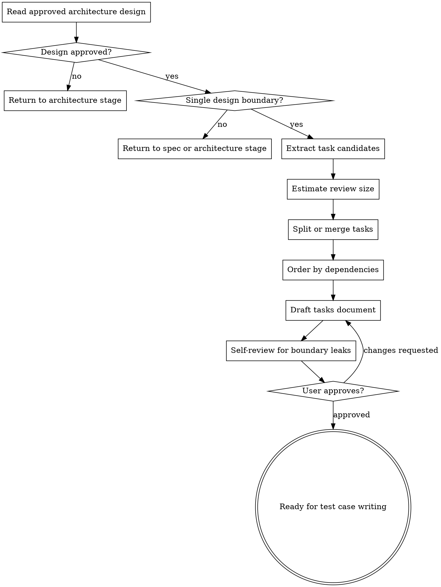

# Architecture to Tasks

把一份已批准的 Architecture Design Doc 转换成任务计划。这个技能负责"按什么顺序做、每个任务交付什么、任务之间如何依赖"，不负责写测试用例、测试代码或功能代码。

<HARD-GATE>
只处理已经批准、且没有会改变组件边界/接口契约/数据流的阻塞问题的单个 Architecture Design Doc。不要重新选择架构方案、不要新增 ADR、不要写 Given-When-Then 测试用例、不要写测试代码、不要写功能代码、不要输出 patch 或逐行修改说明。
</HARD-GATE>

## 边界

| 负责 | 不负责（留给其他阶段） |
| --- | --- |
| 读取已批准的 architecture design、关联 spec、closure review 和 ADR | 修改 PRD、Spec 或架构方案 |
| 提取组件、接口、数据流、迁移、配置、安全、观测性等工作项 | 新增架构决策或 ADR |
| 拆解约 300 行代码 review 粒度的任务 | Given-When-Then 测试用例编写 |
| 明确任务依赖、实施顺序、风险和回滚注意事项 | 测试代码、功能代码、代码 patch |
| 输出任务计划文档并交接给测试用例编写阶段 | 工期排期、人员分配、版本承诺 |

如果自己开始写"测试场景应该是 GIVEN/WHEN/THEN""新增某个方法的代码""第几行改成什么""采用另一种架构方案"，说明已经越界。停下来，把内容改成任务约束、风险或交接说明。

## 任务拆解原则

- **一份 design，一份任务计划**：一次只处理一个工程边界。如果 design 覆盖多个独立边界，先退回前序阶段。
- **任务服务 review**：单个任务的功能代码变更量大致控制在 300 行左右，便于人工 review；这是拆分参考线，不是机械硬上限。
- **按职责和风险拆分**：API 契约、数据迁移、异步补偿、权限、安全、观测性等独立风险域不要混在同一个任务里。
- **按依赖排序**：先做被依赖的基础边界，再做集成和外层流程；能并行的任务明确标出。
- **保留设计约束**：任务要继承 architecture design 和 ADR 的约束，不重新讨论架构选择。
- **可交接给测试**：每个任务都要有可观察完成标准，但不要展开成测试用例。
- **步骤可以存在**：一个任务可以包含多个内部步骤；步骤说明执行顺序，任务才是 review、测试用例设计和实现推进的基本单元。
- **不追求过细**：不要把任务拆成"改一个字段""新增一个私有方法"这类代码操作。
- **不追求过大**：不要把任务写成"实现整个后端""完成全部 UI"这类无法 review 的大块工作。

## 必做清单

按顺序推进：

1. **确认准入** - Architecture Design Doc 已批准；关联 Spec 已通过闭环评审；无阻塞 Open Questions。
2. **读取输入** - 读取 PRD、proposal、目标 spec、closure review、architecture design、ADR、必要现有代码结构和项目约定。
3. **确认单 design 边界** - 如果 design 仍覆盖多个工程边界，退回前序阶段。
4. **提取工作项** - 从组件、接口、数据/控制流、错误处理、安全、观测性、迁移、兼容、配置中提取任务候选。
5. **估算 review 粒度** - 为每个候选任务估算代码变更量和 review 关注点，按约 300 行代码粒度拆分或合并。
6. **梳理依赖顺序** - 标出前置任务、可并行任务、集成任务和阻塞外部条件。
7. **标注风险和回滚点** - 标出高风险任务、兼容窗口、数据迁移、回退策略、人工确认点。
8. **写任务计划文档** - 只写任务计划，不写测试用例或代码。
9. **自检和用户审阅** - 确认可交给测试用例编写阶段。

## 流程图



## Step 1: 确认准入

必须读取并确认：

- PRD 已批准。
- Proposal 和目标 Spec 已批准。
- 闭环评审输出为 `Approved`，或 blocking issues 已修正并复审通过。
- Architecture Design Doc 状态为 `FINAL`，或用户明确批准。
- ADR 若存在，关键决策状态已明确。
- 没有会改变组件边界、接口契约、数据流、状态所有权或安全模型的 Open Questions。

如果 Architecture Design Doc 尚未批准，先退回架构设计阶段。不要为了拆任务替用户默认接受架构方案。

## Step 2: 读取上下文

读取：

- Source PRD、proposal、目标 spec、closure review。
- Architecture Design Doc 的 Summary、Components / Boundaries、Data / Control Flow、Interfaces / Contracts、Error Handling、Security / Privacy、Observability、Handoff to Planning。
- 相关 ADR，尤其是会约束实现顺序、模块边界、兼容策略或基础设施选择的决策。
- 必要的现有代码结构、目录、模块边界、测试目录和项目约定。

只读取能影响任务拆解的上下文。不要重新做架构调研，也不要把无关系统拖进计划。

## Step 3: 提取任务候选

从 architecture design 中提取任务候选：

```markdown
| Candidate | Source | Outcome | Risk Domain | Notes |
|---|---|---|---|---|
| {候选任务} | {design section / ADR} | {完成后的能力或边界变化} | API/Data/Auth/Observability/etc. | {约束} |
```

覆盖这些来源：

- 组件或模块边界。
- API、事件、消息、外部接口或前后端契约。
- 数据读写、状态迁移、一致性、幂等、回滚。
- 错误处理、重试、补偿、失败可见性。
- 权限、安全、隐私、审计。
- 日志、指标、追踪、告警、排障入口。
- 配置、部署、灰度、兼容窗口。
- 与现有模块的集成点。

如果缺少信息导致无法判断任务边界，一次只问一个阻塞问题。

## Step 4: 校准任务粒度

一个任务应满足：

- 能用一句话说明交付结果。
- 有明确依赖和完成条件。
- 可被后续测试用例阶段映射到一个或多个行为场景。
- 预估功能代码变更量大致在 300 行左右。
- review 时可以由一个人完整理解，不需要同时审完整个系统。
- 不混入多个独立风险域。

拆分信号：

- 预估超过约 300 行，且包含多个职责、多个风险点或多个 review 关注点。
- 同时修改 API 契约、核心业务逻辑、数据迁移和观测性。
- 需要不同评审人理解不同上下文。
- 任何一个子部分失败都不应阻塞其他子部分 review。

合并信号：

- 明显小于约 300 行。
- 必须一起理解、一起提交、一起验证。
- 拆开后每个小任务都缺少独立交付意义。
- 单独 review 反而增加上下文切换成本。

## Step 5: 梳理依赖和顺序

为每个任务标出：

- **Depends On**：依赖哪些任务或外部前置条件。
- **Unblocks**：完成后解锁哪些后续任务。
- **Can Run In Parallel With**：可并行的任务。
- **Sequence Reason**：为什么要按这个顺序。

排序原则：

1. 先建立共享边界和契约。
2. 再实现核心领域流程。
3. 再接入外部系统、UI、worker 或集成链路。
4. 再补齐错误处理、安全、观测性、迁移和兼容收尾。

如果安全、兼容或数据迁移是前置风险，不要放到最后补；把它们提前成独立任务。

## Step 6: 写任务计划文档

默认保存到：

```text
openspec/changes/<change>/tasks/<spec-domain>-tasks.md
```

如果项目已有任务计划路径惯例，跟随项目惯例。若项目明确使用单文件任务计划，可以保存为：

```text
openspec/changes/<change>/tasks.md
```

模板：

```markdown
# {Spec Domain} Task Plan

## Status
DRAFT

## Source
- PRD: `{path}`
- Proposal: `{path}`
- Spec: `{path}`
- Closure Review: `{path or summary}`
- Architecture Design: `{path}`
- ADRs:
  - `{path or "None"}`

## Planning Scope
{本任务计划负责的工程边界、明确非目标、必须继承的架构约束}

## Task Overview
| Task | Outcome | Estimated Change Size | Risk | Depends On |
|---|---|---|---|---|
| T1 | {交付结果} | ~300 LOC | Low/Medium/High | - |

## Work Breakdown

### T1: {业务含义明确的任务名}

**Source:** {architecture design section / ADR}

**Outcome:** {完成后系统具备什么能力或边界变化}

**Estimated Change Size:** {~150 LOC / ~300 LOC / >300 LOC, split required}

**Dependencies:** {None / T# / external condition}

**Steps:**
1. {内部执行步骤，不写代码}
2. {内部执行步骤，不写测试用例}

**Implementation Notes:** {设计约束、复用边界、兼容要求、不要做什么}

**Done When:** {可观察完成标准，不写具体测试步骤}

**Risk:** {Low/Medium/High - 原因和缓解}

## Dependency Order
1. {先做什么，为什么}
2. {再做什么，为什么}

## Parallel Work
- `{Task}` can run in parallel with `{Task}` because {reason}.

## Integration Points
| Point | Related Tasks | Notes |
|---|---|---|
| {API/Event/Data/Auth/Observability/etc.} | {T#} | {注意事项} |

## Risk Notes
- {高风险任务、回滚点、兼容窗口、人工确认点}

## Handoff to Test Case Writing
- {需要阶段⑤优先覆盖的行为/风险类别，不展开 Given-When-Then}

## Open Questions
- [ ] {会阻塞任务拆解或改变任务边界的问题}
```

## Step 7: 自检

定稿前检查：

- **准入完整**：是否只处理已批准 design？是否存在会改变任务边界的 Open Questions？
- **边界清晰**：是否只服务一个 Spec / design？是否混入其他工程边界？
- **无架构漂移**：是否重新选择了方案、修改了 ADR 结论或引入未批准技术方向？
- **无测试泄漏**：是否写了 Given-When-Then 测试用例、测试代码或测试文件清单？有则移到后续阶段。
- **无代码泄漏**：是否写了代码片段、patch、逐行修改、具体私有方法实现？有则移除。
- **review 粒度**：每个任务是否大致符合约 300 行代码变更的人工 review 粒度？过大是否拆分，过小是否合并？
- **依赖明确**：任务顺序、并行关系、前置条件是否清楚？
- **风险明确**：高风险任务是否标出缓解、回滚或人工确认点？
- **可交接**：测试用例编写阶段是否能基于任务的 Outcome、Done When、Risk 设计测试场景，而不需要重新拆任务？

如果 Open Questions 会改变任务边界、任务顺序或 review 粒度，禁止定稿。

## Step 8: 用户审阅关卡

自检通过后请求用户审阅：

```markdown
任务计划已写到 `{tasks path}`。
请重点审阅：任务粒度是否便于 review、依赖顺序是否合理、是否有任务过大/过小、风险和交接给测试用例编写的关注点是否完整。
你批准后，我会把状态改为 FINAL，并交接给测试用例编写阶段。
```

用户要求修改时，更新任务计划，重新自检，再请求审阅。

用户批准后：

- 将任务计划状态改为 `FINAL`。
- 明确交接给下一阶段：任务计划路径、任务清单、优先设计测试场景的风险点、仍需注意的非阻塞问题。

## 何时可以精简

小 design 可以使用 Lite 模式：

- 只列 1-3 个任务。
- 每个任务可以省略 Parallel Work。
- Risk Notes 可以合并到任务内部。

但不能跳过：

- 已批准 design 准入。
- 单 design 边界检查。
- 约 300 行 review 粒度判断。
- 任务依赖顺序。
- 无测试/代码泄漏自检。
- 用户审阅。

## 关键原则

- **架构已定，任务只拆执行路径**。
- **任务服务 review，不服务幻觉式完整清单**。
- **约 300 行代码是拆分参考线**。
- **一个任务可以有多个步骤，但一个步骤不等于一个任务**。
- **高风险域独立拆，低价值碎片合并做**。
- **测试场景留给下一阶段，代码留给再后续阶段**。
