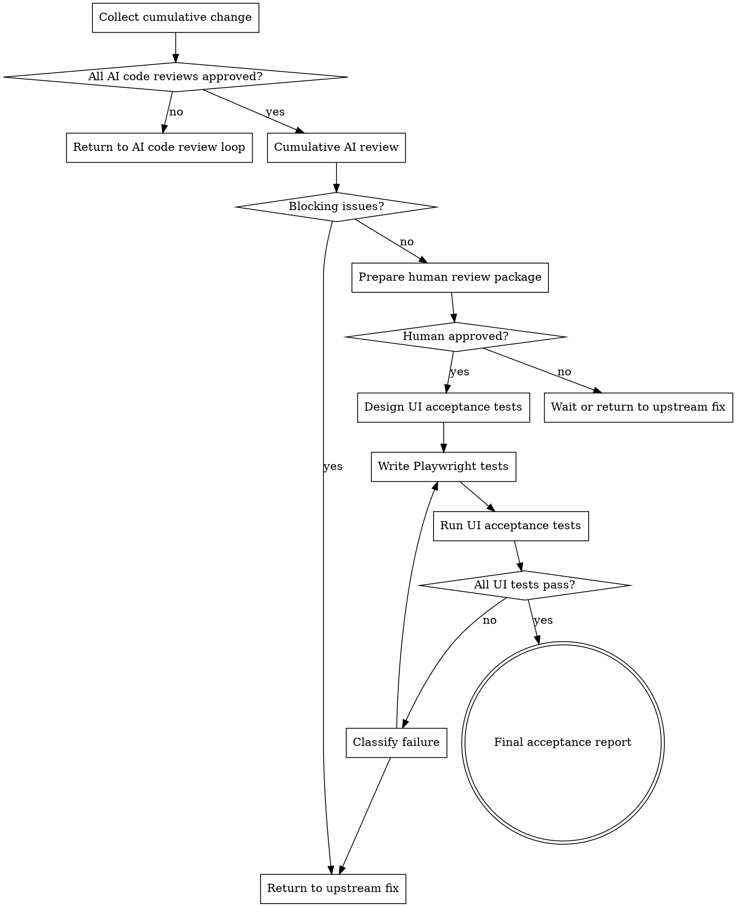

# Human Review UI Acceptance

把已经通过阶段性 AI 代码评审的累计变更交给最终验收。这个技能负责"累计变更 AI 复审 → 人类 review → UI 触发的 Playwright 验收测试编写与运行 → 最终验收报告"，不负责重新实现功能、替代人类审批或发布上线。

## Hard Gate

只处理已经完成 TDD 实现闭环，并且对应单 Spec / 单任务 AI Code Review Report 为 `Approved for Human Review` 的累计变更。

不要代表人类批准 review。没有明确的人类 review 通过结论，不要编写或运行 Playwright UI 验收测试。发现代码、测试、设计或验收口径阻塞问题时，退回相应上游阶段修复，而不是在本阶段现场改功能。

## 边界

| 负责 | 不负责（留给其他阶段） |
| --- | --- |
| 面向累计变更执行一轮 AI 代码复审 | 单任务 TDD 修复或重写功能实现 |
| 汇总单 Spec / 单任务 AI Code Review Report | 替代阶段⑩的单任务代码评审 |
| 准备人类 review 包和人审焦点 | 代表人类 approve / reject |
| 在人审通过后编写 UI 触发的 Playwright 验收测试 | 编写模块级 UT / IT |
| 运行 UI 自动化验收测试并记录证据 | 发布上线、业务 UAT 或生产监控 |
| 输出最终验收报告和残余风险 | 修改 PRD、Spec、Architecture Design、ADR 或任务计划 |

如果人审或 UI 验收发现实现问题，退回阶段⑦⑧⑨修复；修复后必须重新经过阶段⑩和本阶段的累计复审。

## 必做清单

按顺序推进：

1. **确认准入** - 所有相关 Spec / task 均有通过的 TDD 证据和 AI Code Review Report。
2. **汇总累计变更** - 收集 PRD、Spec、Architecture Design、ADR、任务计划、测试用例、TDD 证据、AI code review 报告、代码 diff、测试 diff 和命令结果。
3. **累计 AI 复审** - 新开独立 Reviewer Agent，按 `CUMULATIVE_REVIEWER.md` 审核跨 Spec / 跨任务集成风险。
4. **处理复审结果** - 有 blocking issues 时退回相应上游阶段；无阻塞问题时准备人类 review 包。
5. **人类 Review Gate** - 明确等待人类 review 结论。只有人类批准后才进入 UI 自动化验收。
6. **UI 验收设计** - 人审通过后，按 `PLAYWRIGHT_ACCEPTANCE.md` 从 PRD 验收口径、Spec scenarios 和人审焦点提炼 UI 触发路径。
7. **编写 Playwright 测试** - 只覆盖真实用户可触发的关键验收路径，不补写模块级测试。
8. **运行 UI 自动化测试** - 启动必要服务，运行 Playwright，记录命令、环境、结果和失败证据。
9. **失败处理** - 如果失败来自产品行为或实现问题，退回实现闭环；如果失败来自测试脚本或环境，修正验收脚本或环境后重跑。
10. **最终验收报告** - 所有 UI 验收通过后，输出最终报告并标记可验收。

## 输入

必须读取：

- PRD，尤其是 Goals、Success Metrics 和 Acceptance Criteria。
- `openspec/changes/<change>/proposal.md`。
- 相关 `openspec/changes/<change>/specs/**/spec.md`。
- Architecture Design 和相关 ADR。
- 任务计划。
- 测试用例文档。
- TDD 证据摘要。
- 单 Spec / 单任务 AI Code Review Report。
- 累计代码 diff 和测试 diff。
- 已运行的单元测试、单模块接口集成测试、构建和静态检查结果。
- 人类 review 结论和 review comments。
- 项目现有 Playwright 配置、测试目录、fixture、认证方式、测试数据和启动命令。

如果人类 review 结论不可见，必须停止在 Human Review Gate，不要默认通过。

## 输出

建议输出三类材料：

```text
openspec/changes/<change>/reviews/<change>-cumulative-ai-review.md
openspec/changes/<change>/acceptance/<change>-ui-acceptance-plan.md
openspec/changes/<change>/acceptance/<change>-final-acceptance.md
```

如果项目已有 review、evidence、acceptance 或 test report 目录，跟随项目惯例。

最终验收报告应包含：

- 累计 AI 复审结论。
- 人类 review 结论和关键 comment 处理状态。
- Playwright 验收测试清单。
- UI 自动化测试命令、环境和结果。
- 失败重试记录。
- 残余风险。
- 最终状态：`Accepted` / `Blocked`。

## 流程图



## Step 1: 累计变更 AI 复审

新开独立 Reviewer Agent，按 `CUMULATIVE_REVIEWER.md` 检查：

- 多个 Spec / task 的集成边界是否一致。
- 单任务评审通过后是否仍存在累计层面的冲突、遗漏或顺序问题。
- PRD acceptance criteria 是否被累计实现和测试证据覆盖。
- 迁移、配置、权限、观测性、兼容性和回滚是否在累计变更层面可接受。
- 是否存在人类 review 必须裁决的业务或发布风险。

累计复审通过后，生成或更新累计 AI Review Report。

## Step 2: 人类 Review Gate

准备人类 review 包：

- 累计变更摘要。
- PRD / Spec / Architecture / ADR 链接。
- 单任务 AI Code Review Report 列表。
- 累计 AI Review Report。
- 测试和构建命令结果。
- 需要人类重点看的业务语义、风险取舍、兼容性和 UI 行为。

必须等待人类明确结论：

- `Approved`：进入 UI 自动化验收。
- `Changes Requested`：按 comment 退回相应上游阶段。
- `Blocked / Need Decision`：停止自动推进，等待人类裁决。

不要把"没有反对意见"当作通过。

## Step 3: UI 验收设计

人审通过后，按 `PLAYWRIGHT_ACCEPTANCE.md` 编写 UI 验收计划。验收计划必须从用户可观察行为出发：

- 覆盖 PRD acceptance criteria 中需要 UI 触发的路径。
- 覆盖 Spec scenarios 中最终用户能观察的关键结果。
- 覆盖人审焦点中的 UI 风险和集成风险。
- 明确哪些验收项不适合 UI 自动化，并说明已有 UT / IT / 人审覆盖方式。

不要把内部服务、数据库约束或纯 API 行为强行塞进 UI 测试。

## Step 4: Playwright 编写与运行

编写 Playwright 测试时：

- 优先复用项目现有 Playwright 配置、fixture、page object、认证和测试数据模式。
- 测试名称保留业务语义和验收项编号。
- 断言用户可见结果、可访问状态、关键提示、导航结果或 UI 可触发的业务状态。
- 避免只断言 CSS、DOM 结构或实现细节，除非它们就是验收口径。
- 不通过修改产品代码来让验收测试通过。

运行时必须记录：

- 启动命令。
- Playwright 命令。
- 浏览器和环境。
- 测试结果。
- 失败截图、trace、video 或日志路径（如果有）。

## Step 5: 失败分类

UI 验收失败后先分类：

- **Product Failure**：产品行为与 PRD / Spec / 人审结论不一致。退回阶段⑦⑧⑨修复，再经过阶段⑩和本阶段复审。
- **Test Script Failure**：测试选择器、等待条件、fixture、认证或测试数据错误。修正 Playwright 测试后重跑。
- **Environment Failure**：服务未启动、依赖不可用、端口冲突、网络或浏览器环境问题。修复环境后重跑。
- **Spec Ambiguity**：验收口径不清。退回对应设计阶段或请求人类裁决。

不要把产品失败改写成测试脚本失败，也不要为了通过而删除关键验收断言。

## Step 6: 最终验收报告

模板：

```markdown
# Final Acceptance Report

## Status
Accepted / Blocked

## Source
- PRD: `{path}`
- Proposal: `{path}`
- Specs: `{paths}`
- Human Review: `{summary or link}`

## Cumulative AI Review
- Report: `{path}`
- Verdict: Approved / Changes Required

## Human Review
- Verdict: Approved / Changes Requested / Blocked
- Required Changes: {None or summary}
- Human Review Focus Resolved: Yes/No

## UI Acceptance
| ID | User Journey | Source | Playwright Test | Result |
|---|---|---|---|---|
| UIA-001 | {journey} | {PRD/Spec/Human Review} | `{test}` | PASS/FAIL |

## Commands
| Command | Purpose | Result |
|---|---|---|
| `{command}` | {purpose} | PASS/FAIL |

## Failure Handling
- {failure, classification, action, rerun result; None if no failures}

## Residual Risks
- {risk or None}
```

只有累计 AI 复审通过、人类 review 明确通过、UI 自动化验收全部通过，最终状态才能是 `Accepted`。

## 何时可以精简

小型后端或无 UI 变更可以使用 Lite 模式：

- 仍必须执行累计 AI 复审和人类 review gate。
- 如果没有用户可触发 UI 路径，UI Acceptance 写明 `Not Applicable`，并说明原因。
- 不强制新增 Playwright 测试，但必须列出已有 UT / IT / 人审如何覆盖验收口径。

不能精简：

- 人类 review 明确批准。
- 累计变更 AI 复审。
- 对 UI 可观察验收路径的判断。
- 最终验收报告。

## 关键原则

- **人类批准不可替代**：AI 可以准备材料和复审，但不能代表人类 approve。
- **累计视角**：阶段⑩看单范围，本阶段看多个变更合在一起后的风险。
- **UI 只验收用户可见行为**：不要用 UI 测试替代模块级 UT / IT。
- **失败先分类**：产品失败、脚本失败、环境失败和规格歧义走不同路径。
- **证据闭环**：最终通过必须有 AI 复审、人审和 UI 自动化结果三类证据。
