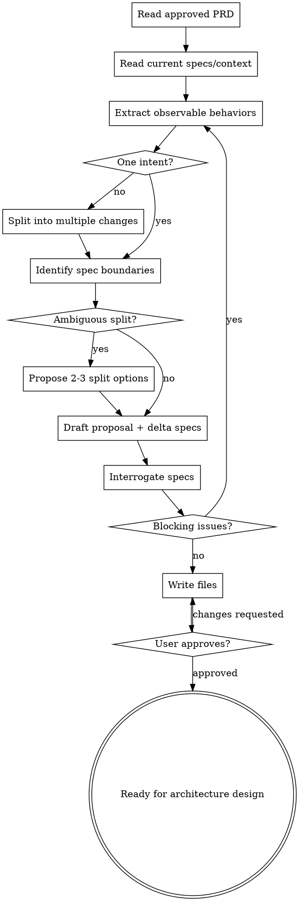

# PRD to Specs

把产品视角的 PRD 转换成 OpenSpec 风格的工程 Spec。这个技能负责定义"哪些工程行为需要改变、边界如何拆、每个边界可如何验证"，不负责架构设计、任务拆解或实现。

<HARD-GATE>
在 Spec 拆分得到用户批准之前，不要写 Architecture Design Doc、不要产出 ADR、不要拆任务、不要写测试代码、不要实现功能。`design.md` 和 `tasks.md` 属于后续阶段。
</HARD-GATE>

## 边界

| 负责 | 不负责（留给后续阶段） |
|---|---|
| 从 PRD 提取工程可验证行为 | 架构设计、技术选型、ADR |
| 判断一个 PRD 应拆成一个还是多个 change/spec | 任务拆解、工期估算 |
| 产出 OpenSpec 风格的 `proposal.md` 和 `specs/**/spec.md` | 可运行测试代码、功能代码 |
| 定义前端/后端/契约/迁移等 Spec 边界 | API 内部实现、数据库表结构细节 |
| 校验 requirements/scenarios 是否可观察、可验证 | 代码级文件变更计划 |

如果自己开始写"用 React Context""建某张表""新增某个类""第 1.1 步实现 X"，说明已经越界。停下来，把这些内容标成 `待 design/tasks 阶段决定`。

## OpenSpec 约束

遵守这些核心规则：

- Spec 是行为契约，不是实现计划。
- Requirement 描述系统可观察行为，用 `MUST` / `SHALL` 表示硬要求；`SHOULD` 只用于确实允许例外的要求。
- 一个 requirement 只表达一个行为。出现多个 "并且/同时/还要" 时拆分。
- 每个 requirement 至少有一个 scenario。
- Scenario 使用具体的 Given / When / Then，能够转成自动化测试或人工验收检查。
- 不把库、框架、类名、函数名、表结构、队列、缓存等实现细节写进 `spec.md`。
- 对已有系统使用 delta spec：`ADDED Requirements`、`MODIFIED Requirements`、`REMOVED Requirements`。
- 一个 change 应该有一句话能说清楚的单一意图。说不清或需要多个 "and also" 时，拆成多个 change。

## 必做清单

按顺序推进：

1. **读取 PRD 和现有上下文** - 确认 PRD 已批准，读取相关现有 specs、代码、文档。
2. **提取行为清单** - 从 PRD 中列出用户/系统/外部依赖可观察的行为变化。
3. **判断 change 粒度** - 决定是一个 OpenSpec change，还是多个独立 change。
4. **判断 spec 边界** - 按领域、组件、前后端、API 契约、迁移、worker 等拆分 spec。
5. **必要时提出拆分选项** - 有多种合理拆法时，给 2-3 个方案和推荐，等待用户选择。
6. **起草 proposal 和 delta specs** - 只写 `proposal.md` 和 `specs/**/spec.md`。
7. **逼问和自检** - 检查单一意图、可观察性、场景覆盖、实现细节泄漏、边界混写。
8. **写入文件** - 保存到 OpenSpec 风格目录。
9. **用户审阅关卡** - 用户批准后才交接给 Spec → 架构设计阶段。

## 流程图



## Step 1: 读取输入

必须先确认输入 PRD 是已批准版本；如果 PRD 仍是草稿，退回 `requirement-to-prd`。

读取：

- PRD 的 Problem、Users、Goals、Non-Goals、Success Metrics、Requirements、Acceptance Criteria、Glossary、Open Questions。
- 现有 `openspec/specs/`，判断哪些行为已存在、哪些是新增、哪些要修改或删除。
- 相关代码和文档，只用于理解现有行为与边界，不用于提前设计实现。

如果 Open Questions 中还有会影响工程边界的问题，先问用户，不要硬拆。

## Step 2: 提取行为清单

把 PRD 转成行为候选表：

```markdown
| PRD Source | Observable Behavior | Actor/System | Existing? | Candidate Spec |
|---|---|---|---|---|
| {PRD section/id} | {可观察行为} | {角色/系统} | New/Existing/Unknown | {domain/component} |
```

只保留可观察行为：

- 用户能看到、触发或依赖的行为。
- 下游系统能调用或验证的输入、输出、错误条件。
- 安全、隐私、可靠性、兼容性等外部约束。

删除或移走：

- 内部实现步骤。
- 代码结构、类名、库名、框架名。
- 详细任务计划。
- 纯业务背景且不形成行为要求的说明。

## Step 3: 判断 change 粒度

先判断 PRD 对应一个 change 还是多个 change。

一个 change 应该有一句话能说清的意图：

```text
Add notification rule configuration.
Rate-limit the login endpoint.
Migrate sessions off cookies.
```

需要拆成多个 change 的信号：

- PRD 包含多个互不依赖的用户目标。
- 半数行为可以独立上线。
- 两个人无法并行工作而不互相冲突。
- proposal 的 Scope 读起来像多个不相关功能的列表。
- 需要不同评审人或不同发布节奏。

一个产品意图同时涉及前端、后端和契约时，不一定拆成多个 change；通常保留一个 change，并在其中拆多个 spec：

```text
openspec/changes/add-notification-rules/
├── proposal.md
└── specs/
    ├── notification-rules-api/spec.md
    ├── notification-rules-ui/spec.md
    └── notification-rules-contract/spec.md
```

如果有多个独立产品意图，拆成多个 change folder。

## Step 4: 判断 spec 边界

Spec 是后续单独 design 的工程行为边界。常见拆分方式：

- **By domain**: `auth/`, `payments/`, `notifications/`
- **By component**: `api/`, `frontend/`, `worker/`, `admin-ui`
- **By contract**: `public-api/`, `webhook-contract/`, `frontend-backend-contract`
- **By migration/compatibility**: `session-migration/`, `legacy-compat`
- **By bounded context**: `ordering/`, `fulfillment/`, `inventory`

拆分原则：

- 一个 spec 只覆盖一个清晰行为域。
- 前端体验、后端能力、前后端契约可以分开，尤其当它们需要不同 design。
- API/契约 spec 描述请求/响应/错误语义，但不写内部服务如何实现。
- 数据迁移 spec 描述外部可验证的迁移结果、兼容窗口、回滚可见行为，不写表结构细节。
- Worker/异步任务 spec 描述触发条件、可观察结果、失败/重试语义，不写队列实现。

需要合并的信号：

- 两个 spec 总是一起变化、一起验收、没有独立设计价值。
- 拆开后大量 requirement 必须互相引用才能理解。

需要拆开的信号：

- 一个 spec 同时要求 UI、API、数据迁移和异步处理。
- 一个 spec 的 scenarios 需要完全不同的测试层级。
- 一个 spec 无法交给一个设计阶段单独处理。

## Step 5: 拆分方案裁决

如果拆分方式不明显，提出 2-3 个方案：

```markdown
我看到三种 Spec 拆分方式：

**选项 A：按实现域拆（推荐）**
- Specs: `{api}`, `{ui}`, `{contract}`
- 优点：每个 Spec 可以单独 design，前后端边界清楚
- 代价：需要额外维护契约 Spec

**选项 B：按用户流程拆**
- Specs: `{create-flow}`, `{edit-flow}`, `{audit-flow}`
- 优点：贴近 PRD 用户旅程
- 代价：前后端行为可能混在每个 Spec 里

**选项 C：单一 Spec**
- Specs: `{feature}`
- 优点：最轻量
- 代价：后续 design 可能过大，前后端/契约边界不清

我建议选 **A**，因为 {理由}。你要按这个方向落 Spec 吗？
```

只有当多种方案都合理且会影响后续设计边界时，才需要这种裁决。明显情况直接拆。

## Step 6: 起草 OpenSpec change

默认写入：

```text
openspec/changes/<change-slug>/
├── proposal.md
└── specs/
    └── <spec-domain>/
        └── spec.md
```

如果项目已有 OpenSpec 目录或命名规则，跟随项目惯例。

### `proposal.md` 模板

```markdown
# Proposal: {Change Title}

## Intent
{1-3 句：为什么要做；追溯到 PRD 的目标/问题}

## Source PRD
- {PRD path/title}

## Scope
In scope:
- {行为范围}

Out of scope:
- {明确不做的内容}

## Spec Split
| Spec | Responsibility | Depends On | Feeds Design For |
|---|---|---|---|
| `{spec-domain}` | {行为边界} | {依赖} | {后续设计对象} |

## PRD Traceability
| PRD Requirement/Metric | Covered By | Notes |
|---|---|---|
| {PRD item} | `{spec-domain}` | {说明} |

## Open Questions
- [ ] {会改变 spec 边界或行为契约的问题}
```

不要在 proposal 里写详细技术方案。高层 Approach 只有在帮助解释范围时才保留；具体技术方案留给 `design.md`。

### `spec.md` 模板

```markdown
# Delta for {Spec Domain}

## Purpose
{这个 spec 覆盖的行为域；不是技术实现说明}

## ADDED Requirements

### Requirement: {Observable Behavior}
The system SHALL {一个可观察行为}.

#### Scenario: {Specific case}
- GIVEN {具体前置条件}
- WHEN {具体触发}
- THEN {可观察结果}
- AND {可选的额外可观察结果}

## MODIFIED Requirements

### Requirement: {Existing Behavior Name}
The system SHALL {完整的新行为表述}.

(Previously: {旧行为摘要或现有 spec 引用})

#### Scenario: {Changed case}
- GIVEN {具体前置条件}
- WHEN {具体触发}
- THEN {新的可观察结果}

## REMOVED Requirements

### Requirement: {Removed Behavior Name}
{为什么移除；引用替代行为或 PRD 决策}
```

只包含实际需要的 ADDED/MODIFIED/REMOVED 章节；不要留空章节。

## Step 7: 逼问和自检

逐条检查：

- **单一意图**：每个 change 是否能用一句话说明？不能就拆。
- **边界清晰**：每个 spec 是否只服务一个工程行为域？是否能单独进入 design？
- **行为可观察**：tester 不看代码能否判断 requirement 是否通过？
- **一条一事**：requirement 是否只有一个 `MUST`/`SHALL` 行为？
- **场景有效**：scenario 是否真正验证 requirement，而不是复述？
- **边界场景**：是否覆盖关键失败、空输入、权限失败、重复操作、兼容性等重要边界？
- **Delta 正确**：已有行为用 MODIFIED/REMOVED，新行为用 ADDED；不确定时读取现有 spec。
- **无实现泄漏**：是否出现框架、类名、函数名、表结构、队列、缓存、代码文件？
- **PRD 可追溯**：PRD 的 Must requirement 和关键指标是否都有 spec 覆盖？
- **不越界**：是否写了 design/tasks/ADR？有则移除或标注留给后续阶段。

阻塞问题只保留会改变 split、requirement 或 scenario 的问题。小的措辞偏好直接修。

## Step 8: 写入文件

如果没有项目惯例，使用：

```text
openspec/changes/<change-slug>/proposal.md
openspec/changes/<change-slug>/specs/<spec-domain>/spec.md
```

多个独立 change 使用多个 change folder。

写入前确认：

- `<change-slug>` 是短横线小写英文/拼音。
- 每个 spec domain 名清楚表达行为域。
- 没有创建 `design.md` 或 `tasks.md`。
- 如果 `openspec/` 不存在，可以创建最小目录结构；不要生成无关模板或空目录。

## Step 9: 用户审阅关卡

自检通过后，交给用户审阅：

```markdown
Spec 拆分已写到 `{change path}`。
请重点审阅：change 粒度、spec 边界、requirements 是否可观察、scenarios 是否覆盖关键验收。
你批准后，下一阶段再针对每个 Spec 单独做架构设计。
```

用户要求修改时，更新 proposal/specs，重新自检，再请求审阅。

用户批准后，交接给 `Spec → 架构设计` 阶段，并明确：

- 哪些 change/spec 已批准。
- 每个 spec 应单独进入 design，还是可合并设计。
- 哪些 Open Questions 仍会阻塞 design。
- `design.md` 和 `tasks.md` 尚未创建，下一阶段再处理。

## 何时可以精简

极小需求可以使用 Lite 模式：

- 一个 change。
- 一个 spec。
- proposal 只写 Intent、Scope、Source PRD。
- 1-3 个 requirements，每个至少一个 scenario。

但仍然不能跳过：

- 可观察 requirement。
- Given/When/Then scenario。
- PRD traceability。
- 无实现细节。
- 用户审阅。

## 关键原则

- **PRD 是产品视角，Spec 是工程行为契约**。
- **先拆边界，再做 design**。
- **一个 change 一个意图**。
- **一个 spec 一个行为域**。
- **一个 requirement 一个可观察行为**。
- **scenario 要能变成测试**。
- **实现细节留给 design，任务留给 tasks**。
- **拆分方式本身不明显时，先让用户裁决**。
