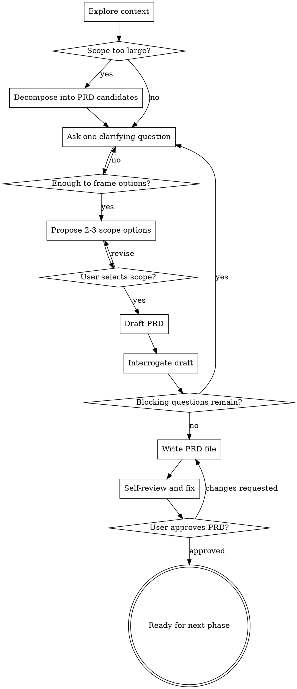

# Requirement to PRD

把一个模糊需求变成一份可以被评审、排期、交接的 PRD。这个技能负责定义"做什么、为谁做、为什么做、做到什么程度算成功"，不负责决定"怎么实现"。

<HARD-GATE>
在 PRD 定稿并得到用户明确认可之前，不要写代码、不要拆实现任务、不要做架构/技术选型、不要调用实现类技能。即使需求看起来很小，也必须先完成最小可用的 PRD 收口。
</HARD-GATE>

## 边界

| 负责 | 不负责（留给后续阶段） |
|---|---|
| 理解背景、用户、问题、动机 | 技术方案、架构选型、数据库/框架选择 |
| 定义目标、非目标、MVP 范围 | 任务拆解、工期估算、实现步骤 |
| 澄清术语、约束、成功指标、验收口径 | ADR、接口细节、数据模型细节 |
| 输出并自检一份可评审 PRD | 直接实现或修改代码 |

如果自己开始写"用哪个库""怎么拆模块""接口怎么设计""表结构怎么建"，说明已经越界。停下来，把这类内容标成 `待后续设计/架构阶段决定`，不要替后续阶段做决定。

## 必做清单

按顺序推进，并在复杂任务中维护一个可见 checklist：

1. **探索上下文** - 阅读相关文档、代码、历史对话、已有 issue/PRD，避免问用户已经能查到的事实。
2. **评估范围** - 判断这是单一需求，还是多个独立子系统/产品方向混在一起。
3. **发散澄清** - 一次只问一个问题，优先使用选择题，理解用户、问题、约束、成功标准。
4. **提出 2-3 个范围框定选项** - 给出取舍和推荐，等待用户选择或修正。
5. **起草 PRD** - 用模板写出草稿，未知项显式标注，不编造事实。
6. **逼问收口** - 对草稿逐段检查歧义、证据、指标、范围和术语。
7. **写入 PRD 文件** - 保存到约定位置；若用户没有偏好，默认 `docs/prds/YYYY-MM-DD-<topic>-prd.md`。
8. **PRD 自检并修正** - 检查占位符、矛盾、范围过大、验收不可测、术语冲突。
9. **用户审阅关卡** - 让用户审阅文件；有修改则更新并重新自检；获得批准后才进入下一阶段。

## 流程图



## Step 1: 探索上下文

先尽量从现有材料里获得事实，再问用户判断性问题：

- 阅读当前需求描述、相关文档、代码结构、已有 PRD/issue、最近变更。
- 区分事实、推断、假设。事实可直接写入 Evidence；推断要标明依据；假设必须待验证。
- 如果是给已有系统加功能，先核实现有术语、角色、流程和限制，不要把可查证事实丢给用户回答。
- 如果发现已有材料互相冲突，先指出冲突，并用一个问题要求用户选择权威来源或解释差异。

上下文总结要短，只列会影响 PRD 的内容：目标对象、已知问题、明确约束、潜在矛盾。

## Step 2: 评估范围

在深入问细节之前，先判断需求是否能对应一份 PRD：

- 如果它包含多个独立能力、多个用户群体、多个成功指标或多个上线节奏，先拆成候选 PRD。
- 不要在过大的需求里逐条抠细节。先帮助用户决定第一份 PRD 覆盖什么。
- 每个拆出的 PRD 都应该能回答：谁的问题、什么场景、为什么现在、MVP 如何验证、什么不做。

范围过大时，用这种格式收口：

```markdown
这个需求里至少有 {N} 个可独立成 PRD 的部分：

1. **{候选 PRD A}** - 解决 {问题}，适合先做如果 {理由}
2. **{候选 PRD B}** - 解决 {问题}，适合后做如果 {理由}
3. **{候选 PRD C}** - 解决 {问题}，风险/依赖是 {说明}

我建议先收敛 **{推荐项}**，因为 {一句话理由}。
你想先定哪一份？
```

## Step 3: 发散澄清

一次只问一个问题。优先给 2-4 个选项，并允许用户补充其他答案。

优先澄清这些维度：

- **Who** - 谁有这个问题？使用具体角色、群体、权限、场景，不写泛称"用户"。
- **Trigger** - 他们在什么情况下遇到问题？前置事件是什么？
- **Pain** - 可观察的痛点是什么？描述行为、阻塞、成本，不写未经验证的心理推测。
- **Current workaround** - 现在怎么处理？为什么不够好？
- **Why now** - 为什么现在要做？有没有时间窗口、业务压力或依赖变化？
- **Success** - 做成以后，什么数字、行为或状态会变化？
- **Constraints** - 有哪些必须遵守的业务、合规、权限、兼容、上线节奏限制？
- **Non-goals** - 哪些看起来相关但这次明确不做？

提问示例：

```markdown
这次 PRD 的主用户更接近哪一种？

A. {角色 A}，他们的核心问题是 {痛点}
B. {角色 B}，他们的核心问题是 {痛点}
C. 两者都重要，但 MVP 先服务 {角色}

我倾向选 {推荐项}，因为 {理由}。你更想按哪个方向收口？
```

## Step 4: 提出范围框定选项

在有基本上下文后，必须提出 2-3 个"产品范围/问题框定"选项，而不是技术方案。

每个选项包含：

- 目标用户
- 核心问题
- MVP 范围
- 明确不做
- 优点
- 代价/风险
- 推荐与否

格式：

```markdown
我看到三种可收口方式：

**选项 A：{名称}（推荐）**
- 适合：{用户/场景}
- MVP：{最小范围}
- 不做：{排除项}
- 取舍：{优点}；代价是 {代价}

**选项 B：{名称}**
- 适合：{用户/场景}
- MVP：{最小范围}
- 不做：{排除项}
- 取舍：{优点}；代价是 {代价}

**选项 C：{名称}**
- 适合：{用户/场景}
- MVP：{最小范围}
- 不做：{排除项}
- 取舍：{优点}；代价是 {代价}

我建议选 **{A/B/C}**，因为 {一句话理由}。你要按这个方向起草 PRD 吗？
```

用户没有选择或没有认可前，不要进入 PRD 定稿。

## Step 5: 起草 PRD

用下面模板起草。未知项写 `TBD - needs validation via {method}`，不要编造看似合理的假设。

```markdown
# {功能/产品名称} PRD

## Status
DRAFT

## Summary
{3-5 句：为谁、解决什么问题、MVP 做到哪里、不做什么}

## Problem
{2-4 句：具体角色在具体场景里的问题；不解决的代价}

## Evidence
- {用户原话 / 数据 / 观察 / 现有系统事实}
- Assumption - needs validation via {method}

## Users
| 用户/角色 | 场景 | 目标 | 备注 |
|---|---|---|---|
| Primary: {角色} | {触发场景} | {想完成的事} | {限制/权限/频率} |
| Secondary: {角色，可选} | {场景} | {目标} | {备注} |
| Not for: {排除对象} | {为什么排除} | - | - |

## Goals
- {产品目标，必须能对应成功指标}

## Non-Goals
- {明确不做的事} - {为什么不做/推迟}

## Hypothesis
We believe **{能力/体验变化}** will **{解决问题}** for **{用户}**.
We'll know we're right when **{可衡量结果}**.

## Success Metrics
| 指标 | 当前值/基线 | 目标值 | 测量方式 | 观察窗口 |
|---|---:|---:|---|---|
| {指标} | {baseline/TBD} | {target} | {source/method} | {timeframe} |

## User Journey / Core Flow
1. {用户触发场景}
2. {用户执行关键动作}
3. {系统/产品给出结果，避免写技术实现}
4. {用户完成目标}

## Requirements
| ID | Requirement | Priority | Acceptance Criteria |
|---|---|---|---|
| R1 | {用户可完成什么能力} | Must | Given {前置条件}, when {动作}, then {可观察结果} |
| R2 | {能力} | Should | {验收口径} |

## Scope
### MVP
- {验证核心假设所需的最小范围}

### Later
- {合理但不进入 MVP 的能力}

### Out of Scope
- {即使被要求也不做的内容} - {原因}

## Constraints & Dependencies
- {业务/合规/权限/平台/兼容/时间约束}
- {依赖的团队、数据、流程、外部系统}

## Glossary
| 术语 | 定义 | 备注 |
|---|---|---|
| {术语} | {唯一含义} | {来源/边界} |

## Open Questions
- [ ] {会改变范围、目标、验收或优先级的问题}

## Risks
| 风险 | 可能性 | 影响 | 缓解/验证方式 |
|---|---|---|---|
| {风险} | Low/Medium/High | Low/Medium/High | {措施} |

## Launch / Review Notes
- {评审时需要特别确认的点}
```

## Step 6: 逼问收口

对草稿逐段检查。一次只问一个阻塞问题；能从上下文查证的，不问用户。

必须检查：

- **Problem** - 痛点是真实观察、数据支持，还是假设？有没有具体场景？
- **Users** - Primary 是否足够具体？是否混入多个角色？`Not for` 是否清楚？
- **Goals vs Requirements** - 目标是否是结果，需求是否是能力，二者有没有混淆？
- **Success Metrics** - 指标是否可测？基线、目标、数据来源、观察窗口是否明确？
- **Scope** - MVP 是否真的最小？Later 和 Out of Scope 是否能抵抗范围蔓延？
- **Acceptance Criteria** - 是否用可观察结果表达？是否能让评审者判断通过/不通过？
- **Glossary** - 是否存在同词多义、旧系统术语冲突、业务词和技术词混用？
- **Open Questions** - 是否只保留会影响范围/优先级/验收的问题？小疑问不要阻塞 PRD。
- **Risks** - 是否包含用户不采纳、数据不可得、流程不配合、权限/合规限制等产品风险？

遇到模糊词要立刻定义。高风险词包括：智能、自动、实时、简单、完整、可配置、优化、权限、管理员、用户、任务、项目、状态、完成、失败、异常、同步、通知、模板。

逼问不是润色。发现不了任何新问题，通常说明还没有真正检查到位。

## Step 7: 写入文件

用户没有指定位置时，保存到：

```text
docs/prds/YYYY-MM-DD-<topic>-prd.md
```

写文件前确认项目是否已有 PRD 目录或命名惯例；有惯例就跟随惯例。文件名使用短横线英文或拼音，避免空格。

如果当前仓库不是产品/代码仓库，而是知识库或文档库，则保存到最贴近当前主题的文档目录，并在最终回复里给出路径。

## Step 8: PRD 自检

写完文件后，立刻用新鲜眼光自检并就地修复：

1. **占位符扫描** - 是否还有 `TBD`、`TODO`、空表格、半句话？如果存在，确认它们是否应该留在 Open Questions；否则补齐或删除。
2. **内部一致性** - Summary、Problem、Goals、Requirements、Metrics 是否指向同一个范围？
3. **范围检查** - 是否混入多个独立 PRD？MVP 是否包含非必要能力？
4. **歧义检查** - 是否有需求可被两种方式理解？选择一种写清楚，或放入 Open Questions。
5. **可验收检查** - 每条 Must requirement 是否有可观察的 acceptance criteria？
6. **术语检查** - Glossary 是否覆盖新增/易混术语？是否与已有系统用语冲突？
7. **越界检查** - 是否出现技术方案、架构选型、任务拆解？有则移除或标注留给后续阶段。

可以使用这个审阅口径：

```markdown
## PRD Review

**Status:** Approved | Issues Found

**Issues:**
- [Section] {具体问题} - {为什么会影响评审/计划/实现}

**Advisory:**
- {不阻塞但建议改善的点}
```

只有会导致后续计划或实现做错的内容才算阻塞问题。纯文风偏好不阻塞。

## Step 9: 用户审阅关卡

自检通过后，把 PRD 路径交给用户，并明确要求审阅：

```markdown
PRD 已写到 `{path}`，我也做了一轮自检。
请你审阅一下：范围、成功指标、验收口径和 Open Questions 是否符合预期？
你批准后，我再进入后续设计/计划阶段。
```

等待用户回复。用户要求修改时，更新 PRD，重新跑 Step 8，再次请求审阅。

用户批准后，才可以说 PRD 完成，并交接给下一阶段。交接时说明：

- PRD 状态已改为 `FINAL`。
- Glossary 里的术语已校准，后续阶段不要重新定义。
- Open Questions 若仍存在，哪些是非阻塞，哪些必须在设计/实现前解决。
- 下一阶段可以进入设计/架构或实现计划，但本技能到此结束。

## 何时可以精简

小需求可以压缩流程，但不能跳过关卡：

- 上下文探索可以很短。
- 发散澄清和逼问收口可以合并为一轮问答。
- PRD 可以是一页以内。
- 仍然必须包含 Problem、Users、Goals/Non-Goals、Scope、Requirements、Success Metrics 或明确的验收口径。
- 仍然必须写入文件、自检、等待用户批准。

## 关键原则

- **一次一个问题** - 不要用问题清单压给用户。
- **优先选择题** - 让用户更容易快速裁决。
- **先范围，后细节** - 范围没定，不要深挖验收细节。
- **证据优先** - 区分事实、推断、假设。
- **坚决 YAGNI** - 把不能验证核心假设的能力移出 MVP。
- **明确不做** - 好 PRD 不只写要做什么，也写即使诱人也不做什么。
- **术语落表** - 模糊词必须进入 Glossary。
- **可验收** - Must requirement 必须能判断通过/不通过。
- **不越界** - PRD 是产品需求文档，不是架构设计或实现计划。
