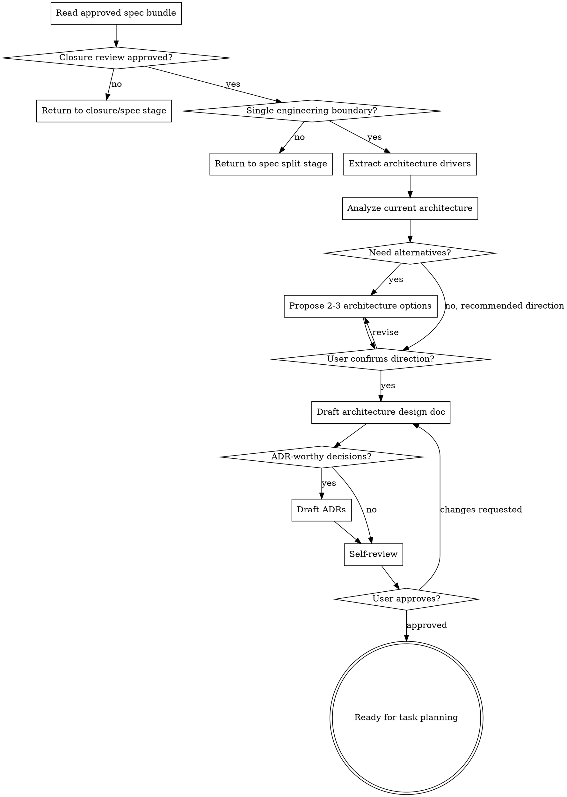

# Spec to Architecture

把一个已闭环的 OpenSpec spec 转换成一份可交给任务拆解阶段使用的 Architecture Design Doc，并在必要时记录 ADR。这个技能负责"如何设计这个工程边界"，不负责拆任务或实现。

<HARD-GATE>
只处理已经通过 PRD/Spec 闭环评审且没有 blocking issues 的单个 Spec。不要处理未经批准的 PRD、不要合并多个工程边界写一份大设计、不要创建任务列表、不要写测试用例、不要写代码。`tasks.md` 和测试相关产物属于后续阶段。
</HARD-GATE>

## 边界

| 负责 | 不负责（留给后续阶段） |
|---|---|
| 读取已批准 proposal/spec/closure review | 修正 PRD 或 Spec 内容 |
| 分析现有代码、架构、ADR、约定 | 任务拆解、工期估算、排期 |
| 提取架构驱动力和非功能约束 | 测试用例编写、测试代码 |
| 提出并选择架构方案 | 功能代码实现 |
| 输出 Architecture Design Doc | 逐文件实现清单、Build Sequence |
| 为关键决策输出 ADR | 代码级 patch 计划 |

如果自己开始写"创建这些文件""第 1 步实现 X""先写测试 Y""修改某函数"，说明已经越界到任务拆解或实现阶段。把这类内容移到 `Handoff to Planning` 的约束说明里，不要展开成任务。

## 架构设计原则

- **适配现有系统**：先理解现有模块、接口、数据流、错误处理、安全模型、部署和运维约定，再提出设计。
- **保持边界清晰**：一个 design 只服务一个 Spec；如果需要设计多个工程边界，分别写多份 design。
- **高内聚低耦合**：组件应有单一职责，通过明确接口协作，避免让调用方知道内部实现。
- **简单优先**：选择满足 Spec 的最简单架构，不为未承诺的未来需求增加抽象。
- **可测试性**：设计应明确可观察行为、接口边界、失败模式和替身/隔离点，方便后续测试用例与任务拆解。
- **安全默认**：权限、输入校验、敏感数据、审计和最小权限要在设计阶段显式处理。
- **可运维性**：关键流程应说明日志、指标、追踪、告警和排障入口。
- **诚实记录取舍**：每个重要选择都要说明为什么不是其它方案；不把 trade-off 藏起来。

## ADR 条件

只有同时满足这些条件才写 ADR：

1. **难逆转**：未来改回去成本明显。
2. **缺少上下文会令人意外**：未来读代码的人会问"为什么这样做"。
3. **存在真实取舍**：有可信备选方案，且选择理由不是显而易见。

适合 ADR 的例子：

- 同步调用 vs 异步事件。
- 复用现有边界 vs 新建模块边界。
- REST vs GraphQL / RPC。
- 新增持久化状态 vs 复用现有状态源。
- 引入队列、缓存、搜索、外部服务等带锁定成本的基础设施。
- 明确偏离项目常规架构模式。

不写 ADR 的例子：

- 普通命名、文件摆放、局部函数结构。
- 代码风格选择。
- 没有真实备选的显然决定。
- 后续很容易改的小实现细节。

## 必做清单

按顺序推进：

1. **确认准入** - Spec 已通过闭环评审；没有 blocking issues。
2. **读取输入** - PRD、proposal、目标 spec、closure review、现有 specs、相关代码/文档/ADR。
3. **确认单 Spec 边界** - 如果目标 spec 仍混入多个工程边界，退回 Spec 拆分阶段。
4. **提取架构驱动力** - 从 requirements/scenarios 中提取功能、NFR、接口、状态、错误、安全、观测性。
5. **现状分析** - 找到现有模块、数据流、接口、约定、约束和技术债。
6. **提出架构方案** - 简单情况给一个推荐方案；存在真实分歧时给 2-3 个方案和 trade-off。
7. **获得用户确认** - 方案未确认前不要定稿 Architecture Design Doc。
8. **写 Architecture Design Doc** - 只写设计，不写任务列表。
9. **写必要 ADR** - 只记录符合 ADR 条件的关键决策。
10. **自检和用户审阅** - 确认可交给任务拆解阶段。

## 流程图



## Step 1: 确认准入

必须读取并确认：

- PRD 已批准。
- `openspec/changes/<change>/proposal.md` 已批准。
- 目标 `openspec/changes/<change>/specs/<spec-domain>/spec.md` 已批准。
- PRD/Spec 闭环评审输出为 `Approved`，或所有 blocking issues 已修正并复审通过。

如果闭环评审不存在，先执行或要求执行闭环评审。不要跳过。

如果目标 spec 仍包含多个工程边界，例如同时覆盖 UI、API、worker、migration、contract，先退回 Spec 拆分阶段重新拆分。第 3 步必须按单个 Spec 设计。

## Step 2: 读取上下文

读取：

- Source PRD、proposal、目标 spec、closure review。
- 相关现有 `openspec/specs/**/spec.md`，理解已有行为。
- 相关代码模块、接口、配置、测试、文档。
- `docs/adr/` 或项目已有 ADR，避免重开已决策问题。
- 项目架构文档、README、约定、style rules。

只读取与目标 spec 相关的上下文，避免把无关系统拖进设计。

## Step 3: 提取架构驱动力

从 spec requirements/scenarios 中提取：

```markdown
| Driver | Source | Architectural Implication |
|---|---|---|
| {功能行为} | {Requirement/Scenario} | {需要什么边界/接口/状态/流程} |
| {性能/安全/兼容等 NFR} | {Requirement/Scenario/PRD metric} | {架构约束} |
```

覆盖这些类别：

- Functional behavior。
- API/契约/事件/模块接口。
- 数据读写、状态变化、一致性要求。
- 错误处理、重试、幂等、回滚。
- 权限、安全、隐私、审计。
- 性能、容量、延迟、可用性。
- 兼容性、迁移、灰度、回退。
- 可观测性：日志、指标、追踪、告警。

如果 spec 没有提供足够信息来决定这些架构影响，一次只问一个阻塞问题。

## Step 4: 现状分析

分析现有系统时，优先回答：

- 当前最接近的模块/边界是什么？
- 当前调用流、数据流、状态所有权在哪里？
- 现有错误处理、安全、观测性模式是什么？
- 是否已有类似 API/事件/worker/UI flow 可复用？
- 是否有 ADR 或约定限制本次设计？
- 哪些技术债会影响该 Spec，但不应扩大成无关重构？

输出现状摘要要短，只保留会影响设计的事实。

## Step 5: 提出架构方案

简单、低风险、只有一个明显设计方向时，可以直接给推荐方案和理由。

当存在真实分歧时，提出 2-3 个架构选项：

```markdown
我看到三种架构方向：

**选项 A：{名称}（推荐）**
- 适合：{约束/场景}
- 设计：{边界、接口、数据流摘要}
- 优点：{收益}
- 代价：{风险/复杂度}
- ADR 候选：{是/否，原因}

**选项 B：{名称}**
- 适合：{约束/场景}
- 设计：{摘要}
- 优点：{收益}
- 代价：{风险/复杂度}
- ADR 候选：{是/否，原因}

我建议选 **A**，因为 {一句话理由}。你要按这个方向写 architecture design 吗？
```

多方案讨论只用于裁决方向。不要在方向未确认前写最终 design。

## Step 6: 写 Architecture Design Doc

默认保存到：

```text
openspec/changes/<change>/design/<spec-domain>-architecture.md
```

如果项目已有 design 目录惯例，跟随项目惯例。不要写 `tasks.md`。

模板：

```markdown
# {Spec Domain} Architecture Design

## Status
DRAFT

## Source
- PRD: `{path}`
- Proposal: `{path}`
- Spec: `{path}`
- Closure Review: `{path or summary}`

## Summary
{3-5 句：本设计解决什么 Spec、采用什么架构方向、主要边界和非目标}

## Architecture Drivers
| Driver | Source | Implication |
|---|---|---|
| {driver} | {Requirement/Scenario} | {implication} |

## Current State
{相关现有模块、数据流、接口、约束、ADR}

## Proposed Architecture
{选定方案的整体说明；可以包含 Mermaid 图，但不强制}

## Components / Boundaries
| Component/Boundary | Responsibility | Inputs | Outputs | Notes |
|---|---|---|---|---|

## Data / Control Flow
{关键流程、状态所有权、一致性边界}

## Interfaces / Contracts
{API、事件、模块接口、前后端契约；只到设计层，不写代码}

## Error Handling
{失败模式、权限失败、校验失败、重试、幂等、回滚/补偿}

## Security / Privacy
{权限、数据暴露、审计、敏感信息、租户/角色边界}

## Observability
{日志、指标、追踪、告警、调试入口}

## Alternatives Considered
| Option | Pros | Cons | Decision |
|---|---|---|---|

## ADRs
| Decision | ADR | Reason |
|---|---|---|

## Open Questions
- [ ] {会阻塞任务拆解的问题}

## Handoff to Planning
{任务拆解时必须遵守的边界、顺序约束、不可越界事项}
```

## Step 7: 写 ADR

如果有 ADR-worthy decision，默认保存到：

```text
docs/adr/NNNN-<decision-slug>.md
```

若项目已有 ADR 目录，跟随现有目录。写 ADR 前先扫描已有 ADR 编号和相关决策，避免重复。

ADR 模板：

```markdown
# ADR-NNNN: {Decision Title}

**Date**: YYYY-MM-DD
**Status**: proposed | accepted
**Deciders**: {names/roles}

## Context
{2-5 句：这个 Spec 下为什么需要做这个选择；相关约束和 forces}

## Decision
{1-3 句：明确选择}

## Alternatives Considered

### {Alternative}
- **Pros**: {benefits}
- **Cons**: {drawbacks}
- **Why not**: {rejection reason}

## Consequences

### Positive
- {benefit}

### Negative
- {trade-off}

### Risks
- {risk and mitigation}
```

如果用户尚未批准架构方向，ADR 状态用 `proposed`；批准后可改为 `accepted`。

## Step 8: 自检

定稿前检查：

- **Spec 覆盖**：每个 requirement/scenario 是否在设计中有对应组件、接口、流程或错误处理？
- **边界洁癖**：是否只设计目标 spec？是否混入其他 spec 的实现域？
- **现有架构一致性**：是否遵循已有模块边界、命名、错误处理、测试和 ADR？
- **NFR 覆盖**：安全、性能、可靠性、兼容、可观测性是否按 spec 风险覆盖？
- **Trade-off 清楚**：关键选择是否记录 alternatives 和 rationale？
- **ADR 适度**：是否只为真正值得记录的决策写 ADR？
- **无任务泄漏**：是否出现文件清单、build sequence、逐步实现计划？有则移除。
- **可交接**：任务拆解阶段是否能基于 design 拆任务，而不需要重新做架构判断？

如果 Open Questions 仍会改变组件边界、接口契约或数据流，禁止定稿。

## Step 9: 用户审阅关卡

自检通过后请求用户审阅：

```markdown
Architecture design 已写到 `{design path}`。
ADR 草稿：{ADR paths or "无"}。
请重点审阅：架构方向、边界、接口/数据流、错误处理、安全/观测性，以及是否足够交给任务拆解。
你批准后，我会把状态改为 FINAL/accepted，并交接给下一阶段。
```

用户要求修改时，更新 design/ADR，重新自检，再请求审阅。

用户批准后：

- 将 design 状态改为 `FINAL`。
- 将已批准 ADR 状态改为 `accepted`。
- 明确交接给下一阶段：design 路径、ADR 路径、仍需注意的 Open Questions。

## 何时可以精简

小 Spec 可以使用 Lite 模式：

- 直接给一个推荐架构方向。
- Architecture Design Doc 可以是一页以内。
- ADR 仅在满足 ADR 条件时创建。

但不能跳过：

- closure review 准入。
- 单 Spec 边界检查。
- 现有代码/架构上下文读取。
- Spec requirement/scenario 覆盖检查。
- 用户审阅。

## 关键原则

- **一个 Spec，一份 design**。
- **先确认边界，再设计架构**。
- **顺着现有架构长出来**。
- **架构文档服务任务拆解，但不是任务拆解**。
- **ADR 记录为什么，不记录流水账**。
- **发现 Spec 过大就退回，不硬写大设计**。
