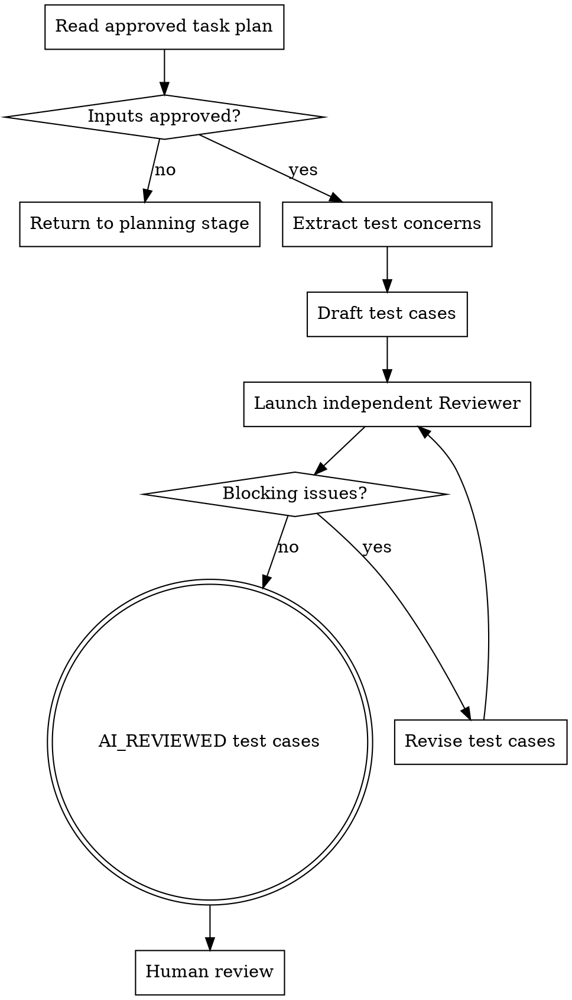

# Test Case Authoring Review

把已批准的任务计划转换成测试用例文档，并在交给人类审阅前完成 AI 审核闭环。这个技能负责"应该测试哪些业务行为、为什么测、用什么层级测、需要哪些场景数据"，不负责写测试代码或功能代码。

## Hard Gate

只处理已经批准、且没有会改变测试边界的阻塞问题的单个任务计划。不要修改 PRD、Spec、Architecture Design、ADR 或任务计划，不要写测试代码、不要写功能代码、不要输出 patch、类名、测试方法实现或逐文件修改说明。

## 边界

| 负责 | 不负责（留给其他阶段） |
| --- | --- |
| 读取已批准的任务计划及其上游设计资料 | 修改 PRD、Spec、Architecture Design、ADR 或任务计划 |
| 编写测试用例文档，说明测什么、为什么测、场景数据和覆盖类型 | 编写可运行测试代码 |
| 区分 UT / IT，并优先选择 UT | 功能代码实现 |
| 调用独立 Reviewer Agent 审核测试用例文档 | 代码 review、测试运行、覆盖率统计 |
| 根据 blocking issues 修订用例并复审 | 工期排期、人员分配、版本承诺 |

如果自己开始写 `@Test`、测试类名、Mock 代码、SQL 脚本、实现步骤或代码 patch，说明已经越界。停下来，把内容改回测试用例文档的业务行为、场景数据或交接说明。

## 必做清单

按顺序推进：

1. **确认准入** - 任务计划已批准；关联 Spec、闭环评审、Architecture Design 和必要 ADR 可追溯；没有会改变测试边界的阻塞问题。
2. **读取输入** - 读取任务计划、关联设计资料、项目测试目录和测试约定。
3. **确认测试边界** - 确认本次只服务一个任务计划覆盖的工程边界；如果任务计划混入多个独立边界，先退回任务拆解阶段。
4. **提取测试关注点** - 从任务的 Outcome、Done When、Risk、Integration Points、Handoff to Test Case Writing 中提取行为、边界和风险。
5. **编写测试用例文档** - 按固定格式输出用例索引、每条用例详情和最小 IT 数据样例。
6. **启动独立审核** - 新开 Reviewer Agent，要求其严格按同目录 `REVIEWER.md` 审核。
7. **修订与复审** - Author 根据 blocking issues 修改用例，再交给 Reviewer 复审。
8. **交给人审** - Reviewer 给出 `Approved for Human Review` 后，将文档状态改为 `AI_REVIEWED` 并请求人类审阅。

## 流程图



## Step 1: 确认准入

必须读取并确认：

- Source PRD 已批准。
- Proposal 和目标 Spec 已批准。
- PRD/Spec 闭环评审输出为 `Approved`，或 blocking issues 已修正并复审通过。
- Architecture Design Doc 已批准。
- 任务计划状态为 `FINAL`，或用户明确批准。
- 任务计划没有会改变测试边界、任务范围、数据所有权或接口契约的 Open Questions。
- 同目录存在 `REVIEWER.md`，可用于独立审核。

如果任务计划尚未批准，先退回任务拆解阶段。不要为了写测试用例替用户默认接受任务计划。

## Step 2: 读取上下文

读取：

- 任务计划的 Planning Scope、Task Overview、Work Breakdown、Done When、Risk、Integration Points、Handoff to Test Case Writing。
- 关联 Spec 的 Requirements 和 Scenarios。
- Architecture Design 的组件边界、接口契约、数据/控制流、错误处理、安全、观测性和 Handoff。
- 相关 ADR，尤其是会约束一致性、幂等、事务、数据库行为、兼容策略或失败处理的决策。
- 项目现有测试目录、测试命名、测试框架、Mock 习惯和集成测试基础设施。

只读取能影响测试用例设计的上下文。不要重新做架构调研，也不要把无关系统拖进测试文档。

## Step 3: 提取测试关注点

从任务计划中提取测试关注点：

```markdown
| Concern | Source | Business Behavior | Risk | Candidate Coverage |
|---|---|---|---|---|
| {关注点} | {任务/设计来源} | {业务行为} | {风险} | UT/IT |
```

覆盖这些来源：

- 正常业务流程。
- 空数据、缺失数据、可选数据。
- 错误数据、非法状态、越权或不满足前置条件。
- 数据读写、约束、事务、一致性、幂等和回滚。
- 外部接口、消息、异步任务或集成边界。
- 错误处理、重试、补偿和失败可见性。
- 权限、安全、审计、隐私。
- 日志、指标、追踪、告警或排障入口。

如果缺少信息导致无法判断测试边界，一次只问一个阻塞问题。

## Step 4: 测试分层约定

| 标记 | 含义 | 典型手段 |
| --- | --- | --- |
| UT | 单元测试 | Mock Repository，不依赖真实数据库 |
| IT | 集成测试 | 真实 PostgreSQL / Testcontainers，验证 DDL 与 INSERT 行为 |

默认优先选择 `UT`。如果能用 `UT` 验证业务规则、分支、错误处理或边界条件，就不要升级为 `IT`。

只有出现这些情况时才选择 `IT`：

- 需要验证真实 DDL、数据库约束、默认值、触发器或索引行为。
- 需要验证真实 INSERT、UPDATE、事务提交、回滚或唯一约束冲突。
- 需要验证 ORM / SQL 映射和数据库类型转换。
- 需要验证真实集成边界，Mock 会掩盖关键风险。

## Step 5: 写测试用例文档

默认保存到：

```text
openspec/changes/<change>/test-cases/<spec-domain>-test-cases.md
```

如果项目已有测试用例文档路径惯例，跟随项目惯例。

模板：

```markdown
# {Spec Domain} Test Cases

## Status
DRAFT

## Source
- PRD: `{path}`
- Proposal: `{path}`
- Spec: `{path}`
- Closure Review: `{path or summary}`
- Architecture Design: `{path}`
- Task Plan: `{path}`
- ADRs:
  - `{path or "None"}`

## Scope
{本测试用例文档负责的业务边界、明确非目标、必须继承的设计约束}

## Case Index
| 编号 | 标题 | 类型 |
|---|---|---|
| TC-001 | {业务语义标题} | UT/IT |

## Test Cases

### TC-001: {业务语义标题}

**测什么：** {用业务语义描述要验证的行为}

**为什么：** {对应哪条设计约束，并用业务语言解释该约束的含义}

**场景数据：**

正例：
- {完整、可理解的业务数据}

反例：
- 空场景：{缺失、为空或不存在的业务数据}
- 错误场景：{非法状态、非法值、冲突、越权或不满足前置条件的数据}

**覆盖类型：** UT/IT

**参数化建议：** {建议 @ParameterizedTest / 不需要}

## Minimal IT Data Samples

### 半成品行
{只包含验证 DDL/INSERT 边界所需的半成品数据，不写 SQL 脚本}

### 完整可执行行
{能支撑关键 IT 场景的完整业务数据，不写 SQL 脚本}

## AI Review Summary
{Reviewer 最后一轮结论；状态为 AI_REVIEWED 前必须填写}

## Human Review Focus
- {交给人类重点看的残余风险或业务判断点}
```

## 用例格式规则

- 文档头部必须有用例索引表，字段为：编号、标题、类型。
- 每条用例必须包含：测什么、为什么、场景数据、覆盖类型。
- “测什么”必须用业务语义描述，不写成纯技术操作。
- “为什么”必须追溯到 Spec、Architecture Design、ADR 或任务计划中的设计约束，并用业务语言解释含义。
- “场景数据”必须把正例和反例分开列出。
- 反例必须同时包含空场景和错误场景，不能只测空数据。
- 覆盖类型只能是 `UT` 或 `IT`。
- 适合参数化的用例必须标注“建议 @ParameterizedTest”。
- 文档末尾必须附“最小 IT 数据样例”，包含半成品行和完整可执行行。

禁止：

- 不写与测试无关的背景介绍章节。
- 正向和反向用例不得合并在同一格内含糊带过。
- 不把测试用例扩展成测试代码、类名、方法名、SQL 脚本或 patch。

## Step 6: AI 审核循环

Author 完成测试用例草案后，必须新开独立 Reviewer Agent。

Reviewer Agent 的任务：

- 只审核测试用例文档。
- 必须读取同目录 `REVIEWER.md` 并按其中规则执行。
- 不参与初稿编写。
- 不直接替 Author 修改测试用例文档。
- 输出 blocking issues、non-blocking suggestions、human review focus 和最终 verdict。

Author 根据 Reviewer 输出处理：

- 有 `Blocking Issues`：逐条修订测试用例文档，再交给 Reviewer 复审。
- 只有 `Non-blocking Suggestions`：Author 判断是否采纳，说明处理结果。
- Reviewer 给出 `Approved for Human Review` 且无 blocking issues：将文档状态改为 `AI_REVIEWED`。

循环上限建议为 3 轮。3 轮后仍存在 blocking issues 时，停止循环，把未收敛问题写入 `Human Review Focus`，交给人类裁决。

## Step 7: 自检

交给 Reviewer 前检查：

- **准入完整**：是否只处理已批准任务计划？
- **边界清晰**：是否只服务一个 Spec / design / task plan？
- **格式完整**：是否有用例索引、每条用例详情和最小 IT 数据样例？
- **业务语义清楚**：测什么、为什么是否能让业务和开发都看懂？
- **正反例分离**：正例、空场景、错误场景是否分开写？
- **分层克制**：能用 UT 的是否没有升级为 IT？
- **无代码泄漏**：是否写了测试代码、SQL 脚本、类名、方法名或 patch？

如果 Open Questions 会改变测试边界或用例分类，禁止定稿。

## Step 8: 用户审阅关卡

AI 审核通过后请求用户审阅：

```markdown
测试用例文档已写到 `{test cases path}`，状态为 `AI_REVIEWED`。
请重点审阅：用例是否符合业务语义、设计约束解释是否准确、正反例数据是否完整、UT/IT 分层是否合理，以及 `Human Review Focus` 中的残余问题。
你批准后，我会交接给测试代码落地阶段。
```

用户要求修改时，更新测试用例文档，重新执行 Reviewer 审核循环，再请求审阅。

用户批准后，明确交接给下一阶段：

- 测试用例文档路径。
- 用例编号与标题。
- 覆盖类型 `UT` / `IT`。
- 参数化建议。
- 最小 IT 数据样例。
- 人审确认事项或残余风险。

## 何时可以精简

小任务计划可以使用 Lite 模式：

- 只列 1-3 条测试用例。
- `Concern` 表可以省略。
- `Human Review Focus` 可以为空，但必须保留标题。

但不能跳过：

- 已批准任务计划准入。
- UT 优先原则。
- 正例、空场景、错误场景分离。
- 最小 IT 数据样例。
- 独立 Reviewer 审核。
- 人类审阅。

## 关键原则

- **测试用例先于测试代码**：先确认应该测什么，再进入可运行测试代码落地。
- **业务语义优先**：用例标题和说明必须让不了解实现细节的人也能理解。
- **用例追溯设计约束**：每条用例都应说明为什么存在，避免为了覆盖而覆盖。
- **UT 优先**：能用 Mock Repository 验证的场景不要使用真实数据库。
- **反例必须包含错误场景**：空数据不是唯一风险，非法状态、冲突、越权和不满足前置条件同样要覆盖。
- **审核独立**：Reviewer 只审，不写初稿，不替 Author 直接改文档。
