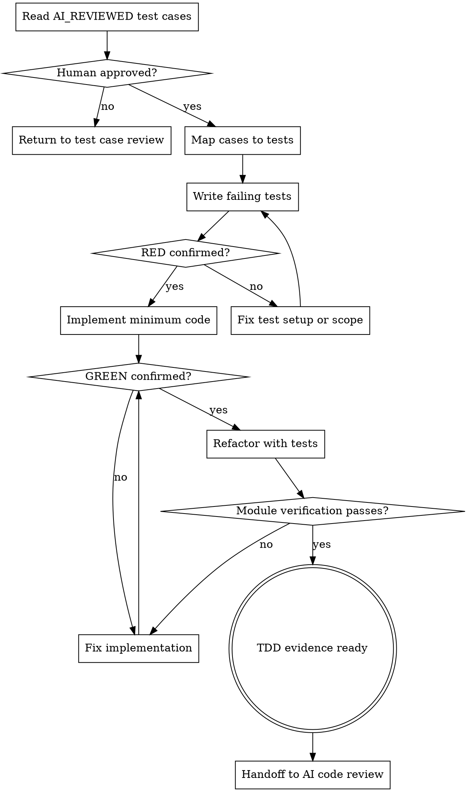

# Test Driven Implementation

把已人审通过的测试用例文档转换成可运行测试代码，并以测试驱动完成功能实现。这个技能负责"先写失败测试、再写最小实现、最后在测试保护下重构和验证"，不负责 AI 代码评审、人类 review 或 UI 自动化验收。

## Hard Gate

只处理已经人审通过的 `AI_REVIEWED` 测试用例文档。不要修改 PRD、Spec、Architecture Design、ADR、任务计划或测试用例文档的设计结论。不要编写 Playwright、UI E2E 或跨系统验收测试；这些属于后续阶段。

## 边界

| 负责 | 不负责（留给其他阶段） |
| --- | --- |
| 读取已批准测试用例文档、任务计划和上游设计资料 | 修改 PRD、Spec、Architecture Design、ADR、任务计划或测试用例设计 |
| 将测试用例落地为可运行测试代码 | Playwright、UI E2E、跨系统验收测试 |
| 按 Red-Green-Refactor 实现功能代码 | AI 代码评审、人类 review、PR 总结 |
| 运行单元测试和单模块接口集成测试 | 最终验收、发布决策、业务 UAT |
| 输出 TDD 证据摘要并交接给 AI 代码评审阶段 | 为了通过测试而删除、跳过或弱化测试 |

如果发现测试用例本身不准确、缺失关键业务约束或会改变接口契约，不要在本阶段自行重写规格。应退回测试用例设计阶段，或请求用户确认后再继续。

## 必做清单

按顺序推进：

1. **确认准入** - 测试用例文档状态为 `AI_REVIEWED`，且已经人类批准；任务计划和上游设计资料可追溯。
2. **读取输入** - 读取测试用例文档、任务计划、Spec、Architecture Design、ADR、现有代码和测试约定。
3. **确认实现边界** - 确认本次只处理单模块或单工程边界；跨模块大范围改动应退回任务拆解阶段。
4. **检测测试命令** - 找到项目现有单元测试、单模块接口集成测试、构建和必要静态检查命令。
5. **测试映射** - 将测试用例编号映射到测试文件、测试类型和待验证行为。
6. **RED** - 先写测试代码并运行目标测试，确认新增测试因功能未实现而失败。
7. **GREEN** - 写最小功能实现，让 RED 阶段失败的测试通过。
8. **Refactor** - 在测试保护下清理结构、命名和重复逻辑，保持测试通过。
9. **Module Verification** - 运行相关单元测试和单模块接口集成测试。
10. **Evidence & Handoff** - 记录 TDD 证据摘要，交接给 AI 代码评审闭环。

## 流程图



## Step 1: 确认准入

必须读取并确认：

- 测试用例文档状态为 `AI_REVIEWED`。
- 测试用例文档已经人类批准。
- 任务计划状态为 `FINAL`。
- Source PRD、Proposal、目标 Spec、闭环评审、Architecture Design 和必要 ADR 可追溯。
- 没有会改变代码边界、接口契约、数据库模型或测试期望的阻塞问题。
- 当前任务属于单模块或单工程边界。
- 可以识别项目现有测试框架、测试目录、Mock 方式和集成测试基础设施。

如果测试用例文档尚未人审通过，先退回测试用例编写/AI 审核闭环阶段。不要为了推进实现替用户默认批准测试用例。

## Step 2: 读取上下文

读取：

- 测试用例文档的 Case Index、Test Cases、Minimal IT Data Samples、AI Review Summary、Human Review Focus。
- 任务计划的 Planning Scope、Work Breakdown、Done When、Risk、Integration Points。
- Spec 的 Requirements 和 Scenarios。
- Architecture Design 的组件边界、接口契约、数据/控制流、错误处理、安全和观测性。
- 相关 ADR，尤其是会约束一致性、幂等、事务、数据库行为、兼容策略或失败处理的决策。
- 现有代码模块、测试目录、测试命名、Mock 习惯和测试运行命令。

只读取能影响本次实现和测试落地的上下文。不要重新做架构设计或任务拆解。

## Step 3: 测试映射

在写功能代码前，先把用例映射到测试落地点：

```markdown
| Case | Type | Test Target | Existing Pattern | Notes |
|---|---|---|---|---|
| TC-001 | UT/IT | `{test file or package}` | `{reference test}` | `{Mock / data / command}` |
```

映射原则：

- `UT` 落地为单元测试，隔离外部依赖，Repository 或外部客户端使用 Mock。
- `IT` 落地为单模块接口集成测试，只覆盖当前模块的接口、数据库或组件集成边界。
- 不在本阶段新增 UI E2E、Playwright 或跨系统端到端测试。
- 测试命名应保留业务语义，能追溯到测试用例编号。
- 不为了复用方便把多个独立风险塞进一个大测试。

## Step 4: RED

先写测试代码，不写功能实现。

RED 必须满足：

- 新增或更新的测试能对应测试用例编号。
- 运行目标测试时失败。
- 失败原因应来自功能尚未实现、行为尚未满足或断言未通过。
- 失败不应来自测试编译错误、测试环境缺失、Mock 配置错误或无关基础设施故障。

如果失败原因不是预期行为缺失，先修正测试或环境，直到得到有效 RED。不要跳过 RED。

记录 RED 证据：

```markdown
| Case | Command | Expected Failure | Actual Failure | RED Valid |
|---|---|---|---|---|
| TC-001 | `{command}` | {预期失败原因} | {实际失败摘要} | Yes/No |
```

## Step 5: GREEN

写最小功能实现，让 RED 阶段失败的测试通过。

GREEN 规则：

- 只实现当前测试用例要求的最小行为。
- 不引入未批准的新架构、新接口或新业务规则。
- 不删除、跳过、弱化测试。
- 不用硬编码测试数据的方式伪造通过。
- 如果实现发现设计约束矛盾，停止并退回上游确认。

GREEN 完成后，必须重跑 RED 阶段的目标测试，并确认失败测试转为通过。

## Step 6: Refactor

在测试保护下重构：

- 清理重复逻辑。
- 改善命名和局部结构。
- 收敛边界和可读性。
- 保持现有行为和测试结果不变。

重构不能扩大范围到无关模块。每次重构后必须重跑相关测试。

## Step 7: Module Verification

完成 GREEN 和 Refactor 后，运行：

- 相关单元测试。
- 当前模块的接口集成测试。
- 必要的构建或静态检查命令。

本阶段不要求运行 Playwright、UI E2E 或跨系统验收测试。

如果测试失败：

- 失败来自实现问题：回到 GREEN 或 Refactor 修复。
- 失败来自测试用例设计问题：退回测试用例设计阶段或请求用户确认。
- 失败来自任务边界扩大：退回任务拆解阶段重新拆分。

## Step 8: TDD 证据摘要

建议输出或更新轻量证据摘要，默认路径：

```text
openspec/changes/<change>/evidence/<spec-domain>-tdd-evidence.md
```

如果项目已有测试报告或 evidence 目录，跟随项目惯例。

模板：

```markdown
# {Spec Domain} TDD Evidence

## Source
- Test Cases: `{path}`
- Task Plan: `{path}`
- Spec: `{path}`
- Architecture Design: `{path}`

## Case Mapping
| Case | Type | Test Target | Result |
|---|---|---|---|
| TC-001 | UT/IT | `{test file or command}` | PASS |

## RED Evidence
| Case | Command | Failure Summary | Valid RED |
|---|---|---|---|
| TC-001 | `{command}` | {失败摘要} | Yes |

## GREEN Evidence
| Case | Command | Result |
|---|---|---|
| TC-001 | `{command}` | PASS |

## Refactor Evidence
- {重构内容和验证命令；无重构则写 None}

## Module Verification
| Command | Scope | Result |
|---|---|---|
| `{command}` | Unit / Module IT / Build | PASS |

## Known Gaps
- {已知风险；无则写 None}
```

证据摘要不是替代测试代码的文档，不要写冗长背景，只记录后续 AI 代码评审和人审需要的事实。

## Step 9: 交接给 AI 代码评审

交接内容：

- 测试用例文档路径。
- 任务计划路径。
- 修改的测试文件和功能文件。
- 运行过的命令及结果。
- TDD 证据摘要路径或摘要内容。
- 已知风险、跳过原因或需重点 review 的实现点。

交接后进入 AI 代码评审闭环。AI 代码评审发现 blocking issues 时，应回到本阶段修复并重跑相关测试。

## 何时可以精简

小改动可以使用 Lite 模式：

- 只映射 1-3 条测试用例。
- TDD 证据摘要可以写在交接消息中，不强制单独建文件。
- 只运行相关目标测试和必要模块验证命令。

但不能跳过：

- 人审通过的 `AI_REVIEWED` 测试用例准入。
- RED 验证。
- GREEN 验证。
- Refactor 后测试保持通过。
- 单元测试和单模块接口集成测试中与本次变更相关的验证。
- 交接给 AI 代码评审的证据。

## 关键原则

- **测试先于实现**：没有有效 RED，不进入 GREEN。
- **最小实现**：只写让已批准测试通过所需的代码。
- **测试不能被削弱**：不能通过删除、跳过或降低断言来获得 GREEN。
- **单模块边界**：本阶段只覆盖单模块实现和单模块接口集成测试。
- **UI 验收后置**：Playwright 和 UI 自动化测试属于人审与 UI 自动化验收阶段。
- **证据可追溯**：每个测试和实现结果都应能追溯到测试用例编号和任务计划。
