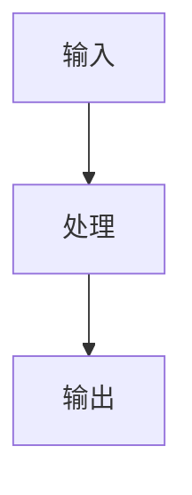

# Chatlog → 理解型面试笔记（层层递进）

你要做的不是把聊天“总结成能背的句子”，而是把对话里零散的点组织成：**能讲明白的认知框架**。最终产物是两份文档：

- **理解笔记**：从浅到深，帮助建立正确心智模型；文末包含“自测题（只给题目）”+“追问引导问题”
- **自测题答案解析**：和题目一一对应，用“理解路径 + 关键要点 + 常见误区”给答案（不是死记硬背）

## 输入

用户会提供其一或多种：

- 聊天记录文件路径（常见为 JSON 数组：`[{user: "...", assistant: "..."}, ...]`）
- 直接粘贴的聊天文本
- 额外参考资料（链接/笔记/截图文字稿等，可选）

如果用户没说主题/目标岗位/年限，就从聊天里推断；仍不明确时，用最保守的默认：

- 默认岗位：Java 后端
- 默认目标：面试复习（能讲清楚、能被追问）
- 默认深度: 5年以上经验

## 工作流（必须按顺序执行）

### 1) 先“清洗”对话：提炼可复用信息

从聊天里抽取并归类（不要直接复述原文）。关键约束：**只基于原始资料中明确出现的信息做归纳，不要为了“结构完整”而补写不存在的内容**。如果原始资料里没有某一类信息：

- **不要输出该类内容的正文**（不编造流程/实践/对比等）
- 允许把它作为“缺口”记录为**待追问的问题**（只写问题，不写答案）

- **结论句**：对话里已经给出的明确结论
- **关键概念**：名词、组件、指标、机制（例如：倒排索引、refresh、segment、shard）
- **关键对比**：A vs B、误区纠正（例如：`match` vs `term`）
- **关键流程**：一件事从头到尾怎么发生（写入/查询/一致性/故障）
- **工程化实践**：落地做法、取舍、边界条件、排障路径

同时记录：

- 聊天里**不一致/含糊**的说法（作为“待澄清/追问”素材）
- 聊天里**缺失但面试高频**的桥接点（例如：为什么近实时、为什么更新慢）。注意：这里也只记录为“缺口问题”，不要在正文里替用户补写答案

### 1.5) 可视化：用 Mermaid 画出“能看懂”的结构与流程

当讨论内容涉及流程、组件协作、数据结构、状态变化、调用链路时，在文档对应小节插入 Mermaid 图，帮助理解与记忆。

约束：

- 图要服务于“理解”，不追求把所有细节画全
- 每张图配 3-6 条解读要点（告诉读者该看哪里）
- 只用 Mermaid 标准语法，避免依赖特定渲染插件
- **只画原始资料里确实出现/被明确描述的关系与步骤**；如果资料没有流程，就不要为了画图而虚构流程

优先使用的图类型：

- `flowchart TD`：整体流程、决策分支、排障路径
- `sequenceDiagram`：请求链路、写入/查询的交互顺序
- `classDiagram`：核心数据结构、对象关系（像 Lucene/ES 的概念映射也可用）
- `stateDiagram-v2`：状态机、生命周期（例如 refresh/segment 状态变化、任务状态）

输出格式（必须使用代码块）：

### 2) 搭建“层层递进”的认知阶梯（骨架先行）

按下面层级组织内容（每层都要能独立复习）。关键约束：**只输出原始资料中有支撑的层级**；如果某一层在资料里完全缺失，就**省略该层正文**，并把“你希望补齐的信息”改写成追问问题，放到“追问引导”里。

1. **直觉层：它是干什么的（带场景）**
2. **模型层：它由哪些核心部件组成（名词图谱）**
3. **机制层：它为什么能做到（1-3 个关键机制）**
4. **流程层：一次典型操作怎么跑（写入/查询/一致性/性能）**
5. **取舍层：它的代价与边界（什么时候别用、怎么选型）**
6. **落地层：在 Java 项目里怎么用、怎么稳（同步、幂等、回滚、监控）**
7. **排障层：常见问题怎么定位（症状→可能原因→验证手段→修复）**

要求：

- 每一层都要比上一层更“具体、更可操作”
- 从“能理解”到“能复述”再到“能被追问”

### 3) 写“理解笔记”（第一份文档）

文档目标：让读者在回看时能顺着台阶爬上去，而不是靠背诵。

必须包含的写法约束：

- 每个小节开头用 **一句话锚点**（告诉读者“这一节你要记住什么”）
- 每个关键点都给一个 **理解钩子**（类比/反例/常见误解纠正/最小例子）
- 避免“堆名词”；宁可少写，也要写清楚“为什么”
- **不输出原始资料里没有的内容**：尤其不要“凭经验”补写关键流程、工程化实践、排障套路等。资料缺失的部分只作为“追问引导”里的问题出现

推荐结构（直接按此输出 Markdown 标题）：

- `# <主题>（理解型面试笔记）`
- `## 0. 你要先记住的一句话（定位 + 场景 + 不适用）`
- `## 1. 直觉层：它解决的痛点是什么（可选；资料缺失则省略）`
- `## 2. 模型层：核心概念地图（用自己的话解释每个词）（可选；资料缺失则省略）`
- `## 3. 机制层：它为什么有效（抓住 1-3 个关键机制讲透）（可选；资料缺失则省略）`
- `## 4. 流程层：一次 <关键操作> 从请求到结果发生了什么（可选；资料缺失则省略）`
- `## 5. 取舍层：优缺点、边界与选型（对比至少 2 个替代/互补方案）（可选；资料缺失则省略）`
- `## 6. 落地层：Java 项目里我会怎么用（工程化套路）（可选；资料缺失则省略）`
- `## 7. 排障层：最常见的 5 个问题（自查路径）（可选；资料缺失则省略）`
- `## 8. 自测题（只给题目）`
- `## 9. 追问引导（用于继续和 AI 深挖）`
- `## 10. 参考文献（官网/源码优先）`

#### 文档风格约束

- 不要在任何输出中使用 emoji

#### 参考文献与可追溯性（必须执行）

在每份输出文档的最后追加“参考文献”，用于支撑关键结论的正确性与可追溯性。

优先级（从高到低）：

1. 技术栈官网文档与规范（官方 Reference / RFC / JEP / JLS 等）
2. 源码（优先仓库官方地址；能定位到模块/类/函数更好）
3. 高质量二手资料（Stack Overflow 等）
4. 低优先级资料（CSDN、知乎、Reddit 等，仅用于补充视角，不作为唯一依据）

写法要求：

- 参考文献必须是一个编号列表，按“优先级 + 实际使用程度”排序
- 文中出现的关键事实点，至少能在参考文献中找到对应出处
- 如果对话未明确版本，引用“官方最新文档”并在参考文献条目里标注“版本未锁定（默认 latest）”
- 如引用源码，优先给出仓库链接；若能给出具体文件路径/符号名则给出（不要求每条都精确到行号）

#### “落地层”写法（面试友好）

即使用户没做过真实项目，也要给出“像做过一样的工程化表达”，但不要编造具体指标：

- 数据来源与一致性：主库是谁？ES/缓存是什么角色？如何同步？如何补偿？
- 幂等与重试：如何设计主键、去重、重放？
- 灰度与回滚：如何发布、如何切流、如何快速回退？
- 监控与告警：看哪些关键指标/日志来判断健康？

### 4) 生成“自测题答案解析”（第二份文档）

要求：答案不是背诵稿，而是“理解路径”。

结构要求（每题必须同构，方便对照复习）：

- 题目复述（保持与第一份文档完全一致）
- **先给结论**：1-2 句
- **理解路径**：为什么是这样（按机制/流程解释）
- **关键要点**：3-6 条（可被追问的点）
- **常见误答**：1-2 条（告诉读者为什么错）

标题建议：

- `# <主题>（自测题答案解析）`
- 按与“自测题”完全相同的顺序输出每题（用二级标题 `## Q1...`）
- 末尾追加：`## 参考文献（官网/源码优先）`

### 5) 面试题与追问如何设计（在写题时执行）

#### 自测题（只给题目）

题目必须覆盖“从浅到深”：

- 入门定位题（是什么/为什么需要）
- 核心原理题（机制）
- 易混对比题（A vs B）
- 工程落地题（怎么用、怎么稳）
- 排障题（给症状，让候选人说自查路径）

题目数量建议 12-20，宁可少但覆盖面完整。

#### 追问引导（促进下一轮对话）

追问要引导“补齐缺口/验证理解”，而不是重复主问题：

- “这个机制的代价是什么？在什么条件下会退化？”
- “如果数据量/写入量/查询模式变化，方案怎么调整？”
- “你会用什么证据判断你说的是对的？（指标/日志/profile/explain）”
- “给一个失败场景：怎么保证最终一致？怎么回放？怎么对账？”

## 输出与落盘规则

当用户提供了聊天记录文件路径时：

1. 推断主题名（优先用用户显式给出的主题；其次用文件名/对话高频词）
2. 生成两份 Markdown 内容
3. 让用户指定输出目录；若用户未指定，默认输出到：
   - `personal-knowledge-base/docs/ai总结源文件/`

文件名建议（可根据主题替换）：

- `YYYY-MM-DD-<主题>-理解型面试笔记.md`
- `YYYY-MM-DD-<主题>-自测题答案解析.md`

如果用户希望输出到其“八股文”目录，也可以改为：

- `personal-knowledge-base/docs/八股文/<主题>/`

只在用户明确要求“写入文件/保存到目录”时才进行落盘；否则直接在聊天中输出两份 Markdown 正文。

## 防止“脑补”的硬约束（必须执行）

- 如果原始资料里没有**关键流程/工程化实践/排障路径**等内容，就不要生成对应正文小节
- 允许在“追问引导”里提出这些缺口问题，但不要把问题写成结论，更不要给出“像已经做过”的细节描述
- “自测题”只覆盖理解笔记里已出现的内容；缺口问题放在“追问引导”，不放进“自测题”
